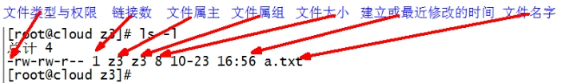

typora-root-url: ./linux&mac.assets

##  linux的目录结构

打开终端，输入```ls```查看linux根目录下的情况

```bash
$ ls /
----------------
bin  boot  dev  etc  home  lib  lib64  media  mnt  opt  proc  root  run  sbin  srv  sys  tmp  usr  var
```


+ /bin (/usr/bin /usr/local/bin )

  是Binary的缩写, 这个目录存放着最经常使用的命令

+ /sbin    (/usr/sbin 、 /usr/local/sbin)
  s就是Super User的意思，这里存放的是系统管理员使用的系统管理程序

+ /**home**
  存放普通用户的主目录，在Linux中每个用户都有一个自己的目录，一般该目录名是以用户的账号命名的。

+ **/root**
  该目录为系统管理员，也称作超级权限者的用户主目录。

+ /lib

  系统开机所需要最基本的动态连接共享库，其作用类似于Windows里的DLL文件。几乎所有的应用程序都需要用到这些共享库。

+ /lost+found

  这个目录一般情况下是空的，当系统非法关机后，这里就存放了一些文件。

+  **/etc**

  所有的系统管理所需要的配置文件和子目录。

+ **/usr**

  这是一个非常重要的目录，用户的很多应用程序和文件都放在这个目录下，类似与windows下的program files目录。

+ /boot

  这里存放的是启动Linux时使用的一些核心文件，包括一些连接文件以及镜像文件，**自己的安装别放这里**

+ /proc

  这个目录是一个虚拟的目录，它是系统内存的映射，我们可以通过直接访问这个目录来获取系统信息。

+ /srv

  service缩写，该目录存放一些服务启动之后需要提取的数据。

+ /sys

  这是linux2.6内核的一个很大的变化。该目录下安装了2.6内核中新出现的一个文件系统 sysfs 。

+ /tmp

  这个目录是用来存放一些临时文件的。

+ /dev

  类似于windows的设备管理器，把所有的硬件用文件的形式存储，**在linux中一切皆文件**。

+ /media

  linux系统会自动识别一些设备，例如U盘、光驱等等，当识别后，linux会把识别的设备挂载到这个目录下。

+ /mnt

  系统提供该目录是为了让用户临时挂载别的文件系统的，我们可以将外部的存储挂载在/mnt/上，然后进入该目录就可以查看里的内容了，比如你挂载的其他硬盘或者u盘等

+ **/opt** 

  这是给主机额外安装软件所摆放的目录。比如你安装一个ORACLE数据库则就可以放到这个目录下。默认是空的。**hadoop就可以安装在此**

+ **/usr/local**

  这是另一个给主机额外安装软件所摆放的目录。一般是通过编译源码方式安装的程序。

+ **/var**

  这个目录中存放着在不断扩充着的东西，我们习惯将那些经常被修改的目录放在这个目录下。包括各种日志文件。

+ /selinux

  SELinux是一种安全子系统,它能控制程序只能访问特定文件。

## 环境变量

输入echo $SHELL后，我的电脑显示bash，说明是Bourne Shell的一个变种，可以把你要添加的环境变量添加到你主目录下面的.profile或者.bash_profile，如果存在没有关系添加进去即可，如果没有生成一个。

#### Mac配置环境变量的地方

 + 1./etc/profile   （建议不修改这个文件 ）全局（公有）配置，不管是哪个用户，登录时都会读取该文件。

 + 2./etc/bashrc    （一般在这个文件中添加系统级环境变量）全局（公有）配置，bash shell执行时，不管是何种方式，都会读取此文件。

 + 3.~/.bash_profile  （一般在这个文件中添加用户级环境变量）每个用户都可使用该文件输入专用于自己使用的shell信息,当用户登录时,该文件仅仅执行一次!

#### Mac系统的环境变量，加载顺序为： 
a. /etc/profile 
b. /etc/paths 
c. ~/.bash_profile 
d. ~/.bash_login 
e. ~/.profile 
f. ~/.bashrc 

其中a和b是系统级别的，系统启动就会加载，其余是用户接别的。c,d,e按照从前往后的顺序读取，如果c文件存在，则后面的几个文件就会被忽略不读了，以此类推。~/.bashrc没有上述规则，它是bash shell打开的时候载入的。这里建议在c中添加环境变量，以下也是以在c中添加环境变量来演示的。

#### MAC 修改host文件

sudo vi /etc/hosts

#### 查看环境变量

```echo $PATH``` 需要在名字前加上$，如echo $HOME，还能 ls $HOME

```shell
env 
```

```
printenv
```

后面加上具体的名字可以查看单个变量，如printenv HOME

#### 添加环境变量

```	
echo $my

my=hello

echo $my #hello
```

my、=、hello中间不能有空格,若赋予的字符串有空格，需要

> my="hello wo"

若要把一个临时变量变成全局变量

``` 
export 变量名(前面不需要$)
```

同时注意，子shell无法使用export改变父shell中全局环境变量的值

#### 删除环境变量

```
unset 变量名（也不用加$）
```

> 当操作变量时不需要加$,用到变量时则要加，唯一例外就是printenv （不需要加）

#### 添加的path格式

PATH=$PATH:<PATH 1>:<PATH 2>:<PATH 3>:------:<PATH N>中间用冒号隔开

$PATH指的是整个path语句，所以上述命令加上：《path》即在后面追加

比如export PATH=/opt/STM/STLinux-2.3/devkit/sh4/bin:$PATH

#### 想**立即生效**请运行：

\# source /etc/profile 不报错则成功

flutter例子中，我用了用户变量，生效运行 source $HOME/.bash_profile 注意Mac 系统，如果只在终端使用 export 这个命令写入环境变量，它配置的只是临时变量，不能长期保存，电脑开关机后或重新打开终端或另开一个窗口，仍然会回到没有配置环境变量的状态。

## 文件权限命令

### 权限介绍

当执行ls -l 或 ls -al 命令后显示的结果中，最前面的第2～10个字符是用来表示权限。第一个字符一般用来区分文件和目录：

+ d：表示是一个目录，事实上在ext2fs中，目录是一个特殊的文件。
+ －：表示这是一个普通的文件。
+ l: 表示这是一个符号链接文件，实际上它指向另一个文件。
+ b、c：分别表示区块设备和其他的外围设备，是特殊类型的文件。
+ s、p：这些文件关系到系统的数据结构和管道，通常很少见到。

第2～10个字符当中的每3个为一组，左边三个字符表示所有者权限，中间3个字符表示与所有者同一组的用户的权限，右边3个字符是其他用户的权限。这三个一组共9个字符，代表的意义如下：

+ **r(Read，读取)：对文件而言，具有读取文件内容的权限；对目录来说，具有浏览目录的权**
+ **w(Write,写入)：对文件而言，具有新增、修改文件内容的权限；对目录来说，具有删除、移动目录内文件的权限。****
+ **x(eXecute，执行)：对文件而言，具有执行文件的权限；对目录了来说该用户具有进入目录的权限。**


－：表示不具有该项权限。
下面举例说明：

> －rwx------: 文件所有者对文件具有读取、写入和执行的权限。
> -rwxr―r--: 文件所有者具有读、写与执行的权限，其他用户则具有读取的权限。
> -rw-rw-r-x: 文件所有者与同组用户对文件具有读写的权限，而其他用户仅具有读取和执行的权限。
> drwx--x--x: 目录所有者具有读写与进入目录的权限,其他用户近能进入该目录，却无法读取任何数据。
> Drwx------: 除了目录所有者具有完整的权限之外，其他用户对该目录完全没有任何权限。

还有所谓的特殊权限。由于特殊权限会拥有一些“特权”，因而用户若无特殊需求，不应该启用这些权限，避免安全方面出现严重漏洞，造成黑客入侵，甚至摧毁系统!!!

+ s或S（SUID,Set UID）：可执行的文件搭配这个权限，便能得到特权，任意存取该文件的所有者能使用的全部系统资源。请注意具备SUID权限的文件，黑客经常利用这种权限，以SUID配上root帐号拥有者，无声无息地在系统中开扇后门，供日后进出使用。

+ s或S（SGID，Set GID）：设置在文件上面，其效果与SUID相同，只不过将文件所有者换成用户组，该文件就可以任意存取整个用户组所能使用的系统资源。

+ T或T（Sticky）：/tmp和 /var/tmp目录供所有用户暂时存取文件，亦即每位用户皆拥有完整的权限进入该目录，去浏览、删除和移动文件。

因为SUID、SGID、Sticky占用x的位置来表示，所以在表示上会有大小写之分。加入同时开启执行权限和SUID、SGID、Sticky，则权限表示字符是小写的：

-rwsr-sr-t 1 root root 4096 6月 23 08：17 conf

如果关闭执行权限，则表示字符会变成大写：

-rwSr-Sr-T 1 root root 4096 6月 23 08：17 conf

文件基本属性介绍，如图所示：

 

（1）如果查看到是文件：链接数指的是硬链接个数。创建硬链接方法

  ```bash
$ ln [原文件] [目标文件]	 
[root@hadoop101 ~]# ln xiyou/dssz/houge.txt ./hg.txt
  ```

（2）如果查看的是文件夹：链接数指的是子文件夹个数。

```bash
[root@hadoop101 ~]# ls -al xiyou/
--------------------------
总用量 16
drwxr-xr-x.  4 root root 4096 1月  12 14:00 .
dr-xr-x---. 29 root root 4096 1月  12 14:32 ..
drwxr-xr-x.  2 root root 4096 1月  12 14:30 dssz
drwxr-xr-x.  2 root root 4096 1月  12 14:04 mingjie
```

### chmod 改变权限

```bash
chmod [ugoa][+-=][rwx] [-R] 文件名或目录
/
chmod nnn [-R] 文件名或目录名
第一个n: 属主的权限值
第二个n：属组的权限值
第三个n：其它用户的权限值
```

* 简单的八进制格式：`chmod 760 newfile`

* 复杂的符号模式

  ```
  [ugoa...][[+-=][rwxX]...][,...]
  ```

  

  其中：

  - u 表示该文件的拥有者，g 表示与该文件的拥有者属于同一个群体(group)者，o 表示其他以外的人，a 表示这三者皆是。

  - \+ 表示增加权限、- 表示移除权限、= 表示等于左边的权限。

  - r 表示可读取，w 表示可写入，x 表示可执行，X 表示只有当该文件是个子目录或者该文件已经被设定过为可执行。t保留文件目录，s运行时重新设置uid或gid，u权限设置和属主一样，g权限设置和属组一样，o权限设置和其他用户一样

    其他参数说明：

  - -c : 若该文件权限确实已经更改，才显示其更改动作
  
  - -f : 若该文件权限无法被更改也不要显示错误讯息
  
  - -v : 显示权限变更的详细资料
  
  - -R : 对目前目录下的所有文件与子目录进行相同的权限变更(即以递回的方式逐个变更)
  
  - --help : 显示辅助说明
  
  - --version : 显示版本

##### 案例

（1）修改文件使其所属主用户具有执行权限

```bash
[root@hadoop101 ~]# cp xiyou/dssz/houge.txt ./
[root@hadoop101 ~]# chmod u+x houge.txt
```

（2）修改文件使其所属组用户具有执行权限

```bash
[root@hadoop101 ~]# chmod g+x houge.txt
```

（3）修改文件所属主用户执行权限,并使其他用户具有执行权限

```bash
[root@hadoop101 ~]# chmod u-x,o+x houge.txt
```

（4）采用数字的方式，设置文件所有者、所属组、其他用户都具有可读可写可执行权限。

```bash
[root@hadoop101 ~]# chmod 777 houge.txt
```

（5）修改整个文件夹里面的所有文件的所有者、所属组、其他用户都具有可读可写可执行权限。

```bash
[root@hadoop101 ~]# chmod -R 777 xiyou/
```

---修改当前目录下文件ana.cfg的权限为属主读写执行，属组读写，其它用户为读
`chmod u+x,g=rw,o=r ana.cfg`
--修改当前目录下文件ana.cfg的权限所有用户都为读写
`chmod a=rw ana.cfg`
---递归修改当前目录下aaa目录以及子目录子文件的权限都为所有用户读写执行
`chmod -R a=rwx aaa`

读： 4
写： 2
执行： 1

读写执行：4+2+1=7
读写： 4+2=6
---递归修改当前目录下aaa目录以及子目录子文件的权限都为所有用户读写执行
chmod -R 777 aaa
---修改当前目录下文件ana.cfg的权限为属主读写执行，属组读写，其它用户为读
chmod 764 ana.cfg

### chown 改变文件/目录属主

```bash
chown [-cfhvR] [--help] [--version] user[:group] file...
常用：
  chown 属主 [-R] 文件或目录
  chown :属组 [-R] 文件或目录
  chown 属主:属组 [-R] 文件或目录
```

**参数** :

- user : 新的文件拥有者的使用者 ID
- group : 新的文件拥有者的使用者组(group)
- -c : 显示更改的部分的信息
- -f : 忽略错误信息
- -h :修复符号链接
- -v : 显示详细的处理信息
- **-R : 处理指定目录以及其子目录下的所有文件**
- --help : 显示辅助说明
- --version : 显示版本

**只有root能改变文件的属主，任何属主都能改变文件的属组，只要属主使原属组和目标属组的成员**

##### 案例

（1）修改文件所有者

```bash
[root@hadoop101 ~]# chown neuedu houge.txt 
[root@hadoop101 ~]# ls -al
---------------------------
-rwxrwxrwx. 1 neuedu root 551 5月  23 13:02 houge.txt
```

（2）递归改变文件所有者和所有组

```bash
[root@hadoop101 xiyou]# ll
---------------------------------------
drwxrwxrwx. 2 root root 4096 9月   3 21:20 xiyou
----------------------------------------
[root@hadoop101 xiyou]# chown -R neuedu:neuedu xiyou/
[root@hadoop101 xiyou]# ll
-----------------------------------------------------
drwxrwxrwx. 2 neuedu neuedu 4096 9月   3 21:20 xiyou
```

---修改当前目录ana.cfg 属主为test2, 属组为neusoft
`chown test2:neusoft ana.cfg`
-修改当前目录下的aaa目录以及子目录子文件的属主为test2, 属组为neusoft
` chown test2:neusoft -R aaa`

### chgrp 改变文件/目录属组

在UNIX系统家族里，文件或目录权限的掌控以拥有者及所属群组来管理。您可以使用chgrp指令去变更文件与目录的所属群组，设置方式采用群组名称或群组识别码皆可。

语法

```bash
$ chgrp [-cfhRv][--help][--version][所属群组][文件或目录...] 或 chgrp [-cfhRv][--help][--reference=<参考文件或目录>][--version][文件或目录...]
$ chgrp [最终用户组] [文件或目录]	（功能描述：改变文件或者目录的所属组）
```

参数说明

+ -c或--changes 效果类似"-v"参数，但仅回报更改的部分。　　
+ -f或--quiet或--silent 　不显示错误信息。
+ -h或--no-dereference 　只对符号连接的文件作修改，而不更动其他任何相关文件。
+ -R或--recursive 　递归处理，将指定目录下的所有文件及子目录一并处理。
+ -v或--verbose 　显示指令执行过程。
+ --help 　在线帮助。
+ --reference=<参考文件或目录> 　把指定文件或目录的所属群组全部设成和参考文件或目录的所属群组相同。
+ --version 　显示版本信息。

实例：改变文件的群组属性：

```bash
chgrp -v bin log2012.log
```

修改文件的所属组

```bash
[root@hadoop101 ~]# chgrp root houge.txt
[root@hadoop101 ~]# ls -al
------------------------------------
-rwxrwxrwx. 1 neuedu root 551 5月  23 13:02 houge.txt
```

## 搜索查找命令

### find 查找文件/目录

有一个相似的命令：which   ---查找命令程序的位置，查找范围是$PATH环境变量中所列出的路径。

find指令将从指定目录向下递归地遍历其各个子目录，将满足条件的文件显示在终端。

#### 基本语法

```bash
$ find [搜索范围] [选项]
```

#### 选项说明

/: 在整个linux系统中进行查找
/etc: 查找配置文件时指定的路径

| 选项            | 功能                                                         |
| --------------- | ------------------------------------------------------------ |
| -name<查询方式> | 按照指定的文件名查找模式查找文件                             |
| -user<用户名>   | 查找属于指定用户名所有文件                                   |
| -size<文件大小> | 按照指定的文件大小查找文件。                                 |
| -type           | 按文件类型    f: 普通文件    d: 目录文件    l: 链接文件   b: 块设备文件   c:  字符设备文件 |

#### 案例

（1）按文件名：根据名称查找/目录下的filename.txt文件。

```bash
[root@hadoop101 ~]# find xiyou/ -name “*.txt”
```

（2）按拥有者：查找/opt目录下，用户名称为-user的文件

```bash
[root@hadoop101 ~]# find xiyou/ -user neuedu
```

（3）按文件大小：在/home目录下查找大于200m的文件（+n 大于  -n小于   n等于）

```bash
[root@hadoop101 ~]find /home -size +204800
```

### grep 过滤查找及“|”管道符

管道符，“|”，表示将前一个命令的处理结果输出传递给后面的命令处理。

前一个命令的输出是后一个命令的输入。

`ls -R / | more`     ---将查找根目录以及子目录的列表分页显示

#### 基本语法

```bash
$ grep 选项 查找内容 源文件
```

#### 选项说明

| 选项 | 功能               |
| ---- | ------------------ |
| -n   | 显示匹配行及行号。 |

##### 案例

（1）查找某文件在第几行

```bash
[root@hadoop101 ~]# ls | grep -n test
```

### **which** **查找命令**

查找命令在那个目录下

#### 基本语法

```bash
$ which 命令
```

##### 案例

```bash
$ which ll
```

## 压缩和解压命令

### gzip/gunzip 压缩

特点注意：

一个压缩包只能压缩一个文件
只能压缩文件不能压缩目录
压缩后原文件不保留
解压后压缩文件不保留

#### **基本语法**

```bash
$ gzip 文件		（功能描述：压缩文件，只能将文件压缩为*.gz文件）

$ gunzip 文件.gz	（功能描述：解压缩文件命令）
```

#### 经验技巧

（1）**只能压缩文件**不能压缩目录

（2）**不保留原来的文件**

#### 案例

（1）gzip压缩

```bash
[root@hadoop101 ~]# ls
------
test.java
-----
[root@hadoop101 ~]# gzip houge.txt
[root@hadoop101 ~]# ls
----------
houge.txt.gz
```

（2）gunzip解压缩文件

```bash
[root@hadoop101 ~]# gunzip houge.txt.gz 
[root@hadoop101 ~]# ls
houge.txt
```

### zip/unzip 压缩

压缩和解压.zip包

#### 基本语法

```bash
$ zip  [选项] XXX.zip  将要压缩的内容 		（功能描述：压缩文件和目录的命令）
$ unzip [选项] XXX.zip						（功能描述：解压缩文件）
```

#### 选项说明

| zip选项 | 功能     |
| ------- | -------- |
| -r      | 压缩目录 |

| unzip选项 | 功能                     |
| --------- | ------------------------ |
| -d<目录>  | 指定解压后文件的存放目录 |

#### 经验技巧

zip 压缩命令在window/linux都通用，**可以压缩目录且保留源文件**。

#### 案例

（1）压缩 1.txt 和2.txt，压缩后的名称为mypackage.zip 

```bash
[root@hadoop101 opt]# touch bailongma.txt
[root@hadoop101 ~]# zip houma.zip houge.txt bailongma.txt 
-----------------------------
  adding: houge.txt (stored 0%)
  adding: bailongma.txt (stored 0%)

[root@hadoop101 opt]# ls
-------------------
houge.txt	bailongma.txt	houma.zip 
```

（2）解压 mypackage.zip

```bash
[root@hadoop101 ~]# unzip houma.zip 
----------------------
Archive:  houma.zip
extracting: houge.txt               
extracting: bailongma.txt       

[root@hadoop101 ~]# ls
-----------------------
houge.txt	bailongma.txt	houma.zip 
```

（3）解压mypackage.zip到指定目录-d

```bash
[root@hadoop101 ~]# unzip houma.zip -d /opt
[root@hadoop101 ~]# ls /opt/
```

### tar 打包

#### 基本语法

```bash
$ tar  [选项]  XXX.tar.gz  将要打包进去的内容		（功能描述：打包目录，压缩后的文件格式.tar.gz）
```

压缩.tar
     tar -cvf 压缩包名.tar 压缩的文件或目录列表
压缩.tar.gz
    tar -zcvf 压缩包名.tar.gz 压缩的文件或目录列表
解压.tar:
    tar -xvf  压缩包名.tar [-C 目标解压目录]
解压.tar.gz:
   tar -zxvf 压缩包名.tar.gz [-C 目标解压目录]

#### 选项说明

| 选项   | 功能                 |
| ------ | -------------------- |
| -z     | 打包同时压缩         |
| **-c** | **产生.tar打包文件** |
| -v     | 显示详细信息         |
| -f     | 指定压缩后的文件名   |
| **-x** | **解包.tar文件**     |

#### 案例

（1）压缩多个文件

```bash
[root@hadoop101 opt]# tar -zcvf houma.tar.gz houge.txt bailongma.txt 
------------
houge.txt
bailongma.txt

[root@hadoop101 opt]# ls
----------------
houma.tar.gz houge.txt bailongma.txt 
```

（2）压缩目录

```bash
[root@hadoop101 ~]# tar -zcvf xiyou.tar.gz xiyou/
----------
xiyou/
xiyou/mingjie/
xiyou/dssz/
xiyou/dssz/houge.txt
```

（3）解压到当前目录

```bash
[root@hadoop101 ~]# tar -zxvf houma.tar.gz
```

（4）解压到指定目录

```bash
[root@hadoop101 ~]# tar -zxvf xiyou.tar.gz - /opt
[root@hadoop101 ~]# ll /opt/
```

## 磁盘分区命令

### df 查看磁盘空间使用情况

`df: disk free 空余硬盘`

#### 基本语法

```bash
$ df  选项	（功能描述：列出文件系统的整体磁盘使用量，检查文件系统的磁盘空间占用情况）
```

#### 选项说明

| 选项 | 功能                                                     |
| ---- | -------------------------------------------------------- |
| -h   | 以人们较易阅读的 GBytes, MBytes, KBytes 等格式自行显示； |
| -t   | 查看指定文件系统的空间占用情况                           |
| -T   | 在结果中显示文件系统类型                                 |

#### 案例

（1）查看磁盘使用情况

```bash
[root@hadoop101 ~]# df -h
------------------------
Filesystem      Size  Used Avail Use% Mounted on
/dev/sda2        15G  3.5G   11G  26% /
tmpfs           939M  224K  939M   1% /dev/shm
/dev/sda1       190M   39M  142M  22% /boot
```

### fdisk 查看分区

#### 基本语法

```bash
$ fdisk -l			（功能描述：查看磁盘分区详情）
```

#### 选项说明

| 选项 | 功能                   |
| ---- | ---------------------- |
| -l   | 显示所有硬盘的分区列表 |

#### 经验技巧

该命令必须在root用户下才能使用

#### 功能说明

（1）Linux分区

```bash
Device：分区序列

Boot：引导

Start：从X磁柱开始

End：到Y磁柱结束

Blocks：容量

Id：分区类型ID

System：分区类型
```

（2）Win7分区，如图

 

##### 案例

（1）查看系统分区情况

```bash
[root@hadoop101 /]# fdisk -l
----------------------------
Disk /dev/sda: 21.5 GB, 21474836480 bytes
255 heads, 63 sectors/track, 2610 cylinders
Units = cylinders of 16065 * 512 = 8225280 bytes
Sector size (logical/physical): 512 bytes / 512 bytes
I/O size (minimum/optimal): 512 bytes / 512 bytes
Disk identifier: 0x0005e654
Device Boot      Start         End      Blocks   Id  System
/dev/sda1   *           1          26      204800   83  Linux
Partition 1 does not end on cylinder boundary.
/dev/sda2              26        1332    10485760   83  Linux
/dev/sda3            1332        1593     2097152   82  Linux swap / Solaris
```

### mount/umount 挂载/卸载

​	对于Linux用户来讲，不论有几个分区，分别分给哪一个目录使用，它总归就是一个根目录、一个独立且唯一的文件结构。

​	Linux中每个分区都是用来组成整个文件系统的一部分，它在用一种叫做“挂载”的处理方法，它整个文件系统中包含了一整套的文件和目录，并将一个分区和一个目录联系起来，要载入的那个分区将使它的存储空间在这个目录下获得。

##### 1．挂载前准备（必须要有光盘或者已经连接镜像文件）

 

 

##### 基本语法

```bash
$ mount [-t vfstype] [-o options] device dir	（功能描述：挂载设备）

$ umount 设备文件名或挂载点			（功能描述：卸载设备）
```

##### 参数说明

| 参数       | 功能                                                         |
| ---------- | ------------------------------------------------------------ |
| -t vfstype | 指定文件系统的类型，通常不必指定。mount 会自动选择正确的类型。常用类型有：光盘或光盘镜像：iso9660DOS fat16文件系统：msdos[Windows](http://blog.csdn.net/hancunai0017/article/details/6995284) 9x fat32文件系统：vfatWindows NT ntfs文件系统：ntfsMount Windows文件[网络](http://blog.csdn.net/hancunai0017/article/details/6995284)共享：smbfs[UNIX](http://blog.csdn.net/hancunai0017/article/details/6995284)(LINUX) 文件网络共享：nfs |
| -o options | 主要用来描述设备或档案的挂接方式。常用的参数有：loop：用来把一个文件当成硬盘分区挂接上系统ro：采用只读方式挂接设备rw：采用读写方式挂接设备　  iocharset：指定访问文件系统所用字符集 |
| device     | 要挂接(mount)的设备                                          |
| dir        | 设备在系统上的挂接点(mount point)                            |

##### 案例

（1）挂载光盘镜像文件

```bash
[root@hadoop101 ~]# mkdir /mnt/cdrom/						建立挂载点
[root@hadoop101 ~]# mount -t iso9660 /dev/cdrom /mnt/cdrom/	设备/dev/cdrom挂载到 挂载点 ：  /mnt/cdrom中
[root@hadoop101 ~]# ll /mnt/cdrom/
```

（2）卸载光盘镜像文件

```bash
[root@hadoop101 ~]# umount /mnt/cdrom
```

5．设置开机自动挂载

```bash
[root@hadoop101 ~]# vi /etc/fstab
```

添加红框中内容，保存退出。

 

## 进程线程命令

进程是正在执行的一个程序或命令，每一个进程都是一个运行的实体，都有自己的地址空间，并占用一定的系统资源。

### free

free -h:以易读方式显示内存的空间占用情况

### ps 查看当前系统进程状态

`ps:process status 进程状态`

#### 基本语法

```bash
$ ps aux | grep xxx		（功能描述：查看系统中所有进程）
$ ps -ef | grep xxx		（功能描述：可以查看子父进程之间的关系）
```

#### 选项说明

| 选项 | 功能                   |
| ---- | ---------------------- |
| -a   | 选择所有进程           |
| -u   | 显示所有用户的所有进程 |
| -x   | 显示没有终端的进程     |

#### 功能说明

（1）ps aux显示信息说明

​	**USER**：该进程是由哪个用户产生的

​	**PID**：进程的ID号

​	**%CPU**：该进程占用CPU资源的百分比，占用越高，进程越耗费资源；

​	**%MEM**：该进程占用物理内存的百分比，占用越高，进程越耗费资源；

​	**VSZ**：该进程占用虚拟内存的大小，单位KB；

​	**RSS**：该进程占用实际物理内存的大小，单位KB；

​	**TTY**：该进程是在哪个终端中运行的。其中tty1-tty7代表本地控制台终端，tty1-tty6是本地的字符界面终端，

​                   tty7是图形终端。pts/0-255代表虚拟终端。

​	**STAT**：进程状态。常见的状态有：R：运行、S：睡眠、T：停止状态、s：包含子进程、+：位于后台

​	**START**：该进程的启动时间

​	**TIME**：该进程占用CPU的运算时间，注意不是系统时间

​	**COMMAND**：产生此进程的命令名

（2）ps -ef显示信息说明

​	**UID**：用户ID 

​	**PID**：进程ID 

​	**PPID**：父进程ID 

​	**C**：CPU用于计算执行优先级的因子。数值越大，表明进程是CPU密集型运算，执行优先级会降低；数值越        小，表明进程是I/O密集型运算，执行优先级会提高 

​	**STIME**：进程启动的时间 

​	**TTY**：完整的终端名称 

​	**TIME**：CPU时间 

​	**CMD**：启动进程所用的命令和参数

#### 经验技巧

​	如果想查看进程的**CPU占用率和内存占用率**，可以使用aux; 如果想查看**进程的父进程ID**可以使用ef;

#### 案例

```bash
[root@hadoop101 datas]# ps aux
```

 

```bash
[root@hadoop101 datas]# ps -ef
```

 

### kill 终止进程

#### 基本语法

```bash
$ kill  [选项] 进程号		（功能描述：通过进程号杀死进程）
$ killall 进程名称			（功能描述：通过进程名称杀死进程，也支持通配符，这在系统因负载过大而变得很慢时很有用）	
```

#### 选项说明

| 选项 | 功能                 |
| ---- | -------------------- |
| -9   | 表示强迫进程立即停止 |

#### 案例

（1）杀死浏览器进程

```bash
[root@hadoop101 桌面]# kill -9 5102
```

（2）通过进程名称杀死进程

```bash
[root@hadoop101 桌面]# killall firefox
```

### pstree 查看进程树

pstree命令在centos minimal版中要单独安装

```bash
$ yum -y install psmisc 
```

#### 基本语法

```bash
$ pstree [选项]
```

#### 选项说明

| 选项 | 功能               |
| ---- | ------------------ |
| -p   | 显示进程的PID      |
| -u   | 显示进程的所属用户 |

#### 案例

（1）显示进程pid

```bash
[root@hadoop101 datas]# pstree -p
```

（2）显示进程所属用户

```bash
[root@hadoop101 datas]# pstree -u
```

### top 查看系统健康状态

#### 基本语法

```bash
$ top [选项]	
```

#### 选项说明

| 选项    | 功能                                                         |
| ------- | ------------------------------------------------------------ |
| -d 秒数 | 指定top命令每隔几秒更新。默认是3秒在top命令的交互模式当中可以执行的命令： |
| -i      | 使top不显示任何闲置或者僵死进程。                            |
| -p      | 通过指定监控进程ID来仅仅监控某个进程的状态。                 |
| -b      | 批处理模式                                                   |
| -n      | 设置迭代数量                                                 |
| -u      | 可以用这些选项浏览特定用户的进程。用户名或者UID可以在选项中指定。-p、-u和-U选项是互斥的，同时只可以使用这其中一个选项。当你试图组合使用这些选项时，你会得到一个错误。 |

#### 操作说明（交互命令）

| 操作       | 功能                                                         |
| ---------- | ------------------------------------------------------------ |
| P          | 以CPU使用率排序，默认就是此项                                |
| M          | 以内存的使用率排序                                           |
| N          | 以PID排序                                                    |
| q          | 退出top                                                      |
| h          | 帮助                                                         |
| 会车或空格 | 手动刷新                                                     |
| A          | 切换交替显示模式，这个命令在全屏和交替模式间切换。在交替模式下会显示4个窗口（译注：分别关注不同的字段）。这四组字段共有一个独立的可配置的概括区域和它自己的可配置任务区域。4个窗口中只有一个窗口是当前窗口。当前窗口的名称显示在左上方。（译注：只有当前窗口才会接受你键盘交互命令）我们可以用’a’和’w’在4个 窗口间切换。’a’移到后一个窗口，’w’移到前一个窗口。用’g’命令你可以输入一个数字来选择当前窗口。 |
| B          | 触发粗体显示                                                 |
| d/s        | 当按下’d’或’s’时，你将被提示输入一个值（以秒为单位），它会以设置的值作为刷新间隔。 |
| l/t/m      | 切换负载、任务、内存信息的显示，这会相应地切换顶部的平均负载、任务/CPU状态和内存信息的概况显示。 |
| f          | 用于选择你想要显示的字段。用’*’标记的是已选择的。上下光标键在字段内导航，左光标键可以选择字段，回车或右光标键确认。按'<‘移动已排序的字段到左边，’>’则移动到右边。 |
| R          | 切换反向/常规排序。                                          |
| c          | 切换是否显示进程启动时的完整路径和程序名。                   |
| i          | 切换显示空闲任务。                                           |
| v          | 切换树视图。                                                 |
| Z          | 按下’Z’向用户显示一个改变top命令的输出颜色的屏幕。可以为8个任务区域选择8种颜色。 |
| z          | 切换彩色，即打开或关闭彩色显示。                             |
| x/y        | 切换高亮信息：’x’将排序字段高亮显示（纵列）；’y’将运行进程高亮显示（横行）。依赖于你的显示设置，你可能需要让输出彩色来看到这些高亮。 |
| u          | 显示特定用户的进程。你会被提示输入用户名。空白将会显示全部用户。 |
| n/#        | 设置最大显示的任务数量                                       |
| k          | top命令中最重要的一个命令之一。用于发送信号给任务（通常是结束任务）。 |
| r          | 重新设置一个任务的调度优先级。                               |

查询结果字段解释

第一行信息为任务队列信息

| 内容                             | 说明                                                         |
| -------------------------------- | ------------------------------------------------------------ |
| 12:26:46                         | 系统当前时间                                                 |
| up 1 day, 13:32                  | 系统的运行时间，本机已经运行1天13小时32分钟                  |
| 2 users                          | 当前登录了两个用户                                           |
| load  average:  0.00, 0.00, 0.00 | 系统在之前1分钟，5分钟，15分钟的平均负载。一般认为小于1时，负载较小。如果大于1，系统已经超出负荷。 |

第二行为进程信息

| Tasks:  95 total | 系统中的进程总数                          |
| ---------------- | ----------------------------------------- |
| 1 running        | 正在运行的进程数                          |
| 94 sleeping      | 睡眠的进程                                |
| 0 stopped        | 正在停止的进程                            |
| 0 zombie         | 僵尸进程。如果不是0，需要手工检查僵尸进程 |

第三行为CPU信息

| Cpu(s):  0.1%us | 用户模式占用的CPU百分比                                      |
| --------------- | ------------------------------------------------------------ |
| 0.1%sy          | 系统模式占用的CPU百分比                                      |
| 0.0%ni          | 改变过优先级的用户进程占用的CPU百分比                        |
| 99.7%id         | 空闲CPU的CPU百分比                                           |
| 0.1%wa          | 等待输入/输出的进程的占用CPU百分比                           |
| 0.0%hi          | 硬中断请求服务占用的CPU百分比                                |
| 0.1%si          | 软中断请求服务占用的CPU百分比                                |
| 0.0%st          | st（Steal  time）虚拟时间百分比。就是当有虚拟机时，虚拟CPU等待实际CPU的时间百分比。 |

第四行为物理内存信息

| Mem:    625344k total | 物理内存的总量，单位KB                                       |
| --------------------- | ------------------------------------------------------------ |
| 571504k used          | 已经使用的物理内存数量                                       |
| 53840k free           | 空闲的物理内存数量，我们使用的是虚拟机，总共只分配了628MB内存，所以只有53MB的空闲内存了 |
| 65800k buffers        | 作为缓冲的内存数量                                           |

第五行为交换分区（swap）信息

| Swap:   524280k total | 交换分区（虚拟内存）的总大小 |
| --------------------- | ---------------------------- |
| 0k used               | 已经使用的交互分区的大小     |
| 524280k free          | 空闲交换分区的大小           |
| 409280k cached        | 作为缓存的交互分区的大小     |


在横向列出的系统属性和状态下面，是以列显示的进程。不同的列代表下面要解释的不同属性。

默认上，top显示这些关于进程的属性：

1. PID 进程ID，进程的唯一标识符
2. USER 进程所有者的实际用户名。
3. PR 进程的调度优先级。这个字段的一些值是’rt’。这意味这这些进程运行在实时态
4. NI 进程的nice值（优先级）。越小的值意味着越高的优先级。
5. VIRT 进程使用的虚拟内存。
6. RES 驻留内存大小。驻留内存是任务使用的非交换物理内存大小。
7. SHR SHR是进程使用的共享内存。
8. S 这个是进程的状态。它有以下不同的值:

- D – 不可中断的睡眠态。
- R – 运行态
- S – 睡眠态
- T – 被跟踪或已停止
- Z – 僵尸态

9. %CPU 自从上一次更新时到现在任务所使用的CPU时间百分比。
10. %MEM 进程使用的可用物理内存百分比。
11. TIME+ 任务启动后到现在所使用的全部CPU时间，精确到百分之一秒。
12. COMMAND 运行进程所使用的命令。

还有许多在默认情况下不会显示的输出，它们可以显示进程的页错误、有效组和组ID和其他更多的信息。

#### 案例

```bash
[root@hadoop101 neuedu]# top -d 1
[root@hadoop101 neuedu]# top -i
[root@hadoop101 neuedu]# top -p 2575
```

执行上述命令后，可以按P、M、N对查询出的进程结果进行排序。

### lsof

+ lsof -i:端口号 查看端口占用情况
+ lsof -i:8080：查看8080端口占用
+ lsof abc.txt：显示开启文件abc.txt的进程
+ lsof -c abc：显示abc进程现在打开的文件
+ lsof -c -p 1234：列出进程号为1234的进程所打开的文件
+ lsof -g gid：显示归属gid的进程情况
+ lsof +d /usr/local/：显示目录下被进程开启的文件
+ lsof +D /usr/local/：同上，但是会搜索目录下的目录，时间较+ 长
+ lsof -d 4：显示使用fd为4的进程
+ lsof -i -U：显示所有打开的端口和UNIX domain文件

### netstat 显示网络统计信息和端口占用情况

#### 基本语法

```bash
$ netstat -anp |grep 进程号	（功能描述：查看该进程网络信息）
$ netstat -nlp	| grep 端口号	（功能描述：查看网络端口号占用情况）
```

#### 选项说明

| 选项 | 功能                                     |
| ---- | ---------------------------------------- |
| -n   | 拒绝显示别名，能显示数字的全部转化成数字 |
| -l   | 仅列出有在listen（监听）的服务状态       |
| -p   | 表示显示哪个进程在调用                   |

#### 案例

（1）通过进程号查看该进程的网络信息

```bash
[root@hadoop101 hadoop-2.7.2]# netstat -anp | grep 火狐浏览器进程号
--------------
unix  2      [ ACC ]     STREAM     LISTENING     **20670**  3115/firefox        /tmp/orbit-root/linc-c2b-0-5734667cbe29
unix  3      [ ]         STREAM     CONNECTED     20673  3115/firefox        /tmp/orbit-root/linc-c2b-0-5734667cbe29
unix  3      [ ]         STREAM     CONNECTED     20668  3115/firefox        
unix  3      [ ]         STREAM     CONNECTED     20666  3115/firefox     
```

（2）查看某端口号是否被占用

```bash
[root@hadoop101 桌面]# netstat -nlp | grep 20670
----------------------------
unix  2      [ ACC ]     STREAM     LISTENING     20670  3115/firefox        /tmp/orbit-root/linc-c2b-0-5734667cbe29
```

## crond 定时任务

### crond 服务管理

重新启动crond服务

```bash
[root@hadoop101 ~]# sytemctl restart crond
```

### crontab 定时任务设置

#### 基本语法

```bash
$ crontab [选项]
```

#### 选项说明

| 选项 | 功能                          |
| ---- | ----------------------------- |
| -e   | 编辑crontab定时任务           |
| -l   | 查询crontab任务               |
| -r   | 删除当前用户所有的crontab任务 |

#### 参数说明

```bash
[root@hadoop101 ~]# crontab -e 
```

（1）进入crontab编辑界面。会打开vim编辑你的工作。

\* * * * * 执行的任务

| 项目      | 含义                 | 范围                    |
| --------- | -------------------- | ----------------------- |
| 第一个“*” | 一小时当中的第几分钟 | 0-59                    |
| 第二个“*” | 一天当中的第几小时   | 0-23                    |
| 第三个“*” | 一个月当中的第几天   | 1-31                    |
| 第四个“*” | 一年当中的第几月     | 1-12                    |
| 第五个“*” | 一周当中的星期几     | 0-7（0和7都代表星期日） |

（2）特殊符号

| 特殊符号 | 含义                                                         |
| -------- | ------------------------------------------------------------ |
| *        | 代表任何时间。比如第一个“*”就代表一小时中每分钟都执行一次的意思。 |
| ，       | 代表不连续的时间。比如“0 8,12,16 * * * 命令”，就代表在每天的8点0分，12点0分，16点0分都执行一次命令 |
| -        | 代表连续的时间范围。比如“0 5  *  *  1-6命令”，代表在周一到周六的凌晨5点0分执行命令 |
| */n      | 代表每隔多久执行一次。比如“*/10  *  *  *  *  命令”，代表每隔10分钟就执行一遍命令 |

（3）特定时间执行命令

| 时间              | 含义                                                         |
| ----------------- | ------------------------------------------------------------ |
| 45 22 * * * 命令  | 在22点45分执行命令                                           |
| 0 17 * * 1 命令   | 每周1 的17点0分执行命令                                      |
| 0 5 1,15 * * 命令 | 每月1号和15号的凌晨5点0分执行命令                            |
| 40 4 * * 1-5 命令 | 每周一到周五的凌晨4点40分执行命令                            |
| */10 4 * * * 命令 | 每天的凌晨4点，每隔10分钟执行一次命令                        |
| 0 0 1,15 * 1 命令 | 每月1号和15号，每周1的0点0分都会执行命令。注意：星期几和几号最好不要同时出现，因为他们定义的都是天。非常容易让管理员混乱。 |

#### 案例

（1）每隔1分钟，向/root/bailongma.txt文件中添加一个11的数字

```bash
$ */1 * * * * /bin/echo ”11” >> /root/bailongma.txt
```


## 基本文件命令

### man 获得帮助信息

#### 基本语法

```bash
$ man [命令或配置文件]		（功能描述：获得帮助信息）
```

#### 显示说明

| 信息        | 功能                     |
| ----------- | ------------------------ |
| NAME        | 命令的名称和单行描述     |
| SYNOPSIS    | 怎样使用命令             |
| DESCRIPTION | 命令功能的深入讨论       |
| EXAMPLES    | 怎样使用命令的例子       |
| SEE ALSO    | 相关主题（通常是手册页） |

#### 案例

查看ls命令的帮助信息

```bash
$ man ls
```

### help 获得shell内置命令的帮助信息

注意：help命令只能获取shell脚本对应的内置命令

#### 基本语法

```bash
$ help 命令	（功能描述：获得shell内置命令的帮助信息
```

#### 案例

查看cd命令的帮助信息```help cd```

### pwd 显示当前工作目录绝对路径

+ 用于切换到新的工作目录

#### 基本语法

```bash
$ pwd		（功能描述：显示当前工作目录的绝对路径）
```

#### 案例

显示当前工作目录的绝对路径

```bash
[root@hadoop150 ~]# pwd
/root
```

### ls 列出目录的内容

#### 基本

+ ls -alF #直接使用用于按列排序输出当前目录下的文件和目录

+ ls -F 区分文件和目录

+ ls -a 显示包括隐藏文件

+ ls -l 长列表输出，班汉每个文件的相关信息

+ ls -i 查看一个文件的编号

+ ls -F -R 

还可合并 ls -FR

显示当前目录下的所有文件以及他们的子文件 可以理解为遍历整个当前目录作为根节点的文件树

#### 过滤

ls -l 《想要的文件名称》 

如果不确定可用模糊查询  

> ？一个字符  
>
> \*  0或多个字符

[ai] 表示某个位置可以是a或i

[a-i] 可以是a到i

[!a] 不可以是a

### touch 创建文件

touch 文件名 访问已经存在的文件时会改变修改时间

touch -a 文件名 仅改变访问时间

用 ls -l —time=atime 文件名 显示文件的访问时间

### cp 复制文件或目录

#### 基本语法

```bash
$ cp [选项] source dest 				（功能描述：复制source文件到dest）
```

#### 选项说明

| 选项 | 功能               |
| ---- | ------------------ |
| -r   | 递归复制整个文件夹 |

#### 参数说明

| 参数   | 功能     |
| ------ | -------- |
| source | 源文件   |
| dest   | 目标文件 |

#### 经验技巧

​	强制覆盖不提示的方法：\cp

#### 案例

（1）复制文件

```bash
$ cp xiyou/dssz/suwukong.txt xiyou/mingjie/
```

（2）递归复制整个文件夹

```bash
$ cp -r xiyou/dssz/ ./
```

### mv  移动文件与目录或重命名

#### 基本语法

```bash
$ mv oldNameFile newNameFile （功能描述：重命名 两个参数都不带 / 表示重命名）
$ mv /temp/movefile /targetFolder	（功能描述：移动文件）
```

#### 案例

（1）重命名

```bash
$ mv xiyou/dssz/suwukong.txt xiyou/dssz/houge.txt
```

（2）移动文件

```bash
$ mv xiyou/dssz/houge.txt ./
```

（3）把aaa的所有内容连同aaa放入bbb（两个文件夹）

```bash
$ mv aaa bbb 
```


### rm 删除文件

rm -i aaa 带有询问是否真的删除aaa文件,文件名可以模糊查询

-f, --force    忽略不存在的文件，从不给出提示。
-i, --interactive 进行交互式删除
-r, -R, --recursive   指示rm将参数中列出的全部目录和子目录均递归地删除。(不推荐，可用下面的删除目录)
-v, --verbose    详细显示进行的步骤
--help     显示此帮助信息并退出
--version  输出版本信息并退出

#### 案例

（1）删除目录中的内容

```bash
$ rm xiyou/mingjie/sunwukong.txt
```

（2）递归删除目录中所有内容

```bash
$ rm -rf dssz/
```

### mkdir创建一个新的目录

mkdir:Make directory 建立目录

##### 基本语法

```bash
mkdir [选项] 要创建的目录
```

##### 选项说明

表1-10 选项说明

| 选项      | 功能                              |
| --------- | --------------------------------- |
| -p        | 创建多层目录                      |
| -m=*mode* | 为目录指定访问权限，与chmod类似。 |
| -v        | 为每个目录显示提示信息。          |

##### 案例

（1）创建一个目录

```bash
$ mkdir xiyou
$ mkdir xiyou/mingjie
```

（2）创建一个多级目录

```bash
$ mkdir -p xiyou/dssz/meihouwang
```

### rmdir 删除目录

rmdir 只能删除空目录

####file 查看文件类型

-b        列出文件辨识结果时，不显示文件名称。

-c        详细显示指令执行过程，便于排错或分析程序执行的情形

-f        列出文件中文件名的文件类型

-F        使用指定分隔符号替换输出文件名后的默认的"："分隔符。

-i        输出mime类型的字符串

-L        查看对应软链接对应文件的文件类型

-z        尝试去解读压缩文件的内容

--help    显示命令在线帮助

-version    显示命令版本信息

### cat 文件名 查看整个文件

一般查看比较小的文件，**一屏幕能显示全的**。

#### 基本语法

```bash
$ cat  [选项] 要查看的文件
```

-n 或 –number 由 1 开始对所有输出的行数编号
-b 或 –number-nonblank 和 -n 相似，只不过对于空白行不编号
-s 或 –squeeze-blank 当遇到有连续两行以上的空白行，就代换为一行的空白行
-v 或 –show-nonprinting

> 范例：
> cat -n linuxfile1 > linuxfile2 把 linuxfile1 的档案内容加上行号后输入 linuxfile2 这个档案里
> cat -b linuxfile1 linuxfile2 >> linuxfile3 把 linuxfile1 和 linuxfile2 的档案内容加上行号(空白行不加)之后将内容附加到linuxfile3 里。
> 范例：
> 把 linuxfile1 的档案内容加上行号后输入 linuxfile2 这个档案里
> cat -n linuxfile1 > linuxfile2
> 把 linuxfile1 和 linuxfile2 的档案内容加上行号(空白行不加)之后将内容附加到 linuxfile3 里。
> cat -b linuxfile1 linuxfile2 >> linuxfile3
> cat /dev/null > /etc/test.txt 此为清空/etc/test.txt档案内容

### more

`more [-dlfpcsu] [-num] [+/pattern] [+linenum] [fileNames..]`
**参数**：

- -num 一次显示的行数
- -d 提示使用者，在画面下方显示 [Press space to continue, 'q' to quit.] ，如果使用者按错键，则会显示 [Press 'h' for instructions.] 而不是 '哔' 声
- -l 取消遇见特殊字元 ^L（送纸字元）时会暂停的功能
- -f 计算行数时，以实际上的行数，而非自动换行过后的行数（有些单行字数太长的会被扩展为两行或两行以上）
- -p 不以卷动的方式显示每一页，而是先清除萤幕后再显示内容
- -c 跟 -p 相似，不同的是先显示内容再清除其他旧资料
- -s 当遇到有连续两行以上的空白行，就代换为一行的空白行
- -u 不显示下引号 （根据环境变数 TERM 指定的 terminal 而有所不同）
- +/pattern 在每个文档显示前搜寻该字串（pattern），然后从该字串之后开始显示
- +num 从第 num 行开始显示
- fileNames 欲显示内容的文档，可为复数个数

#### 操作说明

| 操作           | 功能说明                                 |
| -------------- | ---------------------------------------- |
| 空白键 (space) | 代表向下翻一页；                         |
| Enter          | 代表向下翻『一行』；                     |
| q              | 代表立刻离开 more ，不再显示该文件内容。 |
| Ctrl+F         | 向下滚动一屏                             |
| Ctrl+B         | 返回上一屏                               |
| =              | 输出当前行的行号                         |
| :f             | 输出文件名和当前行的行号                 |

### less  分屏显示文件内容

less 与 more 类似，但使用 less 可以随意浏览文件，而 more 仅能向前移动，却不能向后移动，而且 less 在查看之前不会加载整个文件。less指令在显示文件内容时，并不是一次将整个文件加载之后才显示，而是根据显示需要加载内容，对于显示**大型文件具有较高的效率**。

#### 基本语法

`less [参数] 文件`

#### **参数说明**：

- -b <缓冲区大小> 设置缓冲区的大小
- -e 当文件显示结束后，自动离开
- -f 强迫打开特殊文件，例如外围设备代号、目录和二进制文件
- -g 只标志最后搜索的关键词
- -i 忽略搜索时的大小写
- -m 显示类似more命令的百分比
- -N 显示每行的行号
- -o <文件名> 将less 输出的内容在指定文件中保存起来
- -Q 不使用警告音
- -s 显示连续空行为一行
- -S 行过长时间将超出部分舍弃
- -x <数字> 将"tab"键显示为规定的数字空格
- /字符串：向下搜索"字符串"的功能
- ?字符串：向上搜索"字符串"的功能
- n：重复前一个搜索（与 / 或 ? 有关）
- N：反向重复前一个搜索（与 / 或 ? 有关）
- b 向后翻一页
- d 向后翻半页
- h 显示帮助界面
- Q 退出less 命令
- u 向前滚动半页
- y 向前滚动一行
- 空格键 滚动一页
- 回车键 滚动一行
- [pagedown]： 向下翻动一页
- [pageup]： 向上翻动一页

#### 操作说明

| 操作       | 功能说明                                           |
| ---------- | -------------------------------------------------- |
| 空白键     | 向下翻动一页；                                     |
| [pagedown] | 向下翻动一页                                       |
| [pageup]   | 向上翻动一页；                                     |
| /字串      | 向下搜寻『字串』的功能；n：向下查找；N：向上查找； |
| ?字串      | 向上搜寻『字串』的功能；n：向上查找；N：向下查找； |
| q          | 离开 less 这个程序；                               |

### head 显示文件头部内容

head用于显示文件的开头部分内容，默认情况下head指令显示文件的前10行内容。

#### 基本语法

```bash
$ head 文件	      （功能描述：查看文件头10行内容）
$ head -n 5 文件      （功能描述：查看文件头5行内容，5可以是任意行数）
```

#### 选项说明

| 选项      | 功能                   |
| --------- | ---------------------- |
| -n <行数> | 指定显示头部内容的行数 |

#### 案例

（1）查看文件的头2行

```bash
$ head -n 2 smartd.conf
```

### tail 输出文件尾部内容

tail用于输出文件中尾部的内容，默认情况下tail指令显示文件的后10行内容。

#### 基本语法

```bash
$ tail  文件 			（功能描述：查看文件后10行内容）
$ tail  -n 5 文件 		（功能描述：查看文件后5行内容，5可以是任意行数）
$ tail  -f  文件		（功能描述：实时追踪该文档的所有更新）
```

#### 选项说明

| 选项     | 功能                                 |
| -------- | ------------------------------------ |
| -n<行数> | 输出文件尾部n行内容                  |
| -f       | 显示文件最新追加的内容，监视文件变化 |

#### 案例

（1）查看文件头1行内容

```bash
$ tail -n 1 smartd.conf 
```

（2）实时追踪该档的所有更新

```bash
$ tail -f houge.txt
```

### history 查看已经执行过历史命令

##### 基本语法

```bash
$ history						（功能描述：查看已经执行过历史命令）
```

##### 案例

（1）查看已经执行过的历史命令

```bash
$ history
```

## 关机重启命令

在linux领域内大多用在服务器上，很少遇到关机的操作。毕竟服务器上跑一个服务是永无止境的，除非特殊情况下，不得已才会关机。

**正确的关机流程为**：sync > shutdown > reboot > halt

### 1. 基本语法

（1）sync  			（功能描述：将数据由内存同步到硬盘中）

（2）halt 			（功能描述：关闭系统，等同于shutdown -h now 和 poweroff）

（3）reboot 			（功能描述：就是重启，等同于 shutdown -r now）

（4）shutdown [选项] 时间	

| 选项 | 功能          |
| ---- | ------------- |
| -h   | -h=halt关机   |
| -r   | -r=reboot重启 |

| 参数 | 功能                                   |
| ---- | -------------------------------------- |
| now  | 立刻关机                               |
| 时间 | 等待多久后关机（时间单位是**分钟**）。 |

### 2. 经验技巧

​	Linux系统中为了提高磁盘的读写效率，对磁盘采取了 “预读迟写”操作方式。当用户保存文件时，Linux核心并不一定立即将保存数据写入物理磁盘中，而是将数据保存在缓冲区中，等缓冲区满时再写入磁盘，这种方式可以极大的提高磁盘写入数据的效率。但是，也带来了安全隐患，如果数据还未写入磁盘时，系统掉电或者其他严重问题出现，则将导致数据丢失。使用sync指令可以立即将缓冲区的数据写入磁盘。

### 3. 案例

（1）将数据由内存同步到硬盘中

```bash
$ sync
```

（2）重启

```bash
$ reboot
```

（3）关机

```bash
$ halt
```

（4）计算机将在1分钟后关机，并且会显示在登录用户的当前屏幕中

```bash
$ shutdown -h 1 ‘This server will shutdown after 1 mins’
```

（5）立马关机（等同于 halt）

```bash
$ shutdown -h now 
```

（6）系统立马重启（等同于 reboot）

```bash
$ shutdown -r now
```


## 时间日期命令

### date命令

#### 基本语法

```bash
$ date [OPTION]... [+FORMAT]
```

#### 选项说明

| 选项           | 功能                                           |
| -------------- | ---------------------------------------------- |
| -d<时间字符串> | 显示指定的“时间字符串”表示的时间，而非当前时间 |
| -s<日期时间>   | 设置系统日期时间                               |

#### 参数说明

| 参数            | 功能                         |
| --------------- | ---------------------------- |
| <+日期时间格式> | 指定显示时使用的日期时间格式 |

#### date 显示当前时间

##### 基本语法

```bash
$ date								（功能描述：显示当前时间）
$ date +%Y							（功能描述：显示当前年份）
$ date +%m							（功能描述：显示当前月份）
$ date +%d							（功能描述：显示当前是哪一天）
$ date "+%Y-%m-%d %H:%M:%S"		    （功能描述：显示年月日时分秒）
```

##### 案例

（1）显示当前时间信息

```bash
$ date
```

（2）显示当前时间年月日

```bash
$ date +%Y%m%d
```

（3）显示当前时间年月日时分秒

```bash
$ date "+%Y-%m-%d %H:%M:%S"
```

#### date 显示非当前时间

##### 基本语法

```bash
$ date -d '1 days ago'			（功能描述：显示前一天时间）

$ date -d '-1 days ago'			（功能描述：显示明天时间）
```

##### 案例

（1）显示前一天

```bash
$ date -d '1 days ago'
```

（2）显示明天时间

```bash
$ date -d '-1 days ago'
```

#### date 设置系统时间

##### 基本语法

```bash
$ date -s 字符串时间
```

##### 案例

（1）设置系统当前时间

```bash
$ date -s "2017-06-19 20:52:18"
```

### cal 查看日历

#### 基本语法

```bash
$ cal [选项](功能描述：不加选项，显示本月日历）
```

#### 选项说明

| 选项       | 功能             |
| ---------- | ---------------- |
| 具体某一年 | 显示这一年的日历 |

#### 案例

（1）查看当前月的日历

```bash
$ cal
```

（2）查看2017年的日历

```bash
$ cal 2017
```

## 用户管理命令

### useradd 添加新用户

#### 基本语法

```bash
$ useradd 用户名			（功能描述：添加新用户）

$ useradd -g 组名 用户名	（功能描述：添加新用户到某个组）
```

#### 参数

- u: 指定UID
- d:指宿主目录或家目录， 缺省的家目录为/home/用户名
- g:指定用户的基本组名
- G:指定用户的附加组名
- s:指定用户的登录shell

#### 案例

（1）添加一个用户

```bash
$ useradd tangseng
$ ll /home/
```

  (2) 创建用户test2, 指定用户UID为888，基本组为root组，登录shell为/bin/csh，指定家目录

```bash
 useradd -u 888 -g root -s /bin/csh -d /opt/aaa test2
```

### passwd 设置用户密码

#### 基本语法

```bash
$ passwd 用户名	（功能描述：设置用户密码）
```

#### 参数

+ -l: 锁定密码
+ -u: 解锁密码
+ -S：查看用户的帐号的状态

#### 案例

1. 如果是重置自己的密码：
   `passwd`
2. 如果是设置指定用户的密码（root操作）：
   `passwd 用户名`

### id 查看用户是否存在

##### 基本语法

```bash
$ id 用户名
```

##### 案例

（1）查看用户是否存在

### su 切换用户

`su 用户名`   //切换用户身份，但是不更改当前工作目录
`su - 用户名`    //切换用户身份，并且当前工作目录会更改为新用户的家目录

---当前登录用户是root， 切换到其它用户下，不需要输入密码
`su - 用户名`

---当有登录用户是普通用户，切换到其它用户下，都需要输入密码
`su 用户名`
注意：如果是想切换到root身份下，也可以直接输入su, 回车输入密码即可。

### userdel 删除用户

`userdel [-r] 用户名`

-r: 删除用户时将用户的家目录一并删除

### who /w 查看当前登录用户信息


##### 案例

（1）显示自身用户名称

```bash
[root@hadoop101 opt]# whoami
```

（2）显示登录用户的用户名

```bash
[root@hadoop101 opt]# who am i
```

### **sudo** **设置普通用户具有root权限**

要想让普通用户具有root的权限，我们需要使用sudo命令，但前提是这个用户必须在sudoers名单中

##### 1．添加neuedu用户，并对其设置密码。

```bash
[root@hadoop101 ~]#useradd neuedu

[root@hadoop101 ~]#passwd neuedu
```

##### 2．修改配置文件

```bash
[root@hadoop101 ~]#vi /etc/sudoers
```

修改 /etc/sudoers 文件，找到下面一行(91行)，在root下面添加一行，如下所示：

```bash
## Allow root to run any commands anywhere
root    ALL=(ALL)     ALL
neuedu   ALL=(ALL)     ALL
```

或者配置成采用sudo命令时，不需要输入密码

```bash
\## Allow root to run any commands anywhere
root      ALL=(ALL)     ALL
neuedu   ALL=(ALL)     NOPASSWD:ALL
```

修改完毕，现在可以用neuedu帐号登录，然后用命令 sudo ，即可获得root权限进行操作。

##### 3．案例

（1）用普通用户在/opt目录下创建一个文件夹

```bash
[neuedu@hadoop101 opt]$ sudo mkdir module
[root@hadoop101 opt]# chown neuedu:neuedu module/
```

###  usermod 修改用户

##### 基本语法

```bash
$ usermod -g 用户组 用户名
```

##### 选项说明

| 选项 | 功能                                   |
| ---- | -------------------------------------- |
| -g   | 修改用户的初始登录组，给定的组必须存在 |
| -u   | 修改用户的uid                          |
| -d   | 修改用户的家目录                       |
| -s   | 修改用户的登录shell                    |

##### 案例

（1）将用户加入到用户组

```bash
[root@hadoop101 opt]#usermod -g root zhubajie
```

----修改test3用户的登录shell为/bin/csh, 用户基本组为root
`usermod -s /bin/csh -g root test3`

## 用户组管理命令

每个用户都有一个用户组，系统可以对一个用户组中的所有用户进行集中管理。不同Linux 系统对用户组的规定有所不同，如Linux下的用户属于与它同名的用户组，这个用户组在创建用户时同时创建。用户组的管理涉及用户组的添加、删除和修改。组的增加、删除和修改实际上就是对/etc/group文件的更新。

### groupadd 新增组

#### 基本语法

```bash
$ groupadd 组名
```

#### 案例

（1）添加一个xitianqujing组

```bash
[root@hadoop101 opt]#groupadd xitianqujing
```

---创建一个组neu, 组id为666
`groupadd -g 666 neu`

### groupdel 删除组

#### 基本语法

```bash
$ groupdel 组名
```

#### 案例

（1）删除xitianqujing组

```bash
[root@hadoop101 opt]# groupdel xitianqujing
```

### groupmod 修改组

#### 基本语法

```bash
$ groupmod -n 新组名 老组名
```

#### 选项说明

| 选项       | 功能描述           |
| ---------- | ------------------ |
| -n<新组名> | 指定工作组的新组名 |

#### 案例

（1）修改neuedu组名称为neuedu1

```bash
[root@hadoop101 ~]#groupadd xitianqujing
[root@hadoop101 ~]# groupmod -n xitian xitianqujing
```

#### cat /etc/group 查看创建了哪些组

##### 基本操作

```bash
[root@hadoop101 neuedu]# cat  /etc/group
```

### cat  /etc/group 查看创建了哪些组

#### 基本操作

```bash
[root@hadoop101 neuedu]# cat  /etc/group
```

## 后台运行命令

Unix/Linux下一般比如想让某个程序在后台运行，很多都是使用& 在程序结尾来让程序自动运行。比如我们要运行mysql在后台：
/usr/local/mysql/bin/mysqld_safe --user=mysql &
但是加入我们很多程序并不象mysqld一样做成守护进程，可能我们的程序只是普通程序而已，一般这种程序使用& 结尾，但是如果终端关闭，那么程序也会被关闭。但是为了能够后台运行，那么我们就可以使用nohup这个命令，比如我们有个test.php需要在后台运行，并且希望在后台能够定期运行，那么就使用nohup。

### nohup

nohup命令+ &命令，可以让你的程序在后台运行，这样如果你是用xshell来连接到服务器，即使xshell断开了，程序仍然可以运行。nohup可以不受关闭信号所影响， &用于将程序后台运行。

具体执行命令为: `nohup 你的命令 &`
nohup /root/test.php &
　　提示：
　　[~]$ appending output to nohup.out
　　嗯，证明运行成功，同时把程序运行的输出信息放到当前目录的nohup.out 文件中去。

#### 部署jar包

`$ nohup java -jar test.jar >temp.txt &`

>  注意没成功可能是没有在文件路径下

>  这种方法会把日志文件输入到你指定的文件中，没有则会自动创建。进程会在后台运行。
> 然后输入 cat temp.txt 查看结果

## vim编辑器


基本上 vi/vim 共分为三种模式，分别是命令模式（Command mode）**，**输入模式（Insert mode)和底线命令模式（Last line mode)。

**这三种模式的作用分别是**：

### **命令模式/一般模式：**

用户刚刚启动 vi/vim，便进入了命令模式。

此状态下敲击键盘动作会被Vim识别为命令，而非输入字符。比如我们此时按下i，并不会输入一个字符，i被当作了一个命令。

在这个模式中， 你可以使用『上下左右』按键来移动光标，你可以使用『删除字符』或『删除整行』来处理档案内容， 也可以使用『复制、贴上』来处理你的文件数据。

以下是常用的几个命令：

- **i** 切换到输入模式，以输入字符。
- **x** 删除当前光标所在处的字符。
- **:** 切换到底线命令模式，以在最底一行输入命令。
- **G** 移到最后一行
- **gg** 移到第一行
- **num G** 移到第num行
- **方向键**或**hjkl**，在文本中移动光标
- **Page Up**/**Page Down**或**ctrl+F/B**，上/下翻页
- **dd** 删除光标所在行
- **dw** 删除光标所在的单词
- **d$** 删除光标所在位置至行尾
- **J** 删除当前行尾的换行符
- **u** 撤销上一个命令
- **a** 当前光标后追加数据
- **A** 当前所在行行尾追加数据
- **r char** char替换当前光标位置的单个字符
- **R text** text覆盖当前光标所在位置的数据直到按下esc

其他命令

| 语法                        | 功能描述                                           |
| --------------------------- | -------------------------------------------------- |
| yy                          | **复制**光标当前一行                               |
| y数字y                      | 复制一段（从第几行到第几行）                       |
| p                           | 箭头移动到目的行**粘贴**                           |
| u                           | **撤销上一步**                                     |
| dd                          | **删除**光标当前行                                 |
| d数字d                      | 删除光标（含）后多少行                             |
| x                           | 删除一个字母，相当于del，**向后删**                |
| X                           | 删除一个字母，相当于Backspace，向前删              |
| yw                          | 复制一个词                                         |
| dw                          | 删除一个词                                         |
| h 或 向左箭头键(←)          | 光标向左移动一个字符                               |
| j 或 向下箭头键(↓)          | 光标向下移动一个字符                               |
| k 或 向上箭头键(↑)          | 光标向上移动一个字符                               |
| l 或 向右箭头键(→)          | 光标向右移动一个字符                               |
| [Ctrl] + [f]                | 屏幕『向上』移动一页，相当于 [Page Up] 按键 (常用) |
| [Ctrl] + [b]                | 屏幕『向下』移动半页                               |
| shift+^                     | **移动到行头**                                     |
| shift+$                     | **移动到行尾**                                     |
| gg或者1+G                   | **移动到页头**                                     |
| G                           | **移动到页尾**                                     |
| 数字+G（先输入数字，在按G） | **移动到目标行**                                   |

​								块选择模式

| V         | : 字符选择，会把光标经过的位置反白选择   |
| --------- | ---------------------------------------- |
| v         | 行选择，会把光标经过的行反白选择         |
| Ctrl + v: | 块选择，可以使用长方形的方式反白选择内容 |
| y         | 将反白的地方复制                         |
| d         | 将反白的地方删除                         |
| r         | 修改内容                                 |

命令模式只有一些最基本的命令，因此仍要依靠底线命令模式输入更多命令。

### 输入模式

在命令模式下按下以下对应键就以不同方式进入了输入模式。

注意了！通常在Linux中，按下这些按键时，在画面的左下方会出现『INSERT或 REPLACE』的字样，此时才可以进行编辑。而如果要回到一般模式时， 则必须要按下『Esc』这个按键即可退出编辑模式。

| 按键 | 功能                   |
| ---- | ---------------------- |
| i    | **当前光标前**         |
| a    | 当前光标后             |
| o    | **当前光标行的下一行** |
| I    | 光标所在行最前         |
| A    | 光标所在行最后         |
| O    | 当前光标行的上一行     |

在输入模式中，可以使用以下按键：

- **字符按键以及Shift组合**，输入字符

- **ENTER**，回车键，换行

- **BACK SPACE**，退格键，删除光标前一个字符

- **DEL**，删除键，删除光标后一个字符

- **方向键**或**hjkl**，在文本中移动光标

- **HOME**/**END**，移动光标到行首/行尾

- **Page Up**/**Page Down**或**ctrl+F/B**，上/下翻页

- **Insert**，切换光标为输入/替换模式，光标将变成竖线/下划线

- **ESC**，退出输入模式，切换到命令模式

  

### 底线命令模式/指令模式

在命令模式下按下:（英文冒号）就进入了底线命令模式。

底线命令模式可以输入单个或多个字符的命令，可用的命令非常多。

在底线命令模式中，基本的命令有（已经省略了冒号）：

| 命令                                               | 功能                                                         |
| -------------------------------------------------- | ------------------------------------------------------------ |
| :w                                                 | **保存**                                                     |
| :q                                                 | **退出**                                                     |
| :!                                                 | **强制执行**                                                 |
| / 要查找的词                                       | n 查找下一个，N 往上查找                                     |
| ? 要查找的词                                       | n是查找上一个，N是往下查找                                   |
| :nohlsearch 或:noh                                 | 取消查找高亮                                                 |
| n                                                  | 搜索下一个匹配字符串                                         |
| N                                                  | 搜索上一个匹配                                               |
| :n1,n2s/word1/word2/g                              | n1 与 n2 为数字。在第 n1 与 n2 行之间寻找 word1 这个字符串，并将该字符串取代为 word2举例来说，在 100 到 200 行之间搜寻 vbird 并取代为 VBIRD 则：『:100,200s/vbird/VBIRD/g』。(常用) |
| **:1,$s/word1/word2/g** 或 **:%s/word1/word2/g**   | 从第一行到最后一行寻找 word1 字符串，并将该字符串取代为 word2 ！(常用) |
| **:1,$s/word1/word2/gc** 或 **:%s/word1/word2/gc** | 从第一行到最后一行寻找 word1 字符串，并将该字符串取代为 word2 ！且在取代前显示提示字符给用户确认 (confirm) 是否需要取代！(常用) |
| :w [filename]                                      | 将编辑的数据储存成另一个档案（类似另存新档）                 |
| :n1,n2 w [filename]                                | 将 n1 到 n2 的内容储存成 filename 这个档案。                 |
| :set nu                                            | 显示行号                                                     |
| :set nonu                                          | 关闭行号                                                     |
| ZZ（shift+zz）                                     | **没有修改文件直接退出，如果修改了文件保存后退出**           |
| :! command                                         | 暂时离开 vi 到指令行模式下执行 command 的显示结果！例如<br/>『:! ls /home』即可在 vi 当中察看 /home 底下以 ls 输出的档案信息！ |

按ESC键可随时退出底线命令模式。


### 举个栗子

+ 强制保存退出 `:wq!`

+ 将数列

  ```
  10.1.1.214 
  10.1.1.212 
  10.1.1.210
  ```

  编辑成序列：

  ```shell
  ping -c 4 10.5.5.214 >> result0 
  ping -c 4 10.5.5.212 >> result0 
  ping -c 4 10.5.5.210 >> result0
  ```

  这是一个将 IP 数列修改成可执行的 ping 命令序列的过程。

  1. 修改

     将 IP 数列中第二段所有数字“1” 修改为“5”：

     将游标定位第一个行 IP 地址第二段的“1”

     `ctrl-v `进入纵向编辑模式

     G `移动游标到最后一行，可视块覆盖所要修改的列`

     r `进入修改模式`

     5 `输入数字“5”`

     ESC `退出纵向编辑模式，同时所有被选中的数字都被改成了“5”，并回到命令模式

     结果如下:

     ```shell
     10.5.5.214 
     10.5.5.212
     10.5.5.210
     ```

  2. 前添加

     在所有行之前添加“ping – c 4 ”：

     将游标定位到第一行第一列

     `ctrl-v `进入纵向编辑模式

     `G `移动游标到最后一行第一列，可视块覆盖了第一列

     `I `进入行首插入模式

     `ping -c 4 `输入所要求字符“ping – c 4 ”

     `ESC `**按两下**退出纵向编辑模式的同时所有选中的字符前都添加了“ping – c 4 ”，回到命令模式

     结果如下：

     ```shell
     ping -c 4 10.5.5.214 
     ping -c 4 10.5.5.212 
     ping -c 4 10.5.5.210
     ```

  3. 后添加

     在所有行之后添加“>> result0”：

     将游标定位到第一行最后一列

     `ctrl-v` 进入纵向编辑模式

     `G` 移动游标到最后一行最后一列，VISUAL 　 BLOCK 　覆盖了最后一列

     `A` 进入行尾插入模式

     `>> result`	输入所要求字符“>> result0”

     `ESC` **按两下**退出纵向编辑模式的同时所有选中的字符后都添加了“ >> result0”，回到命令模式

     结果如下：

     ```shell
     ping -c 4 10.5.5.214 >> result0 
     ping -c 4 10.5.5.212 >> result0 
     ping -c 4 10.5.5.210 >> result0
     ```

  以上三个步骤有一个共同特点，就是都纵向为编辑方向。以上由三行代码为例的方法同样也可以适用于更多的行。

## shell脚本

### **准备工作**

创建好脚本文件后，在bash'中输入绝对路径或添加path后就能运行，

如权限不够，可用`chmod 777 filename`

### 基本语法

#### echo

| 控制字符 | 作用                |
| -------- | ------------------- |
| \\       | 输出\本身           |
| \n       | 换行符              |
| \t       | 制表符，也就是Tab键 |

```
echo hello
echo "I'am"
echo ‘I"am'
```

若想其他内容和该语句在一行中输出，则要用引号把字符串框住，并最后多一个空格，以及-n命令

```
echo -n "hello: "
```

#### 变量

+ 对于系统环境变量，可以用$NAME来调用，用set查看所有系统环境变量

  ```
  echo $HOME
  ```

+ 若要真实显示$符号，在前面加一个\即可
+ 用户变量
  + 直接 name=“sdsd”创立变量
  + 使用时用$引用
  + 赋值value1=10 value1=$value2

+ 命令替换
  
  + 用val=\` date\`或val=$(date)将某一命令的输出赋给变量

#### 重定向输入输出

其实这是UNIX系统的标准输入与标准输出功能，在shell中会说到，这里先知道基本用法

##### 基本语法

+ **输入重定向**：<   了解：  命令 < 文件名   ---将文件的内容输入给命令     wc < hadoop.list
+ **输出重定向**：还有一个新的功能---创建新文件
  + 标准输出重定向    
    + 标准输出：指的是命令正确运行的输出结果
      \> : 命令 > 文件名 --- 会前面命令的输出结果写入到文件中,如果文件不存在，会创建该文件后写入命令的输出内容，如果文件存在，会将文件中原来的信息清除掉之后将命令的输出写入
      \>\>：命令>> 文件名   ----与上面的命令一样，只是当文件存在时，会在文件原来内容的后面追加写入命令的输出。标准错误输出重定向
    + 标准错误输出： 指的是命令没有正确运行的报错输出
      		2>:  与>一样，会清除原内容再写入
        		2>>: 追加写入
    + 标准输出和标准错误输出重定向
      + &>:会清除原内容再写入
      + &>>:追加写入

```bash
$ ll >文件		（功能描述：列表的内容写入文件a.txt中（覆盖写））

$ ll >>文件		（功能描述：列表的内容**追加**到文件aa.txt的末尾）

$ cat 文件1 > 文件2	（功能描述：将文件1的内容覆盖到文件2）

$ echo “内容” >> 文件
```

##### 案例

（1）将ls查看信息写入到文件中

```bash
$ ls -l>houge.txt
```

（2）将ls查看信息追加到文件中

```bash
$ ls -l>>houge.txt
```

（3）采用echo将hello单词追加到文件中

```bash
$ echo hello>>houge.txt
```

#### ln 软链接

软链接也成为符号链接，类似于windows里的快捷方式，有自己的数据块，主要存放了链接其他文件的路径。

> linux连接种类参考：https://www.runoob.com/linux/linux-comm-ln.html

##### 基本语法

```bash
$ ln -s [原文件或目录] [软链接名]		（功能描述：给原文件创建一个软链接）
```

##### 经验技巧

删除软链接： rm -rf 软链接名，而不是rm -rf 软链接名/

查询：通过ll就可以查看，列表属性第1位是l，尾部会有位置指向。

##### 案例

（1）创建软连接

```bash
[root@hadoop101 ~]# mv houge.txt xiyou/dssz/
[root@hadoop101 ~]# ln -s xiyou/dssz/houge.txt ./houzi
[root@hadoop101 ~]# ll
-------------------
lrwxrwxrwx. 1 root    root      20 6月  17 12:56 houzi -> xiyou/dssz/houge.txt
```

（2）删除软连接

```bash
[root@hadoop101 ~]# rm -rf houzi
```

（3）进入软连接实际物理路径

```bash
[root@hadoop101 ~]# ln -s xiyou/dssz/ ./dssz
[root@hadoop101 ~]# cd -P dssz/
```

####

#### 管道

```
rpm -qa | sort | more
```

#### 数学运算

+ expr 1+5 不推荐

+ 用$[ ]将算式框住，

  ```
  var1=$[$var2*$var3]
  ```

  但都只能进行整数运算，如100/45=2

+ 使用bc运算器

  ```
  var1=100
  var2=45
  var3=$(echo "scale=4; $var1/$var2" | bc)
  ------
  var1=10.34
  var2=12.5
  var3=34.52
  var4=56.4
  
  var5=$(bc<<eof
  scale=4
  a1=($var1*vsr2)
  b1=($var3*$var4)
  a1+b1
  eof
  )
  ```

#### 退出脚本

+ 退出时都有一个退出状态吗，用echo $? 可以查看

+ 默认脚本以最后一个命令的状态吗退出
+ exit num用来指定自己退出的状态码
+ exit $num 用变量值退出，最大255，超出取模

### 结构化命令

+ if-then

  ```
  if command
  then
  	commands
  fi
  ```

  ```
  if command; then
  	commands
  fi
  ```

  仅当command运行退出状态吗为0时then中的命令才会被运行

+ if-then-else

  ```
  if command
  then
  	commands
  else
  	commands
  fi
  ```

+ 嵌套if

  ```
  if command
  then
  	commands
  elif command2
  then
  	more commands
  fi
  ```

**在elif中，紧跟其后的else语句属于elif代码块，他们并不属于之前的if-then代码块**

+ 使用test可以模拟出和一般语言中if一样的效果

  ```
  if test command
  then
   ...
  fi
  ```

  ```
  if [command]
  then 
   ...
  fi
  ```

  如

  ```
  if [$value1 -gt 5]
  then
  	...
  fi
  ```

  gt表示大于，eq为等于

