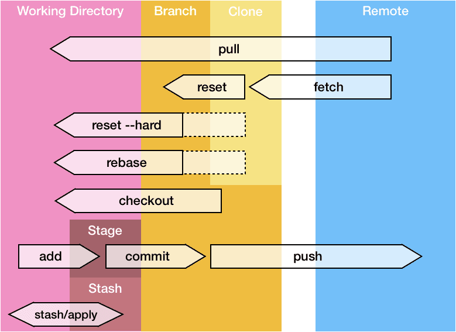
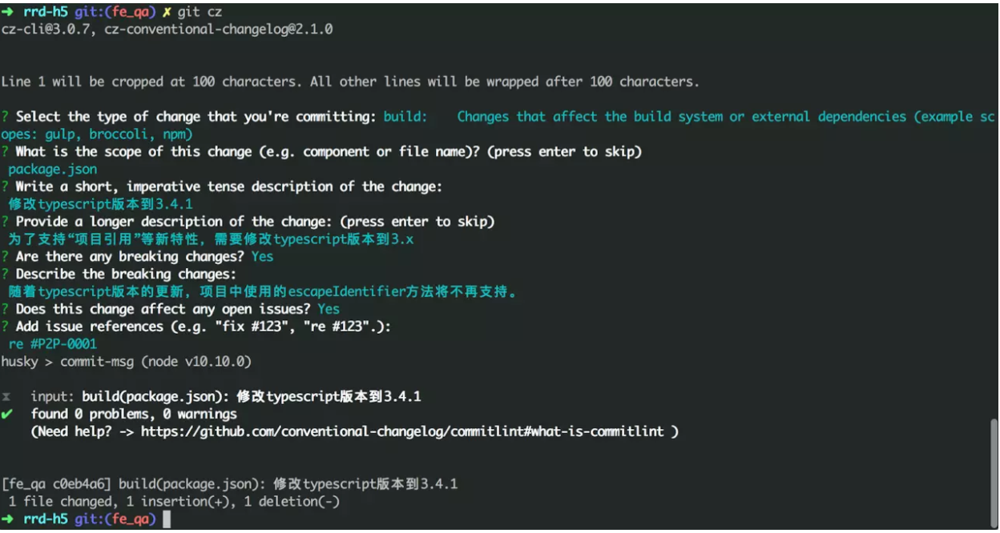
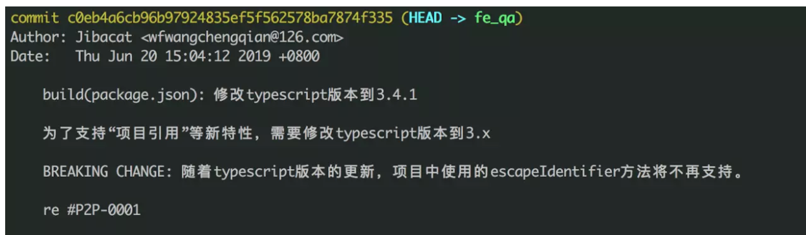

## git



### 命令

#### 用户名设置

安装完成后，还需要最后一步设置，在命令行输入：
$ git config --global user.name "Your Name"
$ git config --global user.email "email@example.com"

要随时掌握工作区的状态，使用git status命令。如果git status告诉你有文件被修改过，用git diff可以查看修改。

HEAD指向的版本就是当前版本，因此，Git允许我们在版本的历史之间穿梭

#### git log 查看历史

穿梭前，用git log可以查看提交历史，以便确定要回退到哪个版本。

```bash
# 每个提交在一行内显示
git log --oneline

# 在所有提交日志中搜索包含「homepage」的提交
git log --all --grep='homepage'

# 获取某人的提交日志
git log --author="Maxence"
```

#### git reflog/reset

要重返未来，用git reflog查看命令历史，以便确定要回到未来的哪个版本。

```bash
# 获取所有操作历史
git reflog

# 重置到相应提交
git reset HEAD@{4}
# ……或者……
git reset --hard <提交的哈希值>
```

1. 工作区（Working Directory）就是你在电脑里能看到的目录，比如我的learngit文件夹就是一个工作区：

2. 版本库（Repository）工作区有一个隐藏目录.git，这个不算工作区，而是Git的版本库。Git的版本库里存了很多东西，其中最重要的就是称为stage（或者叫index）的暂存区，还有Git为我们自动创建的第一个分支master，以及指向master的一个指针叫HEAD。

3. 我们前面讲了，Git管理的是修改，当你用git add命令后，在工作区的第一次修改被放入暂存区，准备提交，但是，在工作区的第二次修改并没有放入暂存区，所以，git commit只负责把暂存区的修改提交了，也就是第一次的修改被提交了，第二次的修改不会被提交。

4. 提交后，用git diff HEAD -- readme.txt命令可以查看工作区和版本库里面最新版本的区别：每次修改，如果不用git add到暂存区，那就不会加入到commit中。

5. 要关联一个远程库，使用命令

   `git remote add origin git@server-name:path/repo-name.git`

   删除远程库 `git remote rm origin`

   关联后，使用命令`git push -u origin master`第一次推送master分支的所有内容；

   此后，每次本地提交后，只要有必要，就可以使用命令`git push origin master`推送最新修改；

6. `git remote ` 你的项目关联的远程存储库列表

7. 要克隆一个仓库，首先必须知道仓库的地址，然后使用git clone命令克隆。
   `git clone git@github.com:michaelliao/gitskills.git`

8. 首先，我们创建dev分支，然后切换到dev分支：

   `git checkout -b dev	//Switched to a new branch 'dev'`

    git checkout命令加上-b参数表示创建并切换，相当于以下两条命令：

    >`git branch dev`
    >
    >`git checkout dev`

    然后，查看当前分支：

    `git branch`

    会列出所有分支，当前分支前面会标一个*号。

    然后，我们就可以在dev分支上正常提交，比如对readme.txt做个修改，加上一行：
    `Creating a new branch is quick.`

    然后提交：

    ```
    $ git add readme.txt 
    $ git commit -m "branch test"
    ```

    现在，dev分支的工作完成，我们就可以切换回master分支：

    ```shell
    git checkout master
    //Switched to branch 'master'
    ```

    切换回master分支后，再查看一个readme.txt文件，刚才添加的内容不见了！
    因为那个提交是在dev分支上，而master分支此刻的提交点并没有变. 

    现在，我们把dev分支的工作成果合并到master分支上：
    `git merge dev`

    `git merge`命令用于合并指定分支到当前分支。合并后，再查看readme.txt的内容，就可以看到，和dev分支的最新提交是完全一样的。

    > 注意到上面的Fast-forward信息，Git告诉我们，这次合并是“快进模式”，也就是直接把master指向dev的当前提交，所以合并速度非常快。当然，也不是每次合并都能Fast-forward，我们后面会讲其他方式的合并。 

    合并完成后，就可以放心地删除dev分支了：
    `git branch -d dev`

    删除后，查看branch，就只剩下master分支了：
    `git branch`

    因为创建、合并和删除分支非常快，所以Git鼓励你使用分支完成某个任务，合并后再删掉分支，这和直接在master分支上工作效果是一样的，但过程更安全。

### .gitignore

```bash
# 此为注释 – 将被 Git 忽略
*.a       ``# 忽略所有 .a 结尾的文件
!lib.a    ``# 但 lib.a 除外
/TODO`     `# 仅仅忽略项目根目录下的 TODO 文件，不包括 subdir/TODO
build/    ``# 忽略 build/ 目录下的所有文件
doc/*.txt ``# 会忽略 doc/notes.txt 但不包括 doc/server/arch.txt
```

• 所有空行或者以 # 开头的行都会被 Git 忽略。 • 可以使用标准的 glob 模式匹配。
 • 匹配模式可以以(/)开头防止递归。
 • 匹配模式可以以(/)结尾指定目录。 

• 要忽略指定模式以外的文件或目录，可以在模式前加上惊叹号(!)取反。

所谓的 glob 模式是指 shell 所使用的简化了的正则表达式。 星号(\*)匹配零个或多个任意字符;[abc] 匹配 任何一个列在方括号中的字符(这个例子要么匹配一个 a，要么匹配一个 b，要么匹配一个 c);问号(?)只匹配一个任意字符;如果在方括号中使用短划线分隔两个字符，表示所有在这两个字符范围内的都可以匹配 (比如 [0-9] 表示匹配所有 0 到 9 的数字)。 使用两个星号(*) 表示匹配任意中间目录，比如 a/**/z 可以匹 配 a/z , a/b/z 或 a/b/c/z 等。 

!!!使更改后的gitignore生效：

```bash
git rm -r --cached .  #清除缓存
git add . #重新trace file
```

### 提交规范

一般个人开发时可随意遵守，但对于团队感觉还是适用的。

[使用插件可访问](https://juejin.im/post/5d0b3f8c6fb9a07ec07fc5d0)

基本commit样式

```bash
<type>(<scope>): <subject>
<BLANK LINE>
<body>
<BLANK LINE>
<footer>
```

#### 1.type

`type`为必填项，用于指定commit的类型，约定了`feat`、`fix`两个`主要type`，以及docs、style、build、refactor、revert五个`特殊type`，`其余type`暂不使用。

```
# 主要type
feat:     增加新功能
fix:      修复bug

# 特殊type
docs:     只改动了文档相关的内容
style:    不影响代码含义的改动，例如去掉空格、改变缩进、增删分号
build:    构造工具的或者外部依赖的改动，例如webpack，npm
refactor: 代码重构时使用
revert:   执行git revert打印的message

# 暂不使用type
test:     添加测试或者修改现有测试
perf:     提高性能的改动
ci:       与CI（持续集成服务）有关的改动
chore:    不修改src或者test的其余修改，例如构建过程或辅助工具的变动
复制代码
```

当一次改动包括`主要type`与`特殊type`时，统一采用`主要type`。

#### 2.scope

`scope`也为必填项，用于描述改动的范围，格式为项目名/模块名，例如： `node-pc/common` `rrd-h5/activity`，而`we-sdk`不需指定模块名。如果一次commit修改多个模块，建议拆分成多次commit，以便更好追踪和维护。

#### 3.body

`body`填写详细描述，主要描述`改动之前的情况`及`修改动机`，对于小的修改不作要求，但是重大需求、更新等必须添加body来作说明。

#### 4.break changes

`break changes`指明是否产生了破坏性修改，涉及break changes的改动必须指明该项，类似版本升级、接口参数减少、接口删除、迁移等。

#### 5.affect issues

`affect issues`指明是否影响了某个问题。例如我们使用jira时，我们在`commit message`中可以填写其影响的`JIRA_ID`，若要开启该功能需要先打通`jira`与`gitlab`。参考文档：[docs.gitlab.com/ee/user/pro…](https://docs.gitlab.com/ee/user/project/integrations/jira.html)

填写方式例如：

```
re #JIRA_ID
fix #JIRA_ID
```

#### 示例

- 完整的commit message示例

  

- 相应的git log

  

## Mysql

重要！进行用户相关操作后记得刷新权限！！！`FLUSH PRIVILEGES;`

+ 列出所有数据库

  `show databases; `

+ 删除数据库

  `drop database name;`

+ 新建数据库

  `create database name;`

+ 新建用户

  `create user movie_user@% identified by'123456';`

  > @后面的参数是指该用户可以登陆的ip地址，"%"是可以在任意ip登陆。

>用户名@IP地址         用户只能该IP下才能访问
>用户名@192.168.1.%   用户只能在改IP段下才能访问(通配符%表示任意)
>用户名@%             用户可以再任意IP下访问(默认IP地址为%)

+ 删除用户

  `drop user '用户名'@'IP地址';`

+ 修改用户及密码

  `rename user '用户名'@'IP地址' to '新用户名'@'IP地址';`

  `set password for '用户名'@'IP地址' = Password('新密码');`

+ 查看权限

  `show grants for '用户'@'IP地址';`

+ 赋予权限

  `GRANT ALL PRIVILEGES ON mall.* TO 'test'@'%'`

  ```shell
  grant 权限 on 数据库.表 to '用户'@'IP地址';
   
  //all privileges  除grant外的所有权限
  select          仅查权限
  select,insert   查和插入权限
  ...
  usage                   无访问权限
  alter                   使用alter table
  alter routine           使用alter procedure和drop procedure
  create                  使用create table
  create routine          使用create procedure
  create temporary tables 使用create temporary tables
  create user             使用create user、drop user、rename user和revoke all privileges
  create view             使用create view
  delete                  使用delete
  drop                    使用drop table
  execute                 使用call和存储过程
  file                    使用select into outfile 和 load data infile
  grant option            使用grant 和 revoke
  index                   使用index
  insert                  使用insert
  lock tables             使用lock table
  process                 使用show full processlist
  select                  使用select
  show databases          使用show databases
  show view               使用show view
  update                  使用update
  reload                  使用flush
  shutdown                使用mysqladmin shutdown(关闭MySQL)
  super                   使用change master、kill、logs、purge、master和set global。还允许mysqladmin????调试登陆
  replication client      服务器位置的访问
  replication slave       由复制从属使用
  ================================================= 
  数据库名.*           数据库中的所有
  数据库名.表             指定数据库中的某张表
  数据库名.存储过程       指定数据库中的存储过程
  *.*                    所有数据库
  ```

+ 删除权限

  `revoke 权限 on 数据库.表 from '用户'@'IP地址';`

## RPM

#### RPM概述

RPM（RedHat Package Manager），RedHat软件包管理工具，类似windows里面的setup.exe是Linux这系列操作系统里面的打包安装工具，它虽然是RedHat的标志，但理念是通用的。

RPM包的名称格式:

Apache-1.3.23-11.i386.rpm

- “apache” 软件名称

- “1.3.23-11”软件的版本号，主版本和此版本

- “i386”是软件所运行的硬件平台，Intel 32位微处理器的统称

- “rpm”文件扩展名，代表RPM包

#### RPM查询命令（rpm -qa）

##### 基本语法

```bash
$ rpm -qa				（功能描述：查询所安装的所有rpm软件包）
```

##### 经验技巧

由于软件包比较多，一般都会采取过滤。**rpm -qa | grep rpm**软件包

##### 案例

（1）查询firefox软件安装情况

```bash
[root@hadoop101 Packages]# rpm -qa |grep firefox 
-------------
firefox-45.0.1-1.el6.centos.x86_64
```

#### RPM卸载命令（rpm -e）

##### 基本语法

```bash
 $ rpm -e RPM软件包   

$ rpm -e --nodeps 软件包 
```

##### 选项说明

| 选项     | 功能                                                         |
| -------- | ------------------------------------------------------------ |
| -e       | 卸载软件包                                                   |
| --nodeps | 卸载软件时，不检查依赖。这样的话，那些使用该软件包的软件在此之后可能就不能正常工作了。 |

##### 案例

（1）卸载firefox软件

```bash
[root@hadoop101 Packages]# rpm -e firefox
```

#### RPM安装命令（rpm -ivh）

##### 基本语法

```bash
$ rpm -ivh RPM包全名
```

##### 选项说明

| 选项     | 功能                     |
| -------- | ------------------------ |
| -i       | -i=install，安装         |
| -v       | -v=verbose，显示详细信息 |
| -h       | -h=hash，进度条          |
| --nodeps | --nodeps，不检测依赖进度 |

##### 案例

（1）安装firefox软件

```bash
[root@hadoop101 Packages]# pwd
-------------------------------
/media/CentOS_6.8_Final/Packages

[root@hadoop101 Packages]# rpm -ivh firefox-45.0.1-1.el6.centos.x86_64.rpm 
---------------------------------------
warning: firefox-45.0.1-1.el6.centos.x86_64.rpm: Header V3 RSA/SHA1 Signature, key ID c105b9de: NOKEY
Preparing...                ########################################### [100%]
   1:firefox                ########################################### [100%]
```

## yum

YUM（全称为 Yellow dog Updater, Modified）是一个在Fedora和RedHat以及CentOS中的Shell前端软件包管理器。基于RPM包管理，能够从指定的服务器自动下载RPM包并且安装，可以自动处理依赖性关系，并且一次安装所有依赖的软件包，无须繁琐地一次次下载、安装，

#### 语法

```shell
yum [options] [command] [package ...]
```

- **options：**可选，选项包括-h（帮助），-y（当安装过程提示选择全部为"yes"），-q（不显示安装的过程）等等。
- **command：**要进行的操作。
- **package**：操作的对象。

#### command

| 参数         | 功能                          |
| ------------ | ----------------------------- |
| install      | 安装rpm软件包                 |
| update       | 更新rpm软件包                 |
| check-update | 检查是否有可用的更新rpm软件包 |
| remove       | 删除指定的rpm软件包           |
| list         | 显示软件包信息                |
| clean        | 清理yum过期的缓存             |
| deplist      | 显示yum软件包的所有依赖关系   |

********

+ 列出所有可更新的软件清单命令：yum check-update

- 更新所有软件命令：yum update
- 仅安装指定的软件命令：yum install <package_name>
- 仅更新指定的软件命令：yum update <package_name>
- 列出所有可安裝的软件清单命令：yum list
- 删除软件包命令：yum remove <package_name>
- 查找软件包 命令：yum search <keyword>
- 清除缓存命令:
  - yum clean packages: 清除缓存目录下的软件包
  - yum clean headers: 清除缓存目录下的 headers
  - yum clean oldheaders: 清除缓存目录下旧的 headers
  - yum clean, yum clean all (= yum clean packages; yum clean oldheaders) :清除缓存目录下的软件包及旧的headers

## brew

brew 是 Mac 下的一个包管理工具，类似于 centos 下的 yum，可以很方便地进行安装/卸载/更新各种软件包，例如：nodejs, elasticsearch, kibana, mysql, mongodb 等等，可以用来快速搭建各种本地环境，程序员必备工具

#### 安装 

```oz
/usr/bin/ruby -e "$(curl -fsSL https://raw.githubusercontent.com/Homebrew/install/master/install)"
```

#### 基本用法

- 安装/卸载/更新
  以 nodejs 为例，执行下面命令即可，安装目录在 /usr/local/Cellar

   ```brew install nodejs```

- 如果需要更新或卸载

```
brew upgrade nodejs
brew remove nodejs
```

- 其他命令

```bash
brew list                   # 列出当前安装的软件
brew search nodejs          # 查询与 nodejs 相关的可用软件
brew info nodejs            # 查询 nodejs 的安装信息
```

- 如果需要指定版本，可以在 brew search 查看有没有需要的版本，在 @ 后面指定版本号，例如 brew install thrift@0.9

#### brew services

- brew services 是一个非常强大的工具，可以用来管理各种服务的启停，有点像 linux 里面的 services，非常方便，以 elasticsearch 为例

```bash
brew install elasticsearch          # 安装 elasticsearch
brew services start elasticsearch   # 启动 elasticsearch
brew services stop elasticsearch    # 停止 elasticsearch
brew services restart elasticsearch # 重启 elasticsearch
brew services list                  # 列出当前的状态
```

##### brew services 服务相关配置以及日志路径

配置路径：/usr/local/etc/
日志路径：/usr/local/var/log

## systemctl

从CentOS 7.x开始，CentOS开始使用systemd服务来代替daemon，

原来管理系统启动和管理系统服务的相关命令全部由systemctl命令来代替。

#### 原来的 service 命令与 systemctl 命令对比

| daemon命令             | systemctl命令                 | 说明     |
| ---------------------- | ----------------------------- | -------- |
| service [服务] start   | systemctl start [unit type]   | 启动服务 |
| service [服务] stop    | systemctl stop [unit type]    | 停止服务 |
| service [服务] restart | systemctl restart [unit type] | 重启服务 |

#### **此外还是二个systemctl参数没有与service命令参数对应**

- status：参数来查看服务运行情况
- reload：重新加载服务，加载更新后的配置文件（并不是所有服务都支持这个参数，比如network.service）

应用举例：

```bash
#启动网络服务
systemctl start network.service

#停止网络服务
systemctl stop network.service

#重启网络服务
systemctl restart network.service

#查看网络服务状态
systemctl status network.serivce
```

#### 原来的chkconfig 命令与 systemctl 命令对比

#### 设置开机启动/不启动

| daemon命令           | systemctl命令                 | 说明                 |
| -------------------- | ----------------------------- | -------------------- |
| chkconfig [服务] on  | systemctl enable [unit type]  | 设置服务开机启动     |
| chkconfig [服务] off | systemctl disable [unit type] | 设备服务禁止开机启动 |

应用举例：

```bash
#停止cup电源管理服务
systemctl stop cups.service

#禁止cups服务开机启动
systemctl disable cups.service

#查看cups服务状态
systemctl status cups.service

#重新设置cups服务开机启动
systemctl enable cups.service
```

#### 查看系统上上所有的服务

命令格式：

```bash
systemctl [command] [–type=TYPE] [–all]
```

参数详解：

command – list-units：依据unit列出所有启动的unit。加上 –all 才会列出没启动的unit; – list-unit-files:依据/usr/lib/systemd/system/ 内的启动文件，列出启动文件列表

–type=TYPE – 为unit type, 主要有service, socket, target

应用举例：

| systemctl命令                                    | 说明                       |
| ------------------------------------------------ | -------------------------- |
| systemctl                                        | 列出所有的系统服务         |
| systemctl list-units                             | 列出所有启动unit           |
| systemctl list-unit-files                        | 列出所有启动文件           |
| systemctl list-units –type=service –all          | 列出所有service类型的unit  |
| systemctl list-units –type=service –all grep cpu | 列出 cpu电源管理机制的服务 |
| systemctl list-units –type=target –all           | 列出所有target             |

#### systemctl特殊的用法

| systemctl命令                   | 说明                       |
| ------------------------------- | -------------------------- |
| systemctl is-active [unit type] | 查看服务是否运行           |
| systemctl is-enable [unit type] | 查看服务是否设置为开机启动 |
| systemctl mask [unit type]      | 注销指定服务               |
| systemctl unmask [unit type]    | 取消注销指定服务           |

应用举例：

```bash
#查看网络服务是否启动
systemctl is-active network.service

#检查网络服务是否设置为开机启动
systemctl is-enable network.service

#停止cups服务
systemctl stop cups.service

#注销cups服务
systemctl mask cups.service

#查看cups服务状态
systemctl status cups.service

#取消注销cups服务
systemctl unmask cups.service
```

