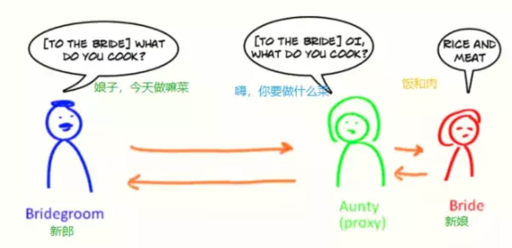
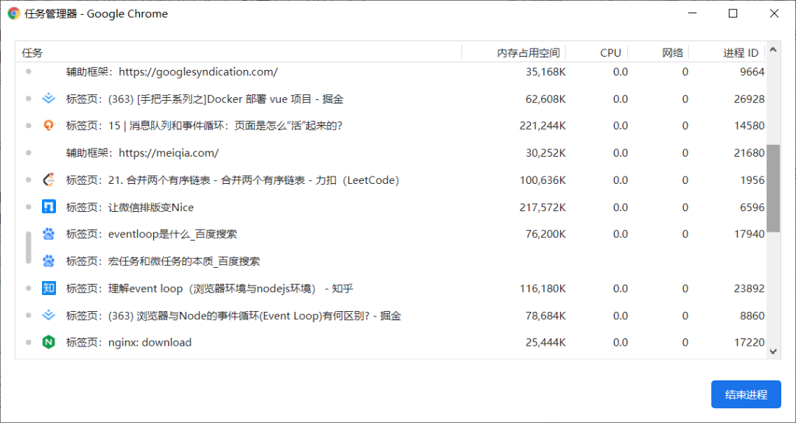
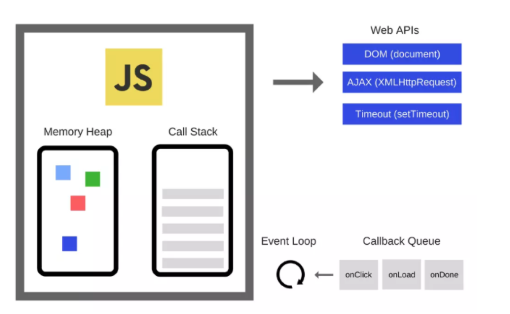
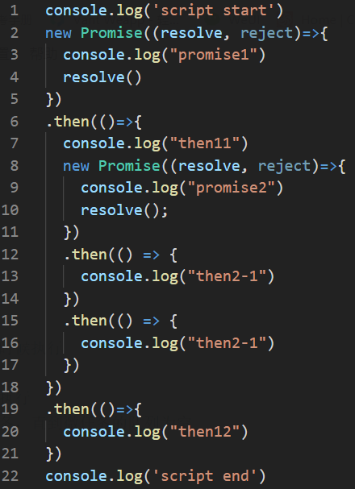
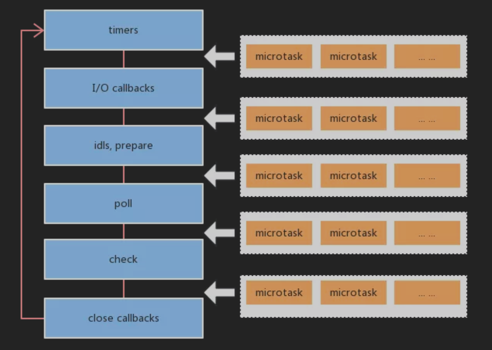
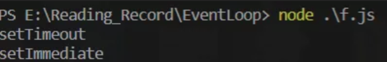
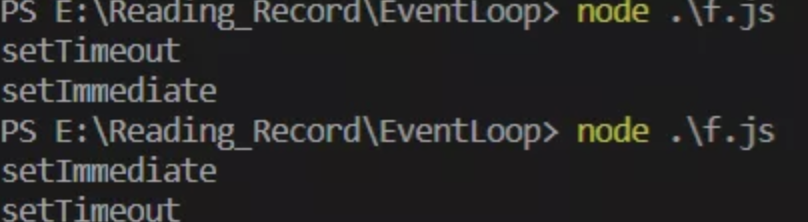
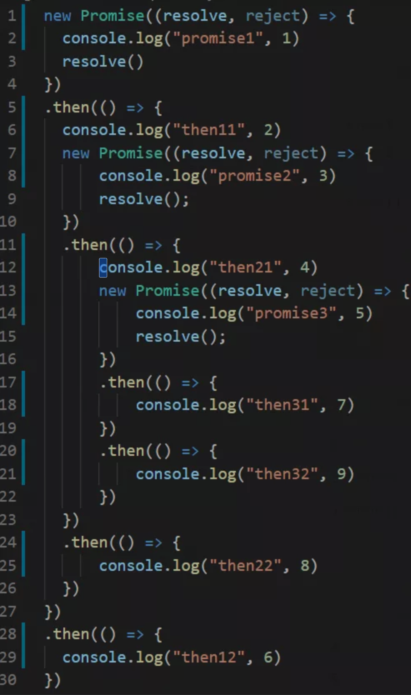

# JavaScript

### 技巧

百度云网页端倍速 `videojs.getPlayers("html5player_html5_api").html5player.tech_.setPlaybackRate(2)`

### Array技巧

#### Array.includes Array.indexOf 

“如果你要在数组中查找元素，请使用 Array.indexOf”。我记得在学习 JavaScript 的时候，在教材中读到这样的一句话。毫无疑问，这句话是真的！

MDN 文档写道，Array.indexOf 将“返回第一次出现给定元素的索引”。因此，如果我们稍后要在代码中使用这个返回的索引，那么使用 Array.indexOf 找到索引就对了。

但是，如果我们只想知道数组是否包含某个值，该怎么办？这似乎是一个是与否的问题，或者说是一个布尔值问题。对于这种情况，我建议使用返回布尔值的 Array.includes。

```javascript
const characters = [
  'ironman',
  'black_widow',
  'hulk',
  'captain_america',
  'hulk',
  'thor',
];

console.log(characters.indexOf('hulk'));
// 2
console.log(characters.indexOf('batman'));
// -1

console.log(characters.includes('hulk'));
// true
console.log(characters.includes('batman'));
// false

```

#### Array.some  Array.find 

Array.find 需要一个回调函数作为参数，并返回一个元素。如果我们想要知道数组是否包含某个值，Array.find 是最好的解决方案吗？可能不是，因为它返回的是一个元素值，而不是一个布尔值。

对于这种情况，我建议使用 Array.some，它返回所需的布尔值。另外，从语义上看，Array.some 表示我们只想知道某个元素是否存在，而不需要得到这个元素

```javascript
const characters = [
  { id: 1, name: 'ironman', env: 'marvel' },
  { id: 2, name: 'black_widow', env: 'marvel' },
  { id: 3, name: 'wonder_woman', env: 'dc_comics' },
];

function hasCharacterFrom(env) {
  return character => character.env === env;
}

console.log(characters.find(hasCharacterFrom('marvel')));
// { id: 1, name: 'ironman', env: 'marvel' }

console.log(characters.some(hasCharacterFrom('marvel')));
// true
```

#### Array.reduce 而不是链接 Array.filter 和 Array.map 

我们遍历了两次数组。第一次过滤数组并创建一个较短的数组，第二次又基于 Array.filter 获得数组创建一个包含新值的数组。为了获得我们想要的新数组，我们使用了两个 Array 方法。每个方法都有自己的回调函数和一个用不到的数组——由 Array.filter 创建的那个数组。

为了避免这种性能损耗，我的建议是使用 Array.reduce。结果是一样的，代码却更简单！ 我们可以使用 Array.reduce 进行过滤，并将目标元素添加到累加器中。累加器可以是递增的数字、要填充的对象、要连接的字符串或数组。

在我们的例子中，因为之前使用了 Array.map，所以我建议使用 Array.reduce 将满足条件的数组元素加入到累加器中。在下面的示例中，根据 env 值的具体情况，我们将它添加到累加器中或保持累加器不变。

```javascript
const characters = [
  { name: 'ironman', env: 'marvel' },
  { name: 'black_widow', env: 'marvel' },
  { name: 'wonder_woman', env: 'dc_comics' },
];

console.log(
  characters
    .filter(character => character.env === 'marvel')
    .map(character => Object.assign({}, character, { alsoSeenIn: ['Avengers'] }))
);
// [
//   { name: 'ironman', env: 'marvel', alsoSeenIn: ['Avengers'] },
//   { name: 'black_widow', env: 'marvel', alsoSeenIn: ['Avengers'] }
// ]

console.log(
  characters
    .reduce((acc, character) => {
      return character.env === 'marvel'
        ? acc.concat(Object.assign({}, character, { alsoSeenIn: ['Avengers'] }))
        : acc;
    }, [])
)
// [
//   { name: 'ironman', env: 'marvel', alsoSeenIn: ['Avengers'] },
//   { name: 'black_widow', env: 'marvel', alsoSeenIn: ['Avengers'] }
// ]
```

### Array文档

#### Array.join()

```javascript
arr.join([separator])
```

```javascript
const elements = ['Fire', 'Air', 'Water'];

console.log(elements.join());
// expected output: "Fire,Air,Water"

console.log(elements.join(''));
// expected output: "FireAirWater"

console.log(elements.join('-'));
// expected output: "Fire-Air-Water"

//> "Fire,Air,Water"
//> "FireAirWater"
//> "Fire-Air-Water"
```

##### 参数

- `separator` 可选

  指定一个字符串来分隔数组的每个元素。如果需要，将分隔符转换为字符串。如果缺省该值，数组元素用逗号（`,`）分隔。如果`separator`是空字符串(`""`)，则所有元素之间都没有任何字符。

##### 返回值

一个所有数组元素连接的字符串。如果 `arr.length` 为0，则返回空字符串。

##### 描述

所有的数组元素被转换成字符串，再用一个分隔符将这些字符串连接起来。

如果一个元素为 `undefined` 或 `null`，它会被转换为空字符串。

#### Array.reduce() 

方法对数组中的每个元素执行一个由您提供的**reducer**函数(升序执行)，将其结果汇总为单个返回值。

```javascript
arr.reduce(callback(accumulator, currentValue[, index[, array]])[, initialValue])
```

##### **参数**

- `callback`

  执行数组中每个值 (如果没有提供 `initialValue则第一个值除外`)的函数，包含四个参数：

  + **`accumulator`**累计器累计回调的返回值; 它是上一次调用回调时返回的累积值，或`initialValue`（见于下方）。

  + `currentValue`数组中正在处理的元素。

  + `index` 可选数组中正在处理的当前元素的索引。如果提供`initialValue`，则起始索引号为0，否则从索引1起始。
  + `array`可选调用`reduce()`的数组

- `initialValue`可选

  作为第一次调用 `callback`函数时的第一个参数的值。 如果没有提供初始值，则将使用数组中的第一个元素。 在没有初始值的空数组上调用 reduce 将报错。

##### **返回值**

函数累计处理的结果

##### **描述**

`reduce`为数组中的每一个元素依次执行`callback`函数，不包括数组中被删除或从未被赋值的元素，接受四个参数：

- `accumulator 累计器`
- `currentValue 当前值`
- `currentIndex 当前索引`
- `array 数组`

回调函数第一次执行时，`accumulator` 和`currentValue`的取值有两种情况：如果调用`reduce()`时提供了`initialValue`，`accumulator`取值为`initialValue`，`currentValue`取数组中的第一个值；如果没有提供 `initialValue`，那么`accumulator`取数组中的第一个值，`currentValue`取数组中的第二个值。

**注意：**如果没有提供`initialValue`，reduce 会从索引1的地方开始执行 callback 方法，跳过第一个索引。如果提供`initialValue`，从索引0开始。

如果数组为空且没有提供`initialValue`，会抛出[`TypeError`](https://developer.mozilla.org/zh-CN/docs/Web/JavaScript/Reference/Global_Objects/TypeError) 。如果数组仅有一个元素（无论位置如何）并且没有提供`initialValue`， 或者有提供`initialValue`但是数组为空，那么此唯一值将被返回并且`callback`不会被执行。

## Proxy

使用`Proxy`，你可以将一只猫伪装成一只老虎。下面大约有6个例子，我希望它们能让你相信，Proxy 提供了强大的 Javascript 元编程。

尽管它不像其他ES6功能用的普遍，但`Proxy`有许多用途，包括运算符重载，对象模拟，简洁而灵活的API创建，对象变化事件，甚至Vue 3背后的内部响应系统提供动力。

`Proxy`用于修改某些操作的默认行为，也可以理解为在目标对象之前架设一层**拦截**，外部所有的访问都必须先通过这层拦截，因此提供了一种机制，可以对外部的访问进行过滤和修改。这个词的原理为代理，在这里可以表示由它来“代理”某些操作，译为“代理器”。

`var proxy = new Proxy(target, handler);`

`Proxy`对象的所有用法，都是上面的这种形式。不同的只是`handle`参数的写法。其中`new Proxy`用来生成`Proxy`实例，`target`是表示所要拦截的对象，`handle`是用来定制拦截行为的对象。

下面是 Proxy 最简单的例子是，这是一个有陷阱的代理，一个`get`陷阱，总是返回`42`。

```javascript
let target = {    x: 10,    y: 20};
let hanler = {    get: (obj, prop) => 42};
target = new Proxy(target, hanler);
target.x; //42target.y; //42target.x; // 42
```

结果是一个对象将为任何属性访问操作都返回“42”。这包括`target.x`，`target['x']`，`Reflect.get(target, 'x')`等。

但是，Proxy 陷阱当然不限于属性的读取。它只是十几个不同陷阱中的一个：

- handler.get
- handler.set
- handler.has
- handler.apply
- handler.construct
- handler.ownKeys
- handler.deleteProperty
- handler.defineProperty
- handler.isExtensible
- handler.preventExtensions
- handler.getPrototypeOf
- handler.setPrototypeOf
- handler.getOwnPropertyDescriptor

#### 用途



##### **默认值/“零值”**

在 Go 语言中，有零值的概念，零值是特定于类型的隐式默认结构值。其思想是提供类型安全的默认基元值，或者用gopher的话说，给结构一个有用的零值。

虽然不同的创建模式支持类似的功能，但Javascript无法用隐式初始值包装对象。Javascript中未设置属性的默认值是`undefined`。但 Proxy 可以改变这种情况。

```javascript
const withZeroValue = (target, zeroValue) =>    new Proxy(target, {        get: (obj, prop) => (prop in obj ? obj[prop] : zeroValue)    });
```

函数`withZeroValue` 用来包装目标对象。如果设置了属性，则返回属性值。否则，它返回一个默认的**“零值”**。

从技术上讲，这种方法也不是隐含的，但如果我们扩展`withZeroValue`，以Boolean (`false`), Number (`0`), String (`""`), Object (`{}`)，Array (`[]`)等对应的零值，则可能是隐含的。

```javascript
let pos = {    x: 4,    y: 19};
console.log(pos.x, pos.y, pos.z); // 4, 19, undefined
pos = withZeroValue(pos, 0);
console.log(pos.z, pos.y, pos.z); // 4, 19, 0
```

此功能可能有用的一个地方是坐标系。绘图库可以基于数据的形状自动支持2D和3D渲染。不是创建两个单独的模型，而是始终将`z`默认为 `0` 而不是`undefined`，这可能是有意义的。

## Promise

**Promise** 对象用于表示一个异步操作的最终完成 (或失败), 及其结果值.

```javascript
const promise1 = new Promise(function(resolve, reject) {
  setTimeout(function() {
    resolve('foo');
  }, 300);
});

promise1.then(function(value) {
  console.log(value);
  // expected output: "foo"
});

console.log(promise1);
// expected output: [object Promise]
```

### 构造函数语法

`new Promise( function(resolve, reject) {...} /* executor */  );`

executor

> executor是带有 `resolve` 和 `reject` 两个参数的函数 。Promise构造函数执行时立即调用`executor` 函数， `resolve` 和 `reject` 两个函数作为参数传递给`executor`（executor 函数在Promise构造函数返回所建promise实例对象前被调用）。`resolve` 和 `reject` 函数被调用时，分别将promise的状态改为*fulfilled（*完成）或rejected（失败）。executor 内部通常会执行一些异步操作，一旦异步操作执行完毕(可能成功/失败)，要么调用resolve函数来将promise状态改成*fulfilled*，要么调用`reject` 函数将promise的状态改为rejected。如果在executor函数中抛出一个错误，那么该promise 状态为rejected。executor函数的返回值被忽略。

### 介绍

`Promise` 对象是一个代理对象（代理一个值），被代理的值在Promise对象创建时可能是未知的。它允许你为异步操作的成功和失败分别绑定相应的处理方法（handlers）。 这让异步方法可以像同步方法那样返回值，**但并不是立即返回最终执行结果，而是一个能代表未来出现的结果的promise对象**。

一个 `Promise`有以下几种状态:

- *pending*: 初始状态，既不是成功，也不是失败状态。
- *fulfilled*: 意味着操作成功完成。
- *rejected*: 意味着操作失败。

pending 状态的 Promise 对象可能会变为fulfilled 状态并传递一个值给相应的状态处理方法，也可能变为失败状态（rejected）并传递失败信息。**当其中任一种情况出现时，Promise 对象的 `then` 方法绑定的处理方法（handlers ）就会被调用**（then方法包含两个参数：onfulfilled 和 onrejected，它们都是 Function 类型。当Promise状态为*fulfilled*时，调用 then 的 onfulfilled 方法，当Promise状态为*rejected*时，调用 then 的 onrejected 方法， 所以在异步操作的完成和绑定处理方法之间不存在竞争）。

因为 `Promise.prototype.then` 和 `Promise.prototype.catch` 方法返回promise 对象， 所以它们可以被链式调用。


**不要和惰性求值混淆：** 有一些语言中有惰性求值和延时计算的特性，它们也被称为“promises”，例如Scheme. Javascript中的promise代表一种已经发生的状态， 而且可以通过回调方法链在一起。 如果你想要的是表达式的延时计算，考虑无参数的"[箭头方法](https://developer.mozilla.org/zh-CN/docs/Web/JavaScript/Reference/Functions/Arrow_functions)": `f = () =>`*`表达式`* 创建惰性求值的表达式*，*使用 `f()` 求值。

**注意：** 如果一个promise对象处在fulfilled或rejected状态而不是pending状态，那么它也可以被称为*settled*状态。你可能也会听到一个术语*resolved* ，它表示promise对象处于settled状态。关于promise的术语， Domenic Denicola 的 [States and fates](https://github.com/domenic/promises-unwrapping/blob/master/docs/states-and-fates.md) 有更多详情可供参考。

### 属性

`Promise.length`

length属性，其值总是为 1 (构造器参数的数目).

[`Promise.prototype`](https://developer.mozilla.org/zh-CN/docs/Web/JavaScript/Reference/Global_Objects/Promise/prototype)

表示 `Promise` 构造器的原型.

### 方法

- [`Promise.all(iterable)`](https://developer.mozilla.org/zh-CN/docs/Web/JavaScript/Reference/Global_Objects/Promise/all)

  这个方法返回一个新的promise对象，该promise对象在iterable参数对象里所有的promise对象都成功的时候才会触发成功，一旦有任何一个iterable里面的promise对象失败则立即触发该promise对象的失败。这个新的promise对象在触发成功状态以后，会把一个包含iterable里所有promise返回值的数组作为成功回调的返回值，顺序跟iterable的顺序保持一致；如果这个新的promise对象触发了失败状态，它会把iterable里第一个触发失败的promise对象的错误信息作为它的失败错误信息。Promise.all方法常被用于处理多个promise对象的状态集合。（可以参考jQuery.when方法---译者注）

- [`Promise.race(iterable)`](https://developer.mozilla.org/zh-CN/docs/Web/JavaScript/Reference/Global_Objects/Promise/race)

  当iterable参数里的任意一个子promise被成功或失败后，父promise马上也会用子promise的成功返回值或失败详情作为参数调用父promise绑定的相应句柄，并返回该promise对象。

- [`Promise.reject(reason)`](https://developer.mozilla.org/zh-CN/docs/Web/JavaScript/Reference/Global_Objects/Promise/reject)

  返回一个状态为失败的Promise对象，并将给定的失败信息传递给对应的处理方法

- [`Promise.resolve(value)`](https://developer.mozilla.org/zh-CN/docs/Web/JavaScript/Reference/Global_Objects/Promise/resolve)

  返回一个状态由给定value决定的Promise对象。如果该值是thenable(即，带有then方法的对象)，返回的Promise对象的最终状态由then方法执行决定；否则的话(该value为空，基本类型或者不带then方法的对象),返回的Promise对象状态为fulfilled，并且将该value传递给对应的then方法。通常而言，如果你不知道一个值是否是Promise对象，使用Promise.resolve(value) 来返回一个Promise对象,这样就能将该value以Promise对象形式使用。

### 原型

#### 属性

- `Promise.prototype.constructor`

  返回被创建的实例函数.  默认为 [`Promise`](https://developer.mozilla.org/zh-CN/docs/Web/JavaScript/Reference/Global_Objects/Promise) 函数.

#### 方法

- [`Promise.prototype.catch(onRejected)`](https://developer.mozilla.org/zh-CN/docs/Web/JavaScript/Reference/Global_Objects/Promise/catch)

  添加一个拒绝(rejection) 回调到当前 promise, 返回一个新的promise。当这个回调函数被调用，新 promise 将以它的返回值来resolve，否则如果当前promise 进入fulfilled状态，则以当前promise的完成结果作为新promise的完成结果.

- [`Promise.prototype.then(onFulfilled, onRejected)`](https://developer.mozilla.org/zh-CN/docs/Web/JavaScript/Reference/Global_Objects/Promise/then)

  添加解决(fulfillment)和拒绝(rejection)回调到当前 promise, 返回一个新的 promise, 将以回调的返回值来resolve.

- [`Promise.prototype.finally(onFinally)`](https://developer.mozilla.org/zh-CN/docs/Web/JavaScript/Reference/Global_Objects/Promise/finally)

  添加一个事件处理回调于当前promise对象，并且在原promise对象解析完毕后，返回一个新的promise对象。回调会在当前promise运行完毕后被调用，无论当前promise的状态是完成(fulfilled)还是失败(rejected)

### 自己实现剖析

https://mp.weixin.qq.com/s/3xfLpQ2h0v8yt2W7opLwGw

### 20行案例

https://mp.weixin.qq.com/s/oHBv7r6x7tVOwm-LsnIbgA

```javascript
function Promise(excutor) {
  var self = this
  self.onResolvedCallback = []
  function resolve(value) {
    setTimeout(() => {
      self.data = value
      self.onResolvedCallback.forEach(callback => callback(value))
    })
  }
  excutor(resolve.bind(self))
}
Promise.prototype.then = function(onResolved) {
  var self = this
  returnnewPromise(resolve => {
    self.onResolvedCallback.push(function() {
      var result = onResolved(self.data)
      if (result instanceofPromise) {
        result.then(resolve)
      } else {
        resolve(result)
      }
    })
  })
}
```

#### 实现过程

1. 首先来实现Promise构造函数

   ```javascript
   function Promise(excutor) {
     var self = this
     self.onResolvedCallback = [] // Promise resolve时的回调函数集
   
     // 传递给Promise处理函数的resolve
     // 这里直接往实例上挂个data
     // 然后把onResolvedCallback数组里的函数依次执行一遍就可以
     function resolve(value) {
       // 注意promise的then函数需要异步执行
       setTimeout(() => {
         self.data = value
         self.onResolvedCallback.forEach(callback => callback(value))
       })
     }
   
     // 执行用户传入的函数
     excutor(resolve.bind(self))
   }
   ```

   好，写到这里先回过头来看案例

## Event Loop

`Event Loop是一个程序结构，用于等待和分派消息和事件`，我个人的理解是 JS 中的 Event Loop 是浏览器或 Node 的一种协调 JavaScript 单线程运行时不会阻塞的一种机制。

### JS 的单线程

很多人都知道的是，JavaScript 是一门**动态的解释型的语言**，具有**跨平台性**。在被问到 JavaScript 为什么是一门单线程的语言，有的人可能会这么回答：“语言特性决定了 JavaScript 是一个单线程语言，JavaScript 天生是一个单线程语言”，这只不过是一层糖衣罢了。

JavaScript 从诞生起就是单线程，原因大概是不想让浏览器变得太复杂，因为多线程需要共享资源、且有可能修改彼此的运行结果，对于一种网页脚本语言来说，这就太复杂了。

准确的来说，我认为 JavaScript 的单线程是指 **JavaScript 引擎是单线程**的，JavaScript 的引擎并不是独立运行的，跨平台意味着 JavaScript 依赖其运行的宿主环境 --- 浏览器(大部分情况下是浏览器)。

浏览器需要渲染 DOM，JavaScript 可以修改 DOM 结构，JavaScript 执行时，浏览器 DOM 渲染停止。如果 JavaScript 引擎线程不是单线程的，那么可以同时执行多段 JavaScript，如果这多段 JavaScript 都操作 DOM，那么就会出现 DOM 冲突。

举个例子来说，在同一时刻执行两个 script 对同一个 DOM 元素进行操作，一个修改 DOM，一个删除 DOM，那这样话浏览器就会懵逼了，它就不知道到底该听谁的，会有资源竞争，这也是 JavaScript 单线程的原因之一。

### 浏览器

#### 浏览器的多线程

之前说过，JavaScript 运行的宿主环境浏览器是多线程的。

以 Chrome 来说，我们可以通过 Chrome 的任务管理器来看看。



当你打开一个 Tab 页面的时候，就创建了一个进程。如果从一个页面打开了另一个页面，打开的页面和当前的页面属于同一站点的话，那么这个页面会复用父页面的渲染进程。

#### 浏览器主线程常驻线程

1. GUI 渲染线程

2. - 绘制页面，解析 HTML、CSS，构建 DOM 树，布局和绘制等
   - 页面重绘和回流
   - 与 JS 引擎线程互斥，也就是所谓的 JS 执行阻塞页面更新

3. JS 引擎线程

4. - 负责 JS 脚本代码的执行
   - 负责准执行准备好待执行的事件，即定时器计数结束，或异步请求成功并正确返回的事件
   - 与 GUI 渲染线程互斥，执行时间过长将阻塞页面的渲染

5. 事件触发线程

6. - 负责将准备好的事件交给 JS 引擎线程执行
   - 多个事件加入任务队列的时候需要排队等待(JS 的单线程)

7. 定时器触发线程

8. - 负责执行异步的定时器类的事件，如 setTimeout、setInterval
   - 定时器到时间之后把注册的回调加到任务队列的队尾

9. HTTP 请求线程

10. - 负责执行异步请求
    - 主线程执行代码遇到异步请求的时候会把函数交给该线程处理，当监听到状态变更事件，如果有回调函数，该线程会把回调函数加入到任务队列的队尾等待执行

这里没看懂没关系，后面我会再说。

### 浏览器端的 Event Loop



上图是一张 JS 的运行机制图，Js 运行时大致会分为几个部分：

1. Call Stack：调用栈(执行栈)，所有同步任务在主线程上执行，形成一个执行栈，因为 JS 单线程的原因，所以调用栈中每次只能执行一个任务，当遇到的同步任务执行完之后，由任务队列提供任务给调用栈执行。
2. Task Queue：任务队列，存放着异步任务，当异步任务可以执行的时候，任务队列会通知主线程，然后该任务会进入主线程执行。任务队列中的都是已经完成的异步操作，而不是说注册一个异步任务就会被放在这个任务队列中。

说到这里，Event Loop 也可以理解为：不断地从任务队列中取出任务执行的一个过程。

#### 同步任务和异步任务

上文已经说过了 JavaScript 是一门单线程的语言，一次只能执行一个任务，如果所有的任务都是同步任务，那么程序可能因为等待会出现假死状态，这对于一个用户体验很强的语言来说是非常不友好的。

比如说向服务端请求资源，你不可能一直不停的循环判断有没有拿到数据，就好像你点了个外卖，点完之后就开始一直打电话问外卖有没有送到，外卖小哥都会抄着锅铲来打你(狗头)。因此，在 JavaScript 中任务有了同步任务和异步任务，异步任务通过注册回调函数，等到数据来了就通知主程序。

1. 同步任务：必须等到结果来了之后才能做其他的事情，举例来说就是你烧水的时候一直等在水壶旁边等水烧开，期间不做其他的任何事情。
2. 异步任务：不需要等到结果来了才能继续往下走，等结果期间可以做其他的事情，结果来了会收到通知。举例来说就是你烧水的时候可以去做自己想做的事情，听到水烧开的声音之后再去处理。

从概念就可以看出来，异步任务从一定程度上来看比同步任务更高效一些，核心是提高了用户体验。

#### Event Loop

Event Loop 很好的调度了任务的运行，宏任务和微任务也知道了，现在我们就来看看它的调度运行机制。

JavaScript 的代码执行时，主线程会从上到下一步步的执行代码，同步任务会被依次加入执行栈中先执行，异步任务会在拿到结果的时候将注册的回调函数放入任务队列，当执行栈中的没有任务在执行的时候，引擎会从任务队列中读取任务压入执行栈(Call Stack)中处理执行。

#### 宏任务和微任务

现在就有一个问题了，任务队列是一个消息队列，先进先出，那就是说，后来的事件都是被加在队尾等到前面的事件执行完了才会被执行。如果在执行的过程中突然有重要的数据需要获取，或是说有事件突然需要处理一下，**按照队列的先进先出顺序这些是无法得到及时处理的。这个时候就催生了宏任务和微任务，微任务使得一些异步任务得到及时的处理**。

曾经看到的一个例子很好，宏任务和微任务形象的来说就是：你去营业厅办一个业务会有一个排队号码，当叫到你的号码的时候你去窗口办充值业务(宏任务执行)，在你办理充值的时候你又想改个套餐(微任务)，这个时候工作人员会直接帮你办，不可能让你重新排队。

所以上文说过的异步任务又分为宏任务和微任务，JS 运行时任务队列会分为宏任务队列和微任务队列，分别对应宏任务和微任务。

先介绍一下(浏览器环境的)宏任务和微任务大致有哪些：

- 宏任务：

- 1. script(整体的代码)
  2. setTimeout
  3. setInterval
  4. I/O 操作
  5. UI 渲染 (对这个笔者持保留意见)

- 微任务：

- 1. Promise.then
  2. MutationObserver

#### 事件运行顺序

1. 执行同步任务，同步任务不需要做特殊处理，直接执行(下面的步骤中遇到同步任务都是一样处理) --- 第一轮从 script开始
2. 从宏任务队列中取出队头任务执行
3. 如果产生了宏任务，将宏任务放入宏任务队列，下次轮循的时候执行
4. 如果产生了微任务，将微任务放入微任务队列
5. 执行完当前宏任务之后，取出微任务队列中的所有任务依次执行
6. 如果微任务执行过程中产生了新的微任务，则继续执行微任务，直到微任务的队列为空
7. 轮循，循环以上 2 - 6

总的来说就是：同步任务/宏任务 -> 执行产生的所有微任务(包括微任务产生的微任务) -> 同步任务/宏任务 -> 执行产生的所有微任务(包括微任务产生的微任务) -> 循环......

注意：微任务队列

#### 举个栗子

光说不练假把式，现在就来看一个例子：

举个栗子

放图的原因是为了让大家在看解析之前可以先自己按照运行顺序走一遍，写好答案之后再来看解析。
解析：
(用绿色的表示同步任务和宏任务，红色表示微任务)

```
+  console.log('script start')
+  setTimeout(function() {
+    console.log('setTimeout')
+  }, 0)
+  new Promise((resolve, reject)=>{
+    console.log("promise1")
+    resolve()
+  })
-  .then(()=>{
-    console.log("then11")
+    new Promise((resolve, reject)=>{
+      console.log("promise2")
+      resolve();
+    })
-    .then(() => {
-      console.log("then2-1")
-    })
-    .then(() => {
-      console.log("then2-2")
-    })
-  })
-  .then(()=>{
-    console.log("then12")
-  })
+  console.log('script end')
```

1. 首先遇到 console.log()，输出 `script start`
2. 遇到 setTimeout 产生宏任务，注册到**宏任务队列[setTimeout]**，下一轮 Event Loop 的时候在执行
3. 然后遇到 new Promise 构造声明(同步)，log 输出 `promise1`，然后 resolve
4. resolve 匹配到 **promise1 的第一个 then**，把这个 then 注册到**微任务队列[then11]中**，继续当前整体脚本的执行
5. 遇到最后的一个 log，输出 `script end`，**当前执行栈清空**
6. **从微任务队列中取出队头任务'then11'** 进行执行，其中有一个 log，输出 `then11`
7. 往下遇到 new Promise 构造声明(同步)，log 输出 `promise2`，然后 resolve
8. resolve 匹配到 **promise2 的第一个 then**，把这个 then 注册到**微任务队列[then2-1]**，当前 then11 可执行部分结束，然后产生了 **promise1 的第二个 then**，把这个 then 注册到**微任务队列[then2-1, then12]**
9. **拿出微任务队头任务'then2-1'** 执行，log 输出 `then2-1`，触发 **promise2 的第二个 then**，注册到**微任务队列[then12, then2-2]**
10. **拿出微任务队头任务'then12'**，log 输出 `then12`
11. **拿出微任务队头任务'then2-2'**，log 输出 `then2-2`
12. 微任务队列执行完毕，别忘了宏任务队列中的 setTimeout，log 输出 `setTimeout`

经过以上一番缜(xia)密(gao)分析，希望没有绕晕你，最后的输出结果就是：
`script start -> promise1 -> script end -> then11 -> promise2 -> then2-1 -> then12 -> then2-2 -> setTimeout`

#### 宏任务？微任务？

不知道大家看了宏任务和微任务之后会不会有一个疑惑，宏任务和微任务都是异步任务，微任务之前说过了是为了及时解决一些必要事件而产生的。

- 为什么要有微任务？
  为什么要有微任务的原因前面已经说了，这里就不再赘述，简单说一下就是为了及时处理一些任务，不然等到最后再执行的时候拿到的数据可能已经是被污染的数据达不到预期目标了。

- 是什么宏任务？什么是微任务？
  相信大家在学习 Event Loop 查找资料的时候，肯定各种资料里面都会讲到宏任务和微任务，但是不知道你有没有灵魂拷问过你自己：`什么是宏任务？什么是微任务？怎么区分宏任务和微任务？`不能只是默许接受这个概念，在这里，我根据我的个人理解进行一番说(hu)明(che)

- 宏任务和微任务的真面目
  其实在 Chrome 的源码中并没有什么宏任务和微任务的代码或是说明，在 **JS 大会**[3]上提到过微任务这个名词，但是也没有说到底什么是微任务。

  宏任务
  文章最开始的时候说过，在 chrome 里，每个页面都对应一个进程。而该进程又有多个线程，比如 JS 线程、渲染线程、IO 线程、网络线程、定时器线程等等，这些线程之间的通信是通过向对象的任务队列中添加一个任务（postTask）来实现的。**宏任务的本质可以认为是多线程事件循环或消息循环，也就是线程间通信的一个消息队列。**

  就拿 setTimeout 举例来说，当遇到它的时候，浏览器就会对 Event Loop 说：嘿，我有一个任务交给你，Event Loop 就会说：好的，我会把它加到我的 todoList 中，之后我会执行它，它是需要调用 API 的。

  **宏任务的真面目是浏览器派发，与 JS 引擎无关的，参与了 Event Loop 调度的任务**

  微任务
  微任务是在运行宏任务/同步任务的时候产生的，是属于当前任务的，所以它不需要浏览器的支持，内置在 JS 当中，直接在 JS 的引擎中就被执行掉了。

#### 特殊的点

1. async 隐式返回 Promise 作为结果
2. 执行完 await 之后直接跳出 async 函数，让出执行的所有权
3. 当前任务的其他代码执行完之后再次获得执行权进行执行
4. 立即 resolve 的 Promise 对象，是在本轮"事件循环"的结束时执行，而不是在下一轮"事件循环"的开始时

#### 再举个栗子

```javascript
console.log('script start')

  asyncfunction async1() {
      await async2()
      console.log('async1 end')
  }
  asyncfunction async2() {
      console.log('async2 end')
  }
  async1()

  setTimeout(function() {
      console.log('setTimeout')
  }, 0)

  newPromise(resolve => {
      console.log('Promise')
      resolve()
  })
  .then(function() {
      console.log('promise1')
  })
  .then(function() {
      console.log('promise2')
  })

  console.log('script end')
```

按照之前的分析方法去分析之后就会得出一个结果：
`script start => async2 end => Promise => script end => promise1 => promise2 => async1 end => setTimeout`

可以看出 async1 函数获取执行权是作为微任务的队尾，但是，在 Chrome73(金丝雀) 版本之后，async 的执行优化了，它会在 promise1 和 promise2 的输出之前执行。笔者大概了解了一下应该是用 PromiseResolve 对 await 进行了优化，减少了 Promise 的再次创建，有兴趣的小伙伴可以看看 Chrome 的源码。

### Node 中的 Event Loop

Node 中也有宏任务和微任务，与浏览器中的事件循环类似。Node 与浏览器事件循环不同，其中有多个宏任务队列，而浏览器是只有一个宏任务队列。

Node 的架构底层是有 libuv，它是 Node 自身的动力来源之一，通过它可以去调用一些底层操作，Node 中的 Event Loop 功能就是在 libuv 中封装实现的。

#### 宏任务和微任务

Node 中的宏任务和微任务在浏览器端的 JS 相比增加了一些，这里只列出浏览器端没有的：

- 宏任务

- 1. setImmediate

- 微任务

- 1. process.nextTick

#### **事件循环机制的六个阶段**



Node 的事件循环分成了六个阶段，每个阶段对应一个宏任务队列，相当于是宏任务进行了一个分类。

1. timers(计时器)
   执行 setTimeout 以及 setInterval 的回调
2. I/O callbacks
   处理网络、流、TCP 的错误回调
3. idel, prepare --- 闲置阶段
   node 内部使用
4. poll(轮循)
   执行 poll 中的 I/O 队列，检查定时器是否到时间
5. check(检查)
   存放 setImmediate 回调
6. close callbacks
   关闭回调，例如 sockect.on('close')

#### 轮循顺序

执行的轮循顺序 --- 每个阶段都要等对应的宏任务队列执行完毕才会进入到下一个阶段的宏任务队列

1. timers
2. I/O callbacks
3. poll
4. setImmediate
5. close events

每两个阶段之间执行微任务队列

#### Event Loop 过程

1. 执行全局的 script 同步代码
2. 执行微任务队列，先执行所有 Next Tick 队列中的所有任务，再执行其他的微任务队列中的所有任务
3. 开始执行宏任务，共六个阶段，从第一个阶段开始执行自己宏任务队列中的所有任务(浏览器是从宏任务队列中取第一个执行！！)
4. 每个阶段的宏任务执行完毕之后，开始执行微任务
5. TimersQueue -> 步骤2 -> I/O Queue -> 步骤2 -> Check Queue -> 步骤2 -> Close Callback Queue -> 步骤2 -> TimersQueue ...

这里要注意的是，nextTick 事件是一个单独的队列，它的优先级会高于微任务，所以在当前宏任务/同步任务执行完成之后，会先执行 nextTick 队列中的所有任务，再去执行微任务队列中的所有任务。

### setTimeout 和 setImmediate

在这里要单独说一下 setTimeout 和 setImmediate，setTimeout 定时器很熟悉，那就说说 setImmediate

setImmediate() 方法用于把一些需要长时间运行的操作放在一个回调函数里，并在浏览器完成其他操作（如事件和显示更新）后立即运行回调函数。从定义来看就是为了防止一些耗时长的操作阻塞后面的操作，这也是为什么 check 阶段运行顺序排的比较后。

### 举个栗子

我们来看这样的一个例子：

```
setTimeout(() => {
  console.log('setTimeout')
}, 0)

setImmediate(() => {
  console.log('setImmediate')
})
```

这里涉及 timers 阶段和 check 阶段，按照上面的运行顺序来说，timers 阶段是在第一个执行的，会早于 check 阶段。运行这段程序可以看到如下的结果：



可是再多运行几次，你就会看到如下的结果：



setImmediate 的输出跑到 setTimeout 前面去了，这时候就是：小朋友你是否有很多的问号❓

#### 分析

我们来分析一下原因，timers 阶段确实是在 check 阶段之前，但是在 timers 阶段时候，这里的 setTimeout 真的到了执行的时间吗？

这里就要先看看 `setTiemout(fn, 0)`，这个语句的意思不是指不延迟的执行，而是指在可以执行 setTimeout 的时候就立即执行它的回调，也就是处理完当前事件的时候立即执行回调。

在 Node 中 setTimeout 第二个时间参数的最小值是 1ms，小于 1ms 会被初始化为 1(浏览器中最小值是 4ms)，所以在这里 `setTimeout(fn, 0) === setTimeout(fn, 1)`

setTimeout 的回调函数在 timers 阶段执行，setImmediate 的回调函数在 check 阶段执行，Event Loop 的开始会先检查 timers 阶段，但是在代码开始运行之前到 timers 阶段(代码的启动、运行)会消耗一定的时间，所以会出现两种情况：

1. timers 前的准备时间超过 1ms，满足 loop -> timers >= 1，setTimeout 的时钟周期到了，则执行 timers 阶段(setTimeout)的回调函数
2. timers 前的准备时间小于 1ms，还没到 setTimeout 预设的时间，则先执行 check 阶段(setImmediate)的回调函数，下一次 Event Loop 再进入 timers 阶段执行 timer 阶段(setTimeout)的回调函数

最开始就说了，一个优秀的程序员要让自己的代码按照自己想要的顺序运行，下面我们就来控制一下 setTimeout 和 setImediate 的运行。

- 让 setTimeout 先执行
  上面代码运行顺序不同无非就是因为 Node 准备时间的不确定性，我们可以直接手动延长准备时间👇

```
const start = Date.now()
  while (Date.now() - start < 10)
  setTimeout(() => {
  console.log('setTimeout')
  }, 0)

  setImmediate(() => {
    console.log('setImmediate')
  })
```

- 让 setImmediate 先执行
  setImmediate 是在 check 阶段执行，相对于 setTimeout 来说是在 timers 阶段之后，只需要想办法把程序的运行环境控制在 timers 阶段之后就可以了。

  让程序至少从 I/O callbacks 阶段开始 --- 可以套一层文件读写把把程序控制在 I/O callbacks 阶段的运行环境中👇

```
const fs = require('fs')

fs.readFile(__dirname, () => {
  setTimeout(() => {
    console.log('setTimeout')
  }, 0)
  
  setImmediate(() => {
    console.log('setImmediate')
  })
})
```

### Node 11.x 的变化

timers 阶段的执行有所变化

```
setTimeout(() =>console.log('timeout1'))
setTimeout(() => {
 console.log('timeout2')
 Promise.resolve().then(() =>console.log('promise resolve'))
})
```

1. node 10 及之前的版本：
   要考虑上一个定时器执行完成时，下一个定时器是否到时间加入了任务队列中，如果未到时间，先执行其他的代码。
   比如：
   timer1 执行完之后 timer2 到了任务队列中，顺序为 `timer1 -> timer2 -> promise resolve`
   timer2 执行完之后 timer2 还没到任务队列中，顺序为 `timer1 -> promise resolve -> timer2`
2. node 11 及其之后的版本：
   `timeout1 -> timeout2 -> promise resolve`
   一旦执行某个阶段里的一个宏任务之后就立刻执行微任务队列，这和浏览器端运行是一致的。

### 小结

Node 和端浏览器端有什么不同

1. 浏览器端的 Event Loop 和 Node.js 中的 Event Loop 是不同的，实现机制也不一样
2. Node.js 可以理解成有4个宏任务队列和2个微任务队列，但是执行宏任务时有6个阶段
3. Node.js 中限制性全局 script 代码，执行完同步代码后，先从微任务队列 Next Tick Queue 中取出所有任务放入调用栈执行，再从其他微任务队列中取出所有任务放入调用栈中执行，然后开始宏任务的6个阶段，每个阶段都将其宏任务队列中的所有任务都取出来执行(浏览器是只取第一个执行)，每个宏任务阶段执行完毕之后开始执行微任务，再开始执行下一阶段宏任务，以此构成事件循环
4. 宏任务包括 ....
5. 微任务包括 ....

看到这里，你应该对浏览器端和 Node 端的 Event Loop 有了一定的了解，那就留一个题目。



不直接放代码是想让大家先自己思考然后在敲代码运行一遍~