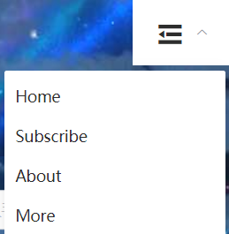

### 开始之前

疫情宅在家无聊ing，看了看同学的Github，发现一个个都个人博客做的飞起，瞬间感受到自己的慵懒和菜鸡，遂决定，自己也撸一个~

按照计划，博客前端使用Vue.js+Element UI，但在设计导航栏时，发现element没有提供传统意义上的页面顶部导航栏组件，只有一个可以用在很多需要选择tab场景的**导航菜单**，便决定在其基础上改造，由于我认为实现移动端良好的体验是必须的，所以便萌生了给其增加响应式功能的想法。

### 需求分析与拆解

假设我们的导航栏有logo和四个`el-menu-item`。

给`window`绑定监听事件，当宽度小于a时，四个链接全部放入右侧`el-submenu`的子菜单：



当宽度在a与b之间时，保留Home和Subscribe两个`el-menu-item`，其余的放入右侧`el-submenu`的子菜单：

当宽度大于b时，右侧`el-submenu`不显示，`el-menu-item`正常显示：


所以，先创建一个数组，存储所有所需的item：

```javascript
navItems: [
  { name: "Home", indexPath: "/home", index: "1" },
  { name: "Subscribe", indexPath: "/subscribe", index: 
  { name: "About", indexPath: "/about", index: "3" },
  { name: "More", indexPath: "/more", index: "4" }
]
```

### 监听宽度

很明显功能实现的关键是随时监听窗口的变化，根据对应的宽度做出响应，在`data`中，我使用`screenWidth`变量来存储窗口大小,初始保存打开页面时的宽度:

```javascript
data() {
  return {
    screenWidth: document.body.clientWidth
    ......
  }
}
```

接下来在`mounted`中绑定屏幕监听事件，将最新的可用屏幕宽度赋给`screenWidth`：

```javascript
mounted() {
  window.onresize = () => {
    this.screenWidth = document.body.clientWidth
  }
}
```

(关于document和window中N多的关于高度和宽度的属性，可以参考[这篇文章](https://segmentfault.com/a/1190000007515034)。)

为了防止频繁触发resize函数导致页面卡顿，可以使用一个定时器，控制下`screenWidth`更新的频率：

```javascript
watch: {
  screenWidth(newValue) {
    // 为了避免频繁触发resize函数导致页面卡顿，使用定时器
    if (!this.timer) {
      // 一旦监听到的screenWidth值改变，就将其重新赋给data里的screenWidth
      this.screenWidth = newValue;
      this.timer = true;
      setTimeout(() => {
        //console.log(this.screenWidth);
        this.timer = false;
      }, 400);
    }
  }
}
```


