# CSS

## 长度单位

+ 像素 px
  像素是我们在网页中使用的最多的一个单位，一个像素就相当于我们屏幕中的一个小点，我们的屏幕实际上就是由这些像素点构成的但是这些像素点，是不能直接看见。不同显示器一个像素的大小也不相同，显示效果越好越清晰，像素就越小，反之像素越大。

+ 百分比 %
  也可以将单位设置为一个百分比的形式，这样浏览器将会根据其父元素的样式来计算该值使用百分比的好处是，当父元素的属性值发生变化时，子元素也会按照比例发生改变。在我们创建一个自适应的页面时，经常使用百分比作为单位。

+ em

  em和百分比类似，它是相对于当前元素的字体大小来计算的

  - 1em = 1font-size
  - 使用em时，当字体大小发生改变时，em也会随之改变
  - 当设置字体相关的样式时，经常会使用em

## 颜色单位

在CSS可以直接使用颜色的单词来表示不同的颜色
红色：red
蓝色：blue
绿色：green	
也可以使用RGB值来表示不同的颜色

+ 所谓的RGB值指的是通过Red Green Blue三元色，通过这三种颜色的不同的浓度，来表示出不同的颜色
  例子：rgb(红色的浓度,绿色的浓度,蓝色的浓度);

  - 颜色的浓度需要一个0-255之间的值，255表示最大，0表示没有
  - 浓度也可以采用一个百分数来设置，需要一个0% - 100%之间的数字使用百分数最终也会转换为0-255之间的数0%表示0,100%表示255.

+ 也可以使用十六进制的rgb值来表示颜色，原理和上边RGB原理一样，只不过使用十六进制数来代替，使用三组两位的十六进制数组来表示一个颜色.每组表示一个颜色.

  第一组表示红色的浓度，范围00-ff
  第二组表示绿色的浓度，范围是00-ff
  第三组表示蓝色的浓度，范围00-ff
  语法：#红色绿色蓝色
  十六进制：
  0 1 2 3 4 5 6 7 8 9 a b c d e f
  00 - ff
  00表示没有，相当于rgb中的0
  ff表示最大，相当于rgb中255
  红色：
  	#ff0000
  像这种两位两位重复的颜色，可以简写
  	比如：#ff0000 可以写成 #f00
  		#abc  #aabbcc	

  ```css
  background-color: rgb(161,187,215);				
  background-color: rgb(100%,50%,50%);			
  background-color: #00f;			
  background-color: #abc; /*#aabbcc*/
  background-color: #084098;
  ```

## 字体

```css
/*
设置文字的大小,浏览器中一般默认的文字大小都是16px
font-size设置的并不是文字本身的大小，在页面中，每个文字都是处在一个看不见的框中的我们设置的font-size实际上是设置格的高度，并不是字体的大小.一般情况下文字都要比这个格要小一些，也有时会比格大，根据字体的不同，显示效果也不能	
 * */
font-size: 30px;
				
/*
 * 通过font-family可以指定文字的字体
 * 当采用某种字体时，如果浏览器支持则使用该字体，
 * 如果字体不支持，则使用默认字体
 * 该样式可以同时指定多个字体，多个字体之间使用,分开
 * 当采用多个字体时，浏览器会优先使用前边的字体，
 * 如果前边没有在尝试下一个
 */
font-family: arial , 微软雅黑;
				
/*
 * 浏览器使用的字体默认就是计算机中的字体，
 * 	如果计算机中有，则使用，如果没有就不用
 * 在开发中，如果字体太奇怪，用的太少了，尽量不要使用，
 * 	有可能用户的电脑没有，就不能达到想要的效果。
 */	
font-family: "curlz mt";

/*
 * font-style可以用来设置文字的斜体
 * 	- 可选值：
 * 	normal，默认值，文字正常显示
 * 	italic 文字会以斜体显示
 * 	oblique 文字会以倾斜的效果显示
 * 	- 大部分浏览器都不会对倾斜和斜体做区分，
 * 	也就是说我们设置italic和oblique它们的效果往往是一样的
 *  - 一般我们只会使用italic
 */
font-style: italic;
				
/*
 * font-weight可以用来设置文本的加粗效果：
 * 	可选值：
 * 		normal，默认值，文字正常显示
 * 		bold，文字加粗显示
 * 	该样式也可以指定100-900之间的9个值，
 * 	但是由于用户的计算机往往没有这么多级别的字体，所以达到
 * 	也就是200有可能比100粗，300有可能比200粗
 */
font-weight: bold;
				
/*
 * font-variant可以用来设置小型大写字母
 * 	可选值：
 * 		normal，默认值，文字正常显示
 * 		small-caps 文本以小型大写字母显示
 * 小型大写字母：
 * 		将所有的字母都以大写形式显示，但是小写字母的大写，
 * 		要比大写字母的大小小一些。
 */
font-variant: small-caps ;

/*
 * 在CSS并没有为我们提供一个直接设置行间距的方式，
 * 我们只能通过设置行高来间接的设置行间距，行高越大行间距越大
 * 使用line-height来设置行高 
 * 行高类似于我们上学单线本，单线本是一行一行，线与线之间的距离就是行高，
 * 网页中的文字实际上也是写在一个看不见的线中的，而文字会默认在行高中垂直居中显示 
 * 行间距 = 行高 - 字体大小
 */
.p1{
	font-size: 20px;
	/*
	 * 通过设置line-height可以间接的设置行高，
	 * 	可以接收的值：
	 * 		1.直接就收一个大小
	 * 		2.可以指定一个百分数，则会相对于字体去计算行高
	 * 		3.可以直接传一个数值，则行高会设置字体大小相应的倍数
	 */
	/*line-height: 200%;*/
	line-height: 2;
}

/*
 * 对于单行文本来说，可以将行高设置为和父元素的高度一致，
 * 	这样可以是单行文本在父元素中垂直居中
 */
line-height: 200px;

/*
 * 在font中也可以指定行高
 * 	在字体大小后可以添加/行高，来指定行高，该值是可选的，如果不指定则会使用默认值
 */
font: 30px "微软雅黑";
line-height: 50px;
```

## 字体图标

字体图标使用场景： 主要用于显示网页中通用、常用的一些小图标。

精灵图是有诸多优点的，但是缺点很明显。 

1. 图片文件还是比较大的。 

2. 图片本身放大和缩小会失真。

3.  一旦图片制作完毕想要更换非常复杂。

    此时，有一种技术的出现很好的解决了以上问题，就是字体图标 iconfont。 字体图标可以为前端工程师提供一种方便高效的图标使用方式，展示的是图标，本质属于字体。

### 使用

#### 下载

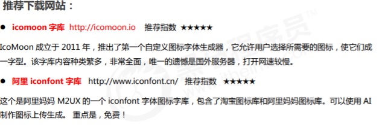

#### 引入

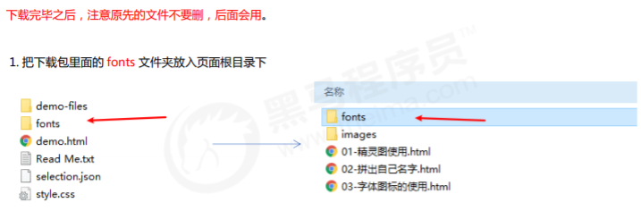

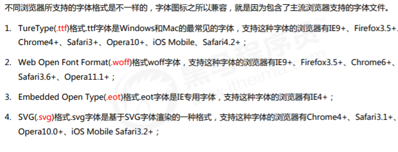

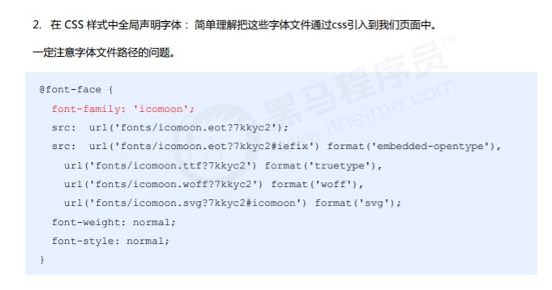

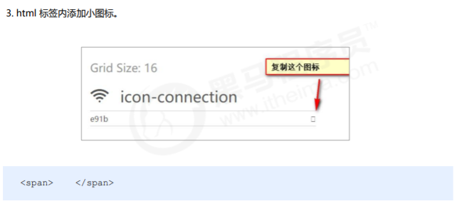

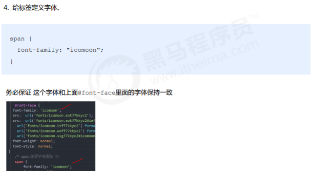

## 文本

```css
/*
 * text-transform可以用来设置文本的大小写
 * 	可选值：
 * 		none 默认值，该怎么显示就怎么显示，不做任何处理
 * 		capitalize 单词的首字母大写，通过空格来识别单词
 * 		uppercase 所有的字母都大写
 * 		lowercase 所有的字母都小写
 */
text-transform: lowercase;

/*
 * text-decoration可以用来设置文本的修饰
 * 	可选值：
 * 		none：默认值，不添加任何修饰，正常显示
 * 		underline 为文本添加下划线
 * 		overline 为文本添加上划线
 * 		line-through 为文本添加删除线
 */
text-decoration: line-through;

a {
/*超链接会默认添加下划线，也就是超链接的text-decoration的默认值是underline如果需要去除超链接的下划线则需要将该样式设置为none* */
	text-decoration: none;
}

/**
 * letter-spacing可以指定字符间距
 */
/*letter-spacing: 10px;*/
				
/*
 * word-spacing可以设置单词之间的距离
 * 	实际上就是设置词与词之间空格的大小
 */
word-spacing: 120px;

/*
 * text-align用于设置文本的对齐方式
 * 	可选值：
 * 		left 默认值，文本靠左对齐
 * 		right 文本靠右对齐
 * 		center 文本居中对齐
 * 		justify 两端对齐
 * 	- 通过调整文本之间的空格的大小，来达到一个两端对齐的目的
 */
text-align: justify ;

/*
 * text-indent用来设置首行缩进
 * 	当给它指定一个正值时，会自动向右侧缩进指定的像素
 * 	如果为它指定一个负值，则会向左移动指定的像素,
 * 	通过这种方式可以将一些不想显示的文字隐藏起来
 *  这个值一般都会使用em作为单位
 */
text-indent: -99999px;
```

#### css3

`text-shadow: h-shadow v-shadow blur color;`

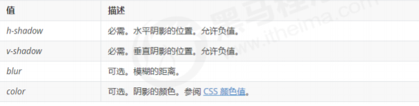

## 盒子模型

盒子可见框的大小由内容区，内边距和边框共同决定

盒子模型：就是把 HTML 页面中的布局元素看作是一个矩形的盒子，也就是一个盛装内容的容器。 CSS 盒子模型本质上是一个盒子，封装周围的 HTML 元素，它包括：边框、外边距、内边距、和实际内容

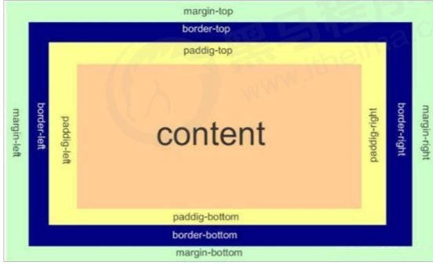

```css
/*
 * 使用width来设置盒子内容区的宽度
 * 使用height来设置盒子内容区的高度
 * 
 * width和height只是设置的盒子内容区的大小，而不是盒子的整个大小，
 * 	!!!盒子可见框的大小由内容区，内边距和边框共同决定
 */
width: 300px;
height: 300px;

```

### 边框

```css
/*
 * 为元素设置边框
 * 	要为一个元素设置边框必须指定三个样式
 * 		border-width:边框的宽度
 * 		border-color:边框颜色
 * 		border-style:边框的样式
 */			
/*
 * 设置边框的宽度
 */
border-width:10px ;			
/*
使用border-width可以分别指定四个边框的宽度
如果在border-width指定了四个值，
则四个值会分别设置给 上 右 下 左，按照顺时针的方向设置的
如果指定三个值，
 	则三个值会分别设置给	上  左右 下
如果指定两个值，
 	则两个值会分别设置给 上下 左右	
如果指定一个值，则四边全都是该值	
除了border-width，CSS中还提供了四个border-xxx-width
xxx的值可能是top right bottom left专门用来设置指定边的宽度	
 * */
border-width:10px 20px 30px 40px ;
border-width:10px 20px 30px ;
border-width: 10px 20px ;
border-width: 10px;
				
border-left-width:100px ;			
/*
 * 设置边框的颜色
 * 和宽度一样，color也提供四个方向的样式，可以分别指定颜色
 * border-xxx-color
 */
border-color: red;
border-color: red yellow orange blue;
border-color: red yellow orange;
border-color: red yellow;
				
/*
 * 设置边框的样式
 * 可选值：
 * 		none，默认值，没有边框
 * 		solid 实线
 * 		dotted 点状边框
 * 		dashed 虚线
 * 		double 双线
 * 
 * style也可以分别指定四个边的边框样式，规则和width一致，
 * 	同时它也提供border-xxx-style四个样式，来分别设置四个边
 */
border-style: double;
border-style: solid dotted dashed double; 

/*设置边框
大部分的浏览器中，边框的宽度和颜色都是有默认值，而边框的样式默认值都是none
 * */
border-width:10px ;
border-color: red;
border-style: solid;
				
/*
 * border
 * 边框的简写样式，通过它可以同时设置四个边框的样式，宽度，颜色
 * 而且没有任何的顺序要求
 * border一指定就是同时指定四个边不能分别指定
 * border-top border-right border-bottom border-left
 * 可以单独设置四个边的样式，规则和border一样，只不过它只对一个边生效
border : border-width || border-style || border-color 
 */
border: red solid 10px   ;
border-left: red solid 10px   ;			
border-top: red solid 10px;
border-bottom: red solid 10px;
border-left: red solid 10px;			
border: red solid 10px;
border-right: none;

/*border-collapse 属性控制浏览器绘制表格边框的方式。它控制相邻单元格的边框。
语法：border-collapse:collapse; 
collapse 单词是合并的意思
border-collapse: collapse; 表示相邻边框合并在一起

边框会额外增加盒子的实际大小。因此我们有两种方案解决:
1. 测量盒子大小的时候,不量边框.
2. 如果测量的时候包含了边框,则需要 width/height 减去边框宽度*/
```

#### CSS3新增的关于边框

border-radius属性用于设置元素的外边框圆角。 

`border-radius:length; `

+ 参数值可以为数值或百分比的形式 
+ 如果是正方形，想要设置为一个圆，把数值修改为高度或者宽度的一半即可，或者直接写为 50%
+ 该属性是一个简写属性，可以跟四个值，分别代表左上角、右上角、右下角、左下角 
+ 分开写：border-top-left-radius、border-top-right-radius、border-bottom-right-radius 和 border-bottom-left-radius 
+ 兼容性 ie9+ 浏览器支持, 但是不会影响页面布局,可以放心使用.

`box-shadow: h-shadow v-shadow blur spread color inset; `

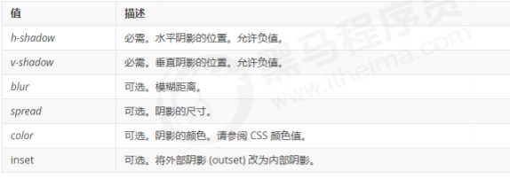

+ 默认的是外阴影(outset), 但是不可以写这个单词,否则造成阴影无效 
+ 盒子阴影不占用空间，不会影响其他盒子排列。

### 内边距（padding）

```css
/*
 * 内边距（padding），指的是盒子的内容区与盒子边框之间的距离
 * 	一共有四个方向的内边距，可以通过：
 * 		padding-top
 * 		padding-right
 * 		padding-bottom
 * 		padding-left
 * 			来设置四个方向的内边距
 * 
 * 内边距会影响盒子的可见框的大小，元素的背景会延伸到内边距,
 * 	盒子的大小由内容区、内边距和边框共同决定
 * 	盒子可见框的宽度 = border-left-width + padding-left + width + padding-right + border-
 *  可见宽的高度 = border-top-width + padding-top + height + padding-bottom + border-bott

当我们给盒子指定 padding 值之后，发生了 2 件事情：
1. 内容和边框有了距离，添加了内边距。
2. padding影响了盒子实际大小。
也就是说，如果盒子已经有了宽度和高度，此时再指定内边框，会撑大盒子。
解决方案：
如果保证盒子跟效果图大小保持一致，则让 width/height 减去多出来的内边距大小即可。
 */				
/*设置上内边距*/
padding-top: 100px;
/*设置右内边距*/
padding-right: 100px;
padding-bottom: 100px;
padding-left: 100px;
				
/*
 * 使用padding可以同时设置四个边框的样式，规则和border-width一致
 */
padding: 100px;			
padding: 100px 200px;				
padding: 100px 200px 300px;		
padding: 100px 200px 300px 400px;
```

### 外边距

```css
/*
 * 外边距指的是当前盒子与其他盒子之间的距离，
 * 	他不会影响可见框的大小，而是会影响到盒子的位置。
 * 盒子有四个方向的外边距：
 * 	margin-top
 * 	margin-right
 * 	margin-bottom
 * 	margin-left
 * 由于页面中的元素都是靠左靠上摆放的，
 * 所以注意当我们设置上和左外边距时，会导致盒子自身的位置发生改变，而如果是设置右和下外边距会改变其他盒子的位置
 */
/*
 * 设置box1的上外边距，盒子上边框和其他的盒子的距离
 */
margin-top: 100px;
				
/*
 * 左外边距
 */
margin-left: 100px;
				
/*设置右和下外边距*/
margin-right: 100px;
margin-bottom: 100px;
				
/*
 * 外边距也可以指定为一个负值，
 * 	如果外边距设置的是负值，则元素会向反方向移动
 */
margin-left: -150px;
margin-top: -100px;
margin-bottom: -100px;
margin-bottom: -100px;
				
/*
 * margin还可以设置为auto，auto一般只设置给水平方向的margin
 * 	如果只指定，左外边距或右外边距的margin为auto则会将外边距设置为最大值
 * 	垂直方向外边距如果设置为auto，则外边距默认就是0
 * 如果将left和right同时设置为auto，则会将两侧的外边距设置为相同的值，
 * 	就可以使元素自动在父元素中居中，所以我们经常将左右外边距设置为auto
 * 	以使子元素在父元素中水平居中
 */
margin-left: auto;
margin-right: auto;
				
/*
 * 外边距同样可以使用简写属性 margin，可以同时设置四个方向的外边距,
 * 	规则和padding一样
 */
margin: 0 auto;
```

垂直外边距的重叠

简单来说就是： 

+ 相邻块元素垂直外边距的合并

当上下相邻的两个块元素（兄弟关系）相遇时，如果上面的元素有下外边距 margin-bottom，下面的元素有 上外边距 margin-top ，则他们之间的垂直间距不是 margin-bottom 与 margin-top 之和。取两个值中的 较大者这种现象被称为相邻块元素垂直外边距的合并。

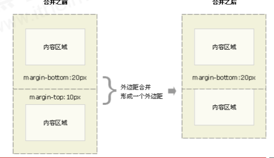

解决方案： 尽量只给一个盒子添加 margin 值。

+ 嵌套块元素垂直外边距的塌陷

对于两个嵌套关系（父子关系）的块元素，父元素有上外边距同时子元素也有上外边距，此时父元素会塌陷较大的外边距值。

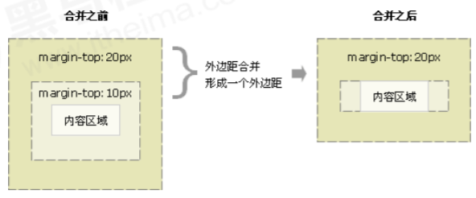

解决方案：

+ 可以为父元素定义上边框。
+ 以为父元素定义上内边距。
+ 可以为父元素添加 overflow:hidden
+ 还有其他方法，比如浮动、固定，绝对定位的盒子不会有塌陷问题，后面咱们再总结。

### 内联元素的盒子

```css
/*
 	内容区、内边距 、边框 、外边距
 * */			
/*
 * 内联元素不能设置width和height
 */
width: 200px;
height: 200px;			
/*
 * 设置水平内边距,内联元素可以设置水平方向的内边距
 */
padding-left: 100px ;
padding-right: 100px ;				
/*
 * 垂直方向内边距，内联元素可以设置垂直方向内边距，但是不会影响页面的布局
 */
padding-top: 50px;
padding-bottom: 50px;
				
/*
 * 为元素设置边框,
 * 	内联元素可以设置边框，但是垂直的边框不会影响到页面的布局
 */
border: 1px blue solid;
				
/*
 * 水平外边距
 * 	内联元素支持水平方向的外边距
 */
margin-left:100px ;
margin-right: 100px;
				
/*
 * 内联元素不支持垂直外边距
 */
margin-top: 200px;
margin-bottom: 200px;
				
/*
 * 设置一个左外边距
 * 水平方向的相邻外边距不会重叠，而是求和
 */
margin-left: 100px;
```

## display&visibility&opacity		

```css
/*
 * 将一个内联元素变成块元素，
 * 	通过display样式可以修改元素的类型
 * 	可选值：
 * 		inline：可以将一个元素作为内联元素显示
 * 		block: 可以将一个元素设置块元素显示
 * 		inline-block：将一个元素转换为行内块元素
 * 		- 可以使一个元素既有行内元素的特点又有块元素的特点
 * 			既可以设置宽高，又不会独占一行
 * 		none: 不显示元素，并且元素不会在页面中继续占有位置
 */
display: none;
```

```css
/*
 * visibility
 * 	- 可以用来设置元素的隐藏和显示的状态
 * 	- 可选值：
 * 		visible 默认值，元素默认会在页面显示
 * 		hidden 元素会隐藏不显示	
 * 使用 visibility:hidden;隐藏的元素虽然不会在页面中显示，但是它的位置会依然保持
 */
visibility:hidden ;
```

```css
/*
 * 设置元素的透明背景
 * opacity可以用来设置元素背景的透明，
 * 	它需要一个0-1之间的值
 * 		0 表示完全透明
 * 		1 表示完全不透明
 * 		0.5 表示半透明
 */
opacity: 0.5;
				
/*
 * opacity属性在IE8及以下的浏览器中不支持
 * IE8及以下的浏览器需要使用如下属性代替
 * 	alpha(opacity=透明度)
 * 透明度，需要一个0-100之间的值
 * 	0 表示完全透明
 * 	100 表示完全不透明
 * 	50 半透明
 * 这种方式支持IE6，但是这种效果在IE Tester中无法测试
 */
filter: alpha(opacity=50);
```

## overflow

```css
/*
 * 子元素默认是存在于父元素的内容区中，
 * 	理论上讲子元素的最大可以等于父元素内容区大小
 * 	如果子元素的大小超过了父元素的内容区，则超过的大小会在父元素以外的位置显示，
 * 	超出父元素的内容，我们称为溢出的内容
 *  父元素默认是将溢出内容，在父元素外边显示，
 * 	通过overflow可以设置父元素如何处理溢出内容：
 * 	可选值：
 * 		- visible，默认值，不会对溢出内容做处理，元素会在父元素以外的位置显示
 * 		- hidden, 溢出的内容，会被修剪，不会显示
 * 		- scroll, 会为父元素添加滚动条，通过拖动滚动条来查看完整内容。该属性不论内容是否溢出，都会添加水平和垂直双方向的滚动条
 * 		- auto，会根据需求自动添加滚动条，
 * 				需要水平就添加水平
 * 				需要垂直就添加垂直
 * 				都不需要就都不加
 */
overflow: auto;
```

## 文档流

```html
<!-- 
文档流
文档流处在网页的最底层，它表示的是一个页面中的位置，我们所创建的元素默认都处在文档流中。
元素在文档流中的特点
	块元素
	1.块元素在文档流中会独占一行，块元素会自上向下排列。
	2.块元素在文档流中默认宽度是父元素的100%
	3.块元素在文档流中的高度默认被内容撑开
	内联元素
	1.内联元素在文档流中只占自身的大小，会默认从左向右排列，如果一行中不足以容纳所有的内联元素，则换到下一行，继续自左向右。
	2.在文档流中，内联元素的宽度和高度默认都被内容撑开	
-->
		
<!-- 
	当元素的宽度的值为auto时，此时指定内边距不会影响可见框的大小，而是会自动修改宽度，以适应内边距。
-->
<div style="background-color: #bfa;">
	<div style="height: 50px;"></div>
</div>
<div style="width: 100px; height: 100px; background-color: #ff0;"></div>	
<span style="background-color: yellowgreen;">我是一个span</span>
<span style="background-color: yellowgreen;">我是一个span</span>
<span style="background-color: yellowgreen;">我是一个span</span>
<span style="background-color: yellowgreen;">我是一个span</span>
<span style="background-color: yellowgreen;">我是一个span</span>
<span style="background-color: yellowgreen;">我是一个span</span>
```

## 浮动

网页布局的本质——用 CSS 来摆放盒子。 把盒子摆放到相应位置. 

CSS 提供了三种传统布局方式(简单说,就是盒子如何进行排列顺序)：普通流（标准流）浮动 定位

为什么需要浮动？

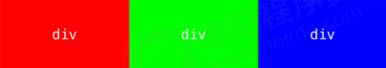

虽然转换为行内块元素可以实现一行显示，但是他们之间会有大的空白缝隙，很难控制。

有很多的布局效果，标准流没有办法完成，此时就可以利用浮动完成布局。 因为浮动可以改变元素标 签默认的排列方式. 浮动最典型的应用：可以让多个块级元素一行内排列显示。 网页布局第一准则：多个块级元素纵向排列找标准流，多个块级元素横向排列找浮动。

浮动特性:

1. 浮动元素会脱离标准流(脱标) 
2. 浮动的元素会一行内显示并且元素顶部对齐
3. 浮动的元素会具有行内块元素的特性.

设置了浮动（float）的元素最重要特性： 

1. 脱离标准普通流的控制（浮） 移动到指定位置（动）, （俗称脱标） 
2. 浮动的盒子不再保留原先的位置

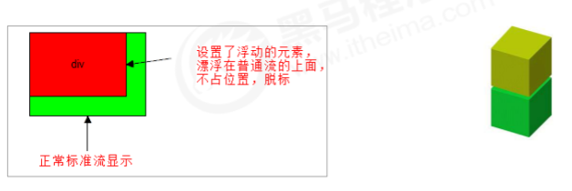

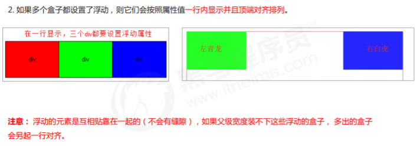

任何元素都可以浮动。不管原先是什么模式的元素，添加浮动之后具有行内块元素相似的特性。

+ 如果块级盒子没有设置宽度，默认宽度和父级一样宽，但是添加浮动后，它的大小根据内容来决定 
+ 浮动的盒子中间是没有缝隙的，是紧挨着一起的 
+ 行内元素同理

```css
/*
 * 块元素在文档流中默认垂直排列，所以这个三个div自上至下依次排开，
 * 如果希望块元素在页面中水平排列，可以使块元素脱离文档流
 * 使用float来使元素浮动，从而脱离文档流
 * 可选值：
 * 	none，默认值，元素默认在文档流中排列
 * 	left，元素会立即脱离文档流，向页面的左侧浮动
 * 	right，元素会立即脱离文档流，向页面的右侧浮动
 * 当为一个元素设置浮动以后（float属性是一个非none的值），
 */
float: left;
```

浮动的元素不会盖住文字，文字会自动环绕在浮动元素的周围，所以我们可以通过浮动来设置文字环绕图片的效果。

内联元素脱离文档流以后会变成块元素。

### 清除浮动、高度塌陷

由于父级盒子很多情况下，不方便给高度，但是子盒子浮动又不占有位置，最后父级盒子高度为 0 时，就会 影响下面的标准流盒子。


由于浮动元素不再占用原文档流的位置，所以它会对后面的元素排版产生影响。

清除浮动的本质

+ 是清除浮动元素造成的影响 

+ 如果父盒子本身有高度，则不需要清除浮动 
+ 清除浮动之后，父级就会根据浮动的子盒子自动检测高度。父级有了高度，就不会影响下面的标准流了

选择器{clear:属性值;} 

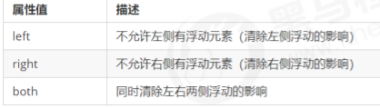

我们实际工作中， 几乎只用 clear: both; 清除浮动的策略是: 闭合浮动. 

### 其他方法

在文档流中，父元素的高度默认是被子元素撑开的，也就是子元素多高，父元素就多高。但是当为子元素设置浮动以后，子元素会完全脱离文档流，此时将会导致子元素无法撑起父元素的高度，导致父元素的高度塌陷。由于父元素的高度塌陷了，则父元素下的所有元素都会向上移动，这样将会导致页面布局混乱。
所以在开发中一定要避免出现高度塌陷的问题,我们可以将父元素的高度写死，以避免塌陷的问题出现，但是一旦高度写死，父元素的高度将不能自动适应子元素的高度，所以这种方案是不推荐使用的。

根据W3C的标准，在页面中元素都一个隐含的属性叫做Block Formatting Context,简称BFC，该属性可以设置打开或者关闭，默认是关闭的。

当开启元素的BFC以后，元素将会具有如下的特性：

+ 1.父元素的垂直外边距不会和子元素重叠	

 * 	2.开启BFC的元素不会被浮动元素所覆盖
 * 	3.开启BFC的元素可以包含浮动的子元素

如何开启元素的BFC

 * 1.设置元素浮动

   使用这种方式开启，虽然可以撑开父元素，但是会导致父元素的宽度丢失而且使用这种方式也会导致下边的元素上移，不能解决问题

 * 2.设置元素绝对定位

 * 3.设置元素为inline-block

   可以解决问题，但是会导致宽度丢失，不推荐使用这种方式

 * 4.将元素的overflow设置为一个非visible的值

   推荐方式：将overflow设置为hidden是副作用最小的开启BFC的方式。

   `overflow: hidden;`

   但是在IE6及以下的浏览器中并不支持BFC，所以使用这种方式不能兼容IE6。在IE6中虽然没有BFC，但是具有另一个隐含的属性叫做hasLayout，该属性的作用和BFC类似，所在IE6浏览器可以通过开hasLayout来解决该问题开启方式很多，我们直接使用一种副作用最小的：直接将元素的zoom设置为1即可。

   zoom表示放大的意思，后边跟着一个数值，写几就将元素放大几倍。zoom:1表示不放大元素，但是通过该样式可以开启hasLayout。zoom这个样式，只在IE中支持，其他浏览器都不支持。

   ```css
   zoom:1;
   overflow: hidden;
   ```

+ 最终办法

```css
/*通过after伪类，选中box1的后边*/
/*
 * 可以通过after伪类向元素的最后添加一个空白的块元素，然后对其清除浮动，
 * 	这样做和添加一个div的原理一样，可以达到一个相同的效果，
 * 	而且不会在页面中添加多余的div，这是我们最推荐使用的方式，几乎没有副作用
 */
.clearfix:after{
	/*添加一个内容*/
	content: "";
	/*转换为一个块元素*/
	display: block;
	/*清除两侧的浮动*/
	clear: both;
}
			
/*
 * 在IE6中不支持after伪类,
 * 	所以在IE6中还需要使用hasLayout来处理
 */
.clearfix{
	zoom:1;
}

/*
 * 经过修改后的clearfix是一个多功能的
 * 	既可以解决高度塌陷，又可以确保父元素和子元素的垂直外边距不会重叠
 */
.clearfix:before,
.clearfix:after{
	content: "";
	display: table;
	clear: both;
}		
.clearfix{
	zoom: 1;
}
style>
```

## 框架集

```html
<!-- 
	框架集和内联框架的作用类似，都是用于在一个页面中引入其他的外部的页面，
		框架集可以同时引入多个页面，而内联框架只能引入一个，
		在h5标准中，推荐使用框架集，而不使用内联框架
	使用frameset来创建一个框架集，注意frameset不能和body出现在同一个页面中
		所以要使用框架集，页面中就不可以使用body标签
	属性：
		rows，指定框架集中的所有的框架，一行一行的排列
		cols， 指定框架集中的所有的页面，一列一列的排列	
		这两个属性frameset必须选择一个，并且需要在属性中指定每一部分所占的大小
		frameset中也可以再嵌套frameset
	frameset和iframe一样，它里边的内容都不会被搜索引擎所检索，
	所以如果搜索引擎检索到的页面是一个框架页的话，它是不能去判断里边的内容的
	使用框架集则意味着页面中不能有自己的内容，只能引入其他的页面，而我们每单独加载一个页面
	浏览器都需要重新发送一次请求，引入几个页面就需要发送几次请求，用户的体验比较差
	如果非得用建议使用frameset而不使用iframe	
-->
<frameset cols="30% , * , 30%">
	<!-- 在frameset中使用frame子标签来指定要引入的页面 
		引入几个页面就写几个frame
	-->	
	<frame src="01.表格.html" />
	<frame src="02.表格.html" />
	<!-- 嵌套一个frameset -->
	<frameset rows="30%,50%,*">
		<frame src="04.表格的布局.html" />
		<frame src="05.完善clearfix.html" />
		<frame src="06.表单.html" />
	</frameset>
</frameset>
```

## 定位

定位指的就是将指定的元素摆放到页面的任意位置
通过定位可以任意的摆放元素

当开启了元素的定位（position属性值是一个非static的值）时，可以通过left right top bottom四个属性来设置元素的偏移量
	left：元素相对于其定位位置的左侧偏移量
	right：元素相对于其定位位置的右侧偏移量
	top：元素相对于其定位位置的上边的偏移量
	bottom：元素相对于其定位位置下边的偏移量
通常偏移量只需要使用两个就可以对一个元素进行定位，一般选择水平方向的一个偏移量和垂直方向的偏移量来为一个元素进行定位

通过position属性来设置元素的定位
可选值：
	static：默认值，元素没有开启定位
	relative：开启元素的相对定位
	absolute：开启元素的绝对定位
	fixed：开启元素的固定定位（也是绝对定位的一种）

### 相对定位

当元素的position属性设置为relative时，则开启了元素的相对定位
1.当开启了元素的相对定位以后，而不设置偏移量时，元素不会发生任何变化
2.相对定位是相对于元素在文档流中原来的位置进行定位
3.相对定位的元素不会脱离文档流
4.相对定位会使元素提升一个层级
5.相对定位不会改变元素的性质，块还是块，内联还是内联

### 绝对定位

当position属性值设置为absolute时，则开启了元素的绝对定位
绝对定位：
	1.开启绝对定位，会使元素脱离文档流
	2.开启绝对定位以后，如果不设置偏移量，则元素的位置不会发生变化
	3.绝对定位是相对于离他最近的开启了定位的祖先元素进行定位的（一般情况，开启了子元素的绝对定位都如果所有的祖先元素都没有开启定位，则会相对于浏览器窗口进行定位）
	4.绝对定位会使元素提升一个层级
	5.绝对定位会改变元素的性质，内联元素变成块元素，块元素的宽度和高度默认都被内容撑开。

### 固定定位

当元素的position属性设置fixed时，则开启了元素的固定定位，固定定位也是一种绝对定位，它的大部分特点都和绝对定位一样，不同的是：
	固定定位永远都会相对于浏览器窗口进行定位
	固定定位会固定在浏览器窗口某个位置，不会随滚动条滚动
IE6不支持固定定位

### 层级

```css
/*
 * 如果定位元素的层级是一样，则下边的元素会盖住上边的
 * 通过z-index属性可以用来设置元素的层级
 * 可以为z-index指定一个正整数作为值，该值将会作为当前元素的层级
 * 	层级越高，越优先显示
 * 
 * 对于没有开启定位的元素不能使用z-index
 */
z-index: 25;	
```

## 背景

```css
/*
 * 使用background-image来设置背景图片
 * 	- 语法：background-image:url(相对路径);
 * 
 * 	- 如果背景图片大于元素，默认会显示图片的左上角
 * 	- 如果背景图片和元素一样大，则会将背景图片全部显示
 * 	- 如果背景图片小于元素大小，则会默认将背景图片平铺以充满元素
 * 
 * 可以同时为一个元素指定背景颜色和背景图片，
 * 	这样背景颜色将会作为背景图片的底色
 * 	一般情况下设置背景图片时都会同时指定一个背景颜色
 */
background-image:url(img/1.png);		
/*
 * background-repeat用于设置背景图片的重复方式
 * 	可选值：
 * 		repeat，默认值，背景图片会双方向重复（平铺）
 * 		no-repeat ，背景图片不会重复，有多大就显示多大
 * 		repeat-x， 背景图片沿水平方向重复
 * 		repeat-y，背景图片沿垂直方向重复
 */
background-repeat: repeat-y;
/*
 * 设置一个背景颜色
 */
background-color: #bfa;
/*
 * 背景图片默认是贴着元素的左上角显示
 * 通过background-position可以调整背景图片在元素中的位置
 * 可选值：
 * 		该属性可以使用 top right left bottom center中的两个值
 * 			来指定一个背景图片的位置
 * 			top left 左上
 * 			bottom right 右下
 * 			如果只给出一个值，则第二个值默认是center
 * 
 * 		也可以直接指定两个偏移量，
 * 			第一个值是水平偏移量
 * 				- 如果指定的是一个正值，则图片会向右移动指定的像素
 * 				- 如果指定的是一个负值，则图片会向左移动指定的像素
 * 			第二个是垂直偏移量	
 * 				- 如果指定的是一个正值，则图片会向下移动指定的像素
 * 				- 如果指定的是一个负值，则图片会向上移动指定的像素
 * 		
 */
background-position: -80px -40px;

/*
 * 当背景图片的background-attachment设置为fixed时，
 * 	背景图片的定位永远相对于浏览器的窗口
 */
background-attachment: fixed;

/*
 * background
 * 	- 通过该属性可以同时设置所有背景相关的样式
 * 	- 没有顺序的要求，谁在前睡在后都行
 * 		也没有数量的要求，不写的样式就使用默认值
 */
background: #bfa url(img/3.png) center center no-repeat fixed;
```

## 表格

表格在日常生活中使用的非常的多，比如excel就是专门用来创建表格的工具，表格就是用来表示一些格式化的数据的，比如：课程表、银行对账单。在网页中也可以来创建出不同的表格。

```html
<!--
	在HTML中，使用table标签来创建一个表格
-->
<table border="1" width="40%" align="center">
<!-- 
	在table标签中使用tr来表示表格中的一行，有几行就有几个tr
-->
<tr>
	<!-- 在tr中需要使用td来创建一个单元格，有几个单元格就有几个td -->
	<td>A1</td>
	<td>A2</td>
	<td>A3</td>
	<td>A4</td>
</tr>
<tr>
	<!--
		可以使用th标签来表示表头中的内容，
			它的用法和td一样，不同的是它会有一些默认效果
	-->
	<th>学号</th>
	<th>姓名</th>
	<th>性别</th>
	<th>住址</th>
</tr>			
<tr>
	<td>B1</td>
	<td>B2</td>
    <td>B3</td>
	<!-- 
		rowspan用来设置纵向的合并单元格
	-->
	<td rowspan="2">B4</td>
</tr>
<tr>
	<td>C1</td>
	<td>C2</td>
	<td>C3</td>
</tr>
<tr>
	<td>D1</td>
	<td>D2</td>
	<!-- 
		colspan横向的合并单元格
	-->
	<td colspan="2">D3</td>
</tr>
</table>
```

```css
/*
 * 设置表格的宽度
 */
table{
	width: 300px;
	/*居中*/
	margin: 0 auto;
	/*边框*/
	/*border:1px solid black;*/
	/*
	 * table和td边框之间默认有一个距离
	 * 	通过border-spacing属性可以设置这个距离
	 */
	/*border-spacing:0px ;*/
	
	/*
	 * border-collapse可以用来设置表格的边框合并
	 * 如果设置了边框合并，则border-spacing自动失效
	 */
	border-collapse: collapse;
	/*设置背景样式*/
	/*background-color: #bfa;*/
}
			
/*
 * 设置边框
 */
td , th{
	border: 1px solid black;
}
			
/*
 * 设置隔行变色
 */
tr:nth-child(even){
	background-color: #bfa;
}
			
/*
 * 鼠标移入到tr以后，改变颜色
 */
tr:hover{
	background-color: #ff0;
}
```

长表格

```html
<table>
	<!-- 
		有一些情况下表格是非常的长的，
			这时就需要将表格分为三个部分，表
		在HTML中为我们提供了三个标签：
			thead 表头
			tbody 表格主体
			tfoot 表格底部
			
		这三个标签的作用，就来区分表格的不
			都需要直接写到table中，tr需要写
			
		thead中的内容，永远会显示在表格的
		tfoot中的内容，永远都会显示表格的
		tbody中的内容，永远都会显示表格的
		
		如果表格中没有写tbody，浏览器会自
		并且将所有的tr都放到tbody中，所以
		通过table > tr 无法选中行 需要通过
	-->
	<thead>
		<tr>
			<th>日期</th>
			<th>收入</th>
			<th>支出</th>
			<th>合计</th>
		</tr>
	</thead>
	
	<tfoot>
		<tr>
			<td></td>
			<td></td>
			<td>合计</td>
			<td>100</td>
		</tr>
	</tfoot>
	
	<tbody>
		<tr>
			<td>10.24</td>
			<td>500</td>
			<td>300</td>
			<td>200</td>
		</tr>
		<tr>
			<td>10.24</td>
			<td>500</td>
			<td>300</td>
			<td>200</td>
		</tr>
		
	</tbody>	
</table>
```

### 表格布局

```html
<!-- 
	以前表格更多的情况实际上是用来对页面进行布局的，但是这种方式早已被CSS所淘汰了
	表格的列数由td最多的那行决定
	表格是可以嵌套，可以在td中在放置一个表格
-->
		
<table border="1" width="100%">
	<tr height="100px">
		<td colspan="2"></td>
	</tr>
	<tr height="400px">
		<td width="20%"></td>
		<td width="80%">
			<table border="1" width="100%" height="100%">
				<tr>
					<td></td>
				</tr>
				<tr>
					<td></td>
				</tr>
			</table>
		</td>
	</tr>
	<tr height="100px">
		<td colspan="2"></td>
	</tr>
</table>
```


## Flex布局

[菜鸟](https://www.runoob.com/w3cnote/flex-grammar.html)

[阮一峰练手](http://www.ruanyifeng.com/blog/2015/07/flex-examples.html)


采用Flex布局的元素，称为Flex容器（flex container），简称”容器”。它的所有子元素自动成为容器成员，称为Flex项目（flex item），简称”项目”。

容器默认存在两根轴：水平的主轴（main axis）和垂直的交叉轴（cross axis）。主轴的开始位置（与边框的交叉点）叫做main start，结束位置叫做main end；交叉轴的开始位置叫做cross start，结束位置叫做cross end。

项目默认沿主轴排列。单个项目占据的主轴空间叫做main size，占据的交叉轴空间叫做cross size。

以下6个属性设置在容器上。

> - flex-direction
>
>   - row（默认值）：主轴为水平方向，起点在左端。
>   - row-reverse：主轴为水平方向，起点在右端。
>   - column：主轴为垂直方向，起点在上沿。
>   - column-reverse：主轴为垂直方向，起点在下沿。
>
> - flex-wrap
>
>   默认情况下，项目都排在一条线（又称”轴线”）上。flex-wrap属性定义，如果一条轴线排不下，如何换行。
>
>   + nowrap:不换行
>
>   + wrap:换行，第一行在上方。
>
>   + wrap-reverse：换行，第一行在下方。
>
>     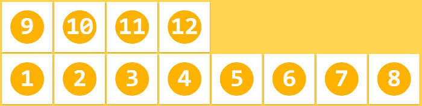
>
> - flex-flow
>
>   flex-flow属性是flex-direction属性和flex-wrap属性的简写形式，默认值为row nowrap。
>
>   ```css
>   flex-flow: <flex-direction> <flex-wrap>;
>   ```
>
> - justify-content
>
>   
>
> - align-items
>
>   align-items属性定义项目在交叉轴上如何对齐。
>
>   
>
> - align-content
>
>   align-content属性定义了多根轴线的对齐方式。如果项目只有一根轴线，该属性不起作用。
>
>   

以下6个属性设置在项目上。

> - order
>
>   定义项目的排列顺序。数值越小，排列越靠前，默认为0。
>
> - flex-grow
>
>   定义项目的放大比例，默认为0，即如果存在剩余空间，也不放大。
>
>   如果所有项目的flex-grow属性都为1，则它们将等分剩余空间（如果有的话）。如果一个项目的flex-grow属性为2，其他项目都为1，则前者占据的剩余空间将比其他项多一倍。
>
> - flex-shrink
>
>   定义了项目的缩小比例，默认为1，即如果空间不足，该项目将缩小。
>
>   如果所有项目的flex-shrink属性都为1，当空间不足时，都将等比例缩小。如果一个项目的flex-shrink属性为0，其他项目都为1，则空间不足时，前者不缩小。
>
>   负值对该属性无效。
>
> - flex-basis
>
>   定义了在分配多余空间之前，项目占据的主轴空间（main size）。浏览器根据这个属性，计算主轴是否有多余空间。它的默认值为auto，即项目的本来大小。
>
> - flex
>
>   flex-grow, flex-shrink 和 flex-basis的简写，默认值为0 1 auto。后两个属性可选。
>
>   ```css
>   flex: none | [ <'flex-grow'> <'flex-shrink'>? || <'flex-basis'> ]
>   ```
>
> - align-self
>
>   允许单个项目有与其他项目不一样的对齐方式，可覆盖align-items属性。默认值为auto，表示继承父元素的align-items属性，如果没有父元素，则等同于stretch。
>
>   
>
>   ```css
>   align-self: auto | flex-start | flex-end | center | baseline | stretch;
>   ```
>
>   除了auto，其他都与align-items属性完全一致。


## CSS3动画

+ 使用CSS3技术来控制页面元素CSS属性的变化
+ 不需要js也能写
+ 由浏览器执行，更加流畅
+ 减少代码量

### 应用场景

+ 网页特效
+ 用户交互
+ 抽奖动画
+ 网页小游戏

### transition

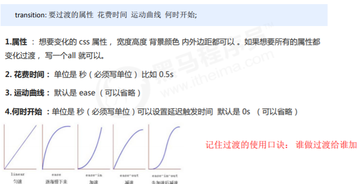

##### `transition-property` 指定应用过渡属性的名称

```css
div{
    transition-property:width 2s;
    width:100px;
}
div:hover{
    width:200px;
}
```

避免使用transition时所有元素都加入动画。

##### `transition-delay` 延迟动画的时间

### transform

转换`transform`是CSS3中具有颠覆性的特征之一，可以实现元素的位移、旋转、缩放等效果。

移动：translate

旋转：rotate

缩放：scale

#### transform 2D

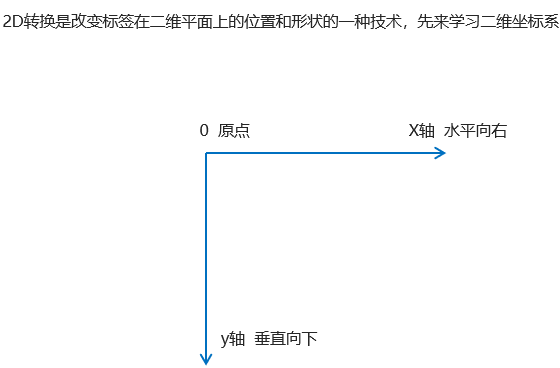

**transform-origin**:

转换中心点

`transform-origin: x y;`

+ 注意后面的参数 x 和 y 用空格隔开
+ x y 默认转换的中心点是元素的中心点 (50% 50%)
+ 还可以给x y 设置 像素 或者 方位名词 （top bottom left right center）

**translate：**

`transform: translate(x,y);` 或者分开写

`transform: translateX(n);`

`transform: translateY(n);`

+ 定义 2D 转换中的移动，沿着 X 和 Y 轴移动元素

+ translate最大的优点：不会影响到其他元素的位置
+ translate中的百分比单位是相对于自身元素的 translate:(50%,50%);
+ 对行内标签没有效果

**rotate**：

`transform:rotate(度数)`

+ rotate里面跟度数， 单位是 deg 比如 rotate(45deg)
+ 角度为正时，顺时针，负时，为逆时针
+ 默认旋转的中心点是元素的中心点

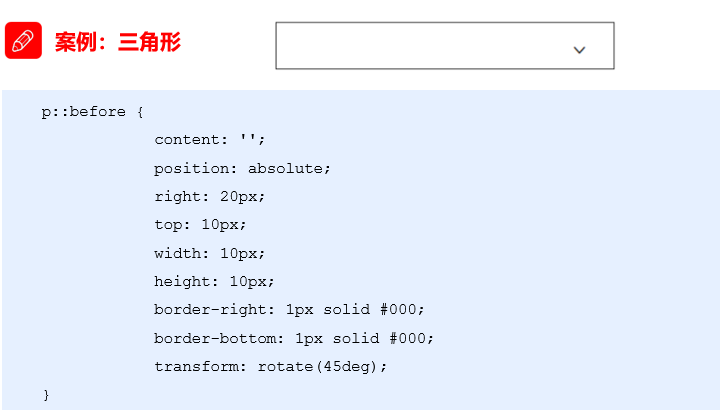

**scale**：

`transform:scale(x,y);`

+ 注意其中的x和y用逗号分隔
+ transform:scale(1,1) ：宽和高都放大一倍，相对于没有放大
+ transform:scale(2,2) ：宽和高都放大了2倍
+ transform:scale(2) ：只写一个参数，第二个参数则和第一个参数一样，相当于 scale(2,2)
+ transform:scale(0.5,0.5)：缩小
+ sacle缩放最大的优势：可以设置转换中心点缩放，默认以中心点缩放的，而且不影响其他盒子

**注意：**

1. 同时使用多个转换，其格式为：`transform: translate() rotate() scale() ...`等，
2. 其顺序会影转换的效果。（先旋转会改变坐标轴方向）
3. 当我们同时有位移和其他属性的时候，记得要将位移放到最前

#### transform 3D

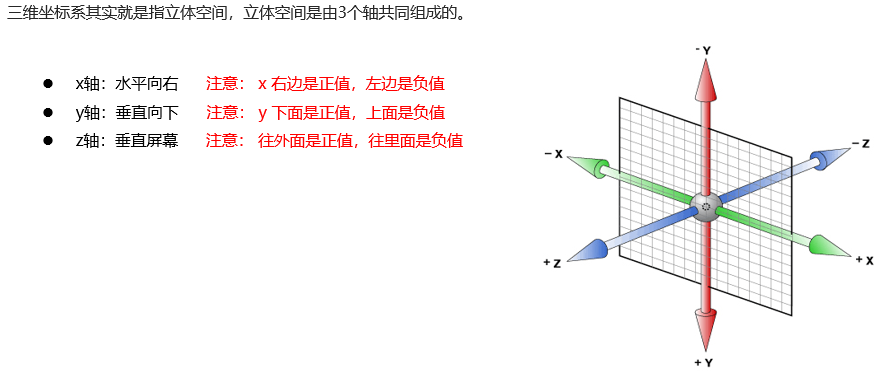

**translate3d**:

3D移动在2D移动的基础上多加了一个可以移动的方向，就是z轴方向。 

+ `translform:translateX(100px)`：仅仅是在x轴上移
+ `translform:translateY(100px)`：仅仅是在Y轴上移动
+ `translform:translateZ(100px)`：仅仅是在Z轴上移动（注意：translateZ一般用px单位）
+ `transform:translate3d(x,y,z)`：其中 x、y、z 分别指要移动的轴的方向的距离 

因为z轴是垂直屏幕，由里指向外面，所以默认是看不到元素在z轴的方向上移动。

**perspective**:

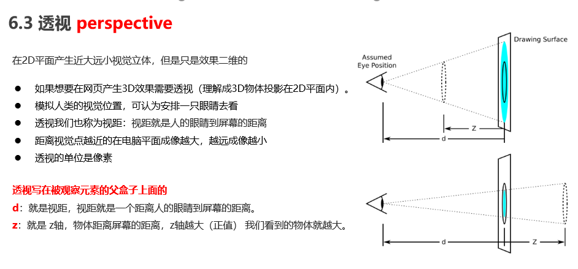

`translform:translateZ(100px)`：仅仅是在Z轴上移动。有了透视，就能看到translateZ 引起的变化了  

**rotate3d**:

3D旋转指可以让元素在三维平面内沿着 x轴，y轴，z轴或者自定义轴进行旋转。

+ `transform:rotateX(45deg)`：沿着x轴正方向旋转 45度
+ `transform:rotateY(45deg)` ：沿着y轴正方向旋转 45deg
+ `transform:rotateZ(45deg)` ：沿着Z轴正方向旋转 45deg
+ `transform:rotate3d(x,y,z,deg)`： 沿着自定义轴旋转 deg为角度（了解即可）xyz是表示旋转轴的矢量，是标示你是否希望沿着该轴旋转，最后一个标示旋转的角度。`transform:rotate3d(1,1,0,45deg)` 就是沿着对角线旋转 45deg

**transfrom-style**:

控制子元素是否开启三维立体环境。

+ `transform-style: flat;` 子元素不开启3d立体空间 默认的

+ `ltransform-style: preserve-3d;` 子元素开启立体空间

代码写给父级，但是影响的是子盒子。这个属性很重要，后面必用。

**动画（animation）**是CSS3中具有颠覆性的特征之一，可通过设置多个节点来精确控制一个或一组动画，常用来实现复杂的动画效果。

相比较过渡，动画可以实现更多变化，更多控制，连续自动播放等效果。

### 用keyframes定义动画

```css
@keyframes 动画名称 {
   0%{
        width:100px;
   }  
   100%{
        width:200px;
   }
}
```

+ 0% 是动画的开始，100% 是动画的完成。这样的规则就是动画序列。
+ 在 @keyframes 中规定某项 CSS 样式，就能创建由当前样式逐渐改为新样式的动画效果。
+ 动画是使元素从一种样式逐渐变化为另一种样式的效果。您可以改变任意多的样式任意多的次数。
+ 请用百分比来规定变化发生的时间，或用关键词 "from" 和 "to"，等同于 0% 和 100%。

### 使用动画

```css
/* 调用动画 */
animation-name: 动画名称;
/* 持续时间 */
animation-duration: 持续时间;
```

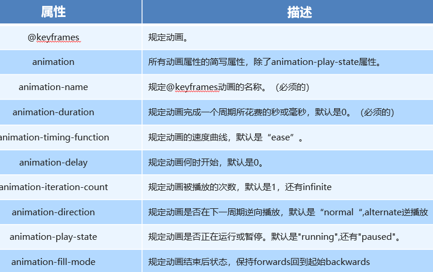

`animation：动画名称 持续时间 运动曲线 何时开始 播放次数 是否反方向 动画起始或者结束的状态;`

+ 简写属性里面不包含 animation-play-state 
+ 暂停动画：animation-play-state:  puased;  经常和鼠标经过等其他配合使用
+ 想要动画走回来 ，而不是直接跳回来：`animation-direction:alternate;`
+ 盒子动画结束后，停在结束位置： `animation-fill-mode:forwards;`

animation-timing-function：

规定动画的速度曲线，默认是“ease”

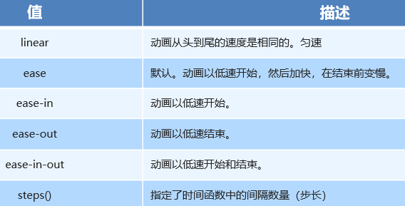

### 旋转木马案例

```html
<!DOCTYPE html>
<html lang="en">
<head>
  <meta charset="UTF-8">
  <meta name="viewport" content="width=device-width, initial-scale=1.0">
  <meta http-equiv="X-UA-Compatible" content="ie=edge">
  <title>Document</title>
  <style>
    body{
      perspective: 1000px;
    }
    section{
      position: relative;
      height: 200px;
      width: 300px;
      margin: 200px auto;
      transform-style: preserve-3d;
      animation: rota 0.5s linear infinite;
    }

    section:hover{
      animation-play-state: paused;
    }

    @keyframes  rota {
      0%{
        transform:rotateY(0) ;
      }
      100%{
        transform: rotateY(360deg);
      }
    }
    section div{
      position: absolute;
      top: 0;
      left: 0;
      width: 100%;
      height: 100%;
      background: url('http://pic0.iqiyipic.com/common/lego/20200209/ccc614312b7048f19408192c91a8ecf9.jpg') no-repeat ;
    }
    section div:nth-child(1){
      transform: translateZ(300px);
    }
    section div:nth-child(2){
      transform: rotateY(60deg) translateZ(300px);
    }
    section div:nth-child(3){
      transform: rotateY(120deg) translateZ(300px);
    }
    section div:nth-child(4){
      transform: rotateY(180deg) translateZ(300px);
    }
    section div:nth-child(5){
      transform: rotateY(240deg) translateZ(300px);
    }
    section div:nth-child(6){
      transform: rotateY(300deg) translateZ(300px);
    }
  </style>
</head>
<body>
  <section>
    <div></div>
    <div></div>
    <div></div>
    <div></div>
    <div></div>
    <div></div>
  </section>
</body>
</html>
```

## 技巧及零碎知识点

+ 提高幸福感的 9 个 CSS 技巧

  [掘金](https://juejin.im/post/5cb45a06f265da03474df54e)

  总结：

  + 建议使用 padding 代替 margin，所有毗邻的两个或多个盒元素的 `margin` 将会合并为一个 `margin` 共享。 毗邻的定义为：同级或者嵌套的盒元素，并且它们之间没有非空内容、`Padding` 或 `Border` 分隔。

  + 文字超出省略、文字两端对齐

    ```html
    // html两端对齐
    <div>姓名</div>
    <div>手机号码</div>
    <div>账号</div>
    <div>密码</div>
    
    // css
    div {
        margin: 10px 0; 
        width: 100px;
        border: 1px solid red;
        text-align: justify;
        text-align-last:justify
    }
    ```

    

