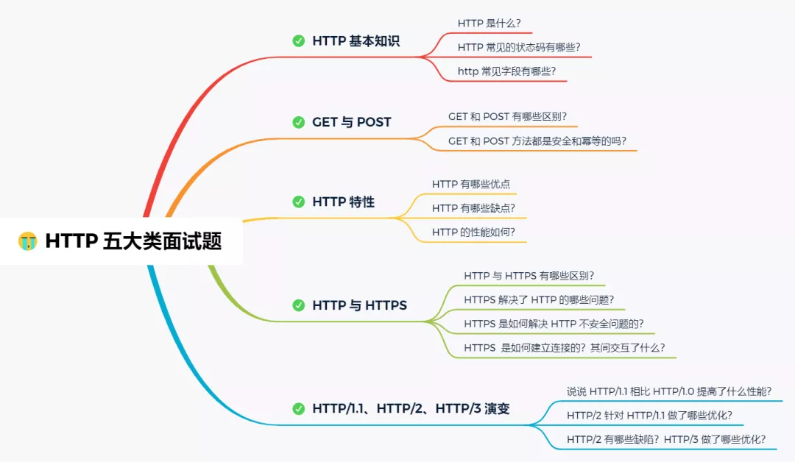
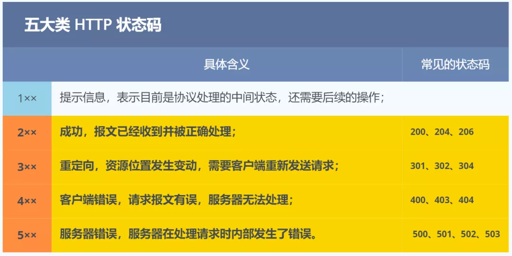
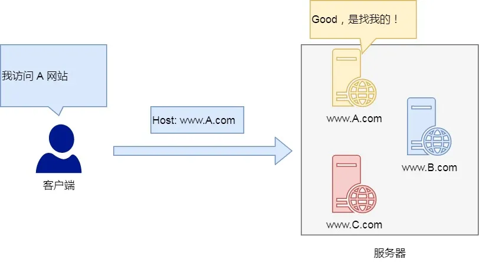
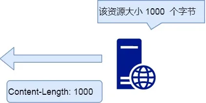
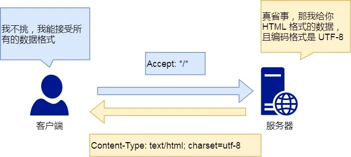
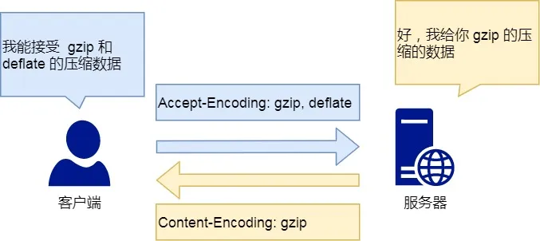

## HTTP 基本概念

HTTP 是超文本传输协议，也就是**H**yperText **T**ransfer **P**rotocol。



HTTP的名字「超文本协议传输」，它可以拆成三个部分：

- 超文本

  我们先来理解「文本」，在互联网早期的时候只是简单的字符文字，但现在「文本」。的涵义已经可以扩展为图片、视频、压缩包等，在 HTTP 眼里这些都算做「文本」。

  再来理解「超文本」，它就是**超越了普通文本的文本**，它是文字、图片、视频等的混合体最关键有超链接，能从一个超文本跳转到另外一个超文本。

  HTML 就是最常见的超文本了，它本身只是纯文字文件，但内部用很多标签定义了图片、视频等的链接，在经过浏览器的解释，呈现给我们的就是一个文字、有画面的网页了。

  OK，经过了对 HTTP 里这三个名词的详细解释，就可以给出比「超文本传输协议」这七个字更准确更有技术含量的答案：

  **HTTP 是一个在计算机世界里专门在「两点」之间「传输」文字、图片、音频、视频等「超文本」数据的「约定和规范」。**

  > 那「HTTP 是用于从互联网服务器传输超文本到本地浏览器的协议HTTP」 ，这种说法正确吗？

  这种说法是**不正确**的。因为也可以是「服务器< -- >服务器」，所以采用**两点之间**的描述会更准确。

- 传输

  HTTP 协议是一个**双向协议**。

  我们在上网冲浪时，浏览器是请求方 A ，百度网站就是应答方 B。双方约定用 HTTP 协议来通信，于是浏览器把请求数据发送给网站，网站再把一些数据返回给浏览器，最后由浏览器渲染在屏幕，就可以看到图片、视频了。

- 协议


## HTTP 常见的状态码



### *1xx*

`1xx` 类状态码属于**提示信息**，是协议处理中的一种中间状态，实际用到的比较少。

### *2xx*

`2xx` 类状态码表示服务器**成功**处理了客户端的请求，也是我们最愿意看到的状态。

「**200 OK**」是最常见的成功状态码，表示一切正常。如果是非 `HEAD` 请求，服务器返回的响应头都会有 body 数据。

「**204 No Content**」也是常见的成功状态码，与 200 OK 基本相同，但响应头没有 body 数据。

「**206 Partial Content**」是应用于 HTTP 分块下载或断电续传，表示响应返回的 body 数据并不是资源的全部，而是其中的一部分，也是服务器处理成功的状态。

### *3xx*

`3xx` 类状态码表示客户端请求的资源发送了变动，需要客户端用新的 URL 重新发送请求获取资源，也就是**重定向**。

「**301 Moved Permanently**」表示永久重定向，说明请求的资源已经不存在了，需改用新的 URL 再次访问。

「**302 Moved Permanently**」表示临时重定向，说明请求的资源还在，但暂时需要用另一个 URL 来访问。

301 和 302 都会在响应头里使用字段 `Location`，指明后续要跳转的 URL，浏览器会自动重定向新的 URL。

「**304 Not Modified**」不具有跳转的含义，表示资源未修改，重定向已存在的缓冲文件，也称缓存重定向，用于缓存控制。

### *4xx*

`4xx` 类状态码表示客户端发送的**报文有误**，服务器无法处理，也就是错误码的含义。

「**400 Bad Request**」表示客户端请求的报文有错误，但只是个笼统的错误。

「**403 Forbidden**」表示服务器禁止访问资源，并不是客户端的请求出错。

「**404 Not Found**」表示请求的资源在服务器上不存在或未找到，所以无法提供给客户端。

### *5xx*

`5xx` 类状态码表示客户端请求报文正确，但是**服务器处理时内部发生了错误**，属于服务器端的错误码。

「**500 Internal Server Error**」与 400 类型，是个笼统通用的错误码，服务器发生了什么错误，我们并不知道。

「**501 Not Implemented**」表示客户端请求的功能还不支持，类似“即将开业，敬请期待”的意思。

「**502 Bad Gateway**」通常是服务器作为网关或代理时返回的错误码，表示服务器自身工作正常，访问后端服务器发生了错误。

「**503 Service Unavailable**」表示服务器当前很忙，暂时无法响应服务器，类似“网络服务正忙，请稍后重试”的意思。

## 常见字段

*Host*

客户端发送请求时，用来指定服务器的域名。




```
Host: www.A.com
```

有了 `Host` 字段，就可以将请求发往「同一台」服务器上的不同网站。

*Content-Length 字段*

服务器在返回数据时，会有 `Content-Length` 字段，表明本次回应的数据长度。




```
Content-Length: 1000
```

如上面则是告诉浏览器，本次服务器回应的数据长度是 1000 个字节，后面的字节就属于下一个回应了。

*Connection 字段*

`Connection` 字段最常用于客户端要求服务器使用 TCP 持久连接，以便其他请求复用。


HTTP/1.1 版本的默认连接都是持久连接，但为了兼容老版本的 HTTP，需要指定 `Connection` 首部字段的值为 `Keep-Alive`。

```
Connection: keep-alive
```

一个可以复用的 TCP 连接就建立了，直到客户端或服务器主动关闭连接。但是，这不是标准字段。

*Content-Type 字段*

`Content-Type` 字段用于服务器回应时，告诉客户端，本次数据是什么格式。




```
Content-Type: text/html; charset=utf-8
```

上面的类型表明，发送的是网页，而且编码是UTF-8。

客户端请求的时候，可以使用 `Accept` 字段声明自己可以接受哪些数据格式。

```
Accept: */*
```

上面代码中，客户端声明自己可以接受任何格式的数据。

*Content-Encoding 字段*

`Content-Encoding` 字段说明数据的压缩方法。表示服务器返回的数据使用了什么压缩格式




```
Content-Encoding: gzip
```

上面表示服务器返回的数据采用了 gzip 方式压缩，告知客户端需要用此方式解压。

客户端在请求时，用 `Accept-Encoding` 字段说明自己可以接受哪些压缩方法。

```
Accept-Encoding: gzip, deflate
```