# Html

h5的文档声明，声明当前的网页是按照HTML5标准编写的

编写网页时一定要将h5的文档声明写在网页的最上边

如果不写文档声明，则会导致有些浏览器会进入一个怪异模式，

进入怪异模式以后，浏览器解析页面会导致页l面无法正常显示，所以为了避免进入该模式，一定要写文档声明

```html
<!doctype *html*>
```

## 实体

```html
<!-- 
			在HTML中，一些如< >这种特殊字符是不能直接使用，
				需要使用一些特殊的符号来表示这些特殊字符，这些特殊符号我们称为实体（转义字符串）
				浏览器解析到实体时，会自动将实体转换为其对应的字符
			实体的语法：
				&实体的名字;
					<  &lt;
					>  &gt;
					空格  &nbsp;
					版权符号 &copy;
		-->
		a&lt;b&gt;c
		<p>&copy;&divide;今天天气&nbsp;&nbsp;&nbsp;好晴朗，处处好风光</p>
```

[w3](https://www.w3school.com.cn/html/html_entities)

## 块元素和内联元素和行内块元素

### 块元素

常见的块元素有`/<h1>~<h6>、<p>、<div>、<ul>、<ol>、<li>`等，其中div标签是最典型的块元素。 

块级元素的特点： 

+ 比较霸道，自己独占一行,无论他的内容有多少。 

+ 高度，宽度、外边距以及内边距都可以控制。 

+ 宽度默认是容器（父级宽度）的100%。 

+ 是一个容器及盒子，里面可以放行内或者块级元素。 

  注意：

  + 文字类的元素内不能使用块级元素 
  + \<p>标签主要用于存放文字，因此里面不能放块级元素，特别是不能放\<div>。
  + 同理，\<h1>-\<h6>等都是文字类块级标签，里面也不能放其他块级元素

### 内联元素

a strong b em i del s ins u spac iframe

行内元素的特点:

+ 相邻行内元素在一行上，一行可以显示多个。

+ 高、宽直接设置是无效的。

+ 默认宽度就是它本身内容的宽度。

+ 行内元素只能容纳文本或其他行内元素。 

  注意：

  + 链接里面不能再放链接
  + 特殊情况\<a>链接里面可以放块级元素，但是给\<a>转换一下块级模式最安全

### 行内块元素

在行内元素中有几个特殊的标签img、input、td,它们同时具有块元素和行内元素的特点。 有些资料称它们为行内块元素

行内块元素的特点：

+ 和相邻行内元素（行内块）在一行上，但是他们之间会有空白缝隙。一行可以显示多个（行内元素特点）。
+ 默认宽度就是它本身内容的宽度（行内元素特点）。
+ 高度，行高、外边距以及内边距都可以控制（块级元素特点）。

## 选择器

### 元素选择器

作用：通过元素选择器可以选则页面中的所有指定元素

语法：标签名 {}

```css
p{
	color: red;
}
```

### id选择器

通过元素的id属性值选中唯一的一个元素

语法：#id属性值 {}

```css
#p1{
	font-size: 20px;
}
```

### 类选择器

通过元素的class属性值选中一组元素

语法：.class属性值{}

```css
.classname{
    color:red;
}
```

### 选择器分组(并集选择器)

通过选择器分组可以同时选中多个选择器对应的元素

语法：选择器1,选择器2,选择器N{}

```css
#p1 , .p2 , h1{
	background-color: yellow;
}
```

### 通配选择器

他可以用来选中页面中的所有的元素
语法：*{}

### 复合选择器（交集选择器）

作用：可以选中同时满足多个选择器的元素

语法：选择器1选择器2选择器N{}

```css
span .p3 {
	background-color: yellow;
}
```

> 对于id选择器来说，不建议使用复合选择器

### 伪类选择器

伪类专门用来表示元素的一种的特殊的状态，
比如：访问过的超链接，比如普通的超链接，比如获取焦点的文本框.当我们需要为处在这些特殊状态的元素设置样式时，就可以使用伪类

```css
/*
 * 为没访问过的链接设置一个颜色为绿色
 * 	:link
 * 		- 表示普通的链接（没访问过的链接）
 */
a:link{
	color: yellowgreen;
}
```

```css
/*
 * 为访问过的链接设置一个颜色为红色
 * 	:visited
 * 		- 表示访问过的链接
 * 
 * 浏览器是通过历史记录来判断一个链接是否访问过,
 * 由于涉及到用户的隐私问题，所以使用visited伪类只能设置字体的颜色
 * 
 */
a:visited{
	color: red;
}
```

```css
/*
 * :hover伪类表示鼠标移入的状态
 */
a:hover{
	color: skyblue;
}
```

```css
/*
 * :active表示的是超链接被点击的状态
 */
a:active{
	color: black;
}
```

```css
/*
 * 文本框获取焦点以后，修改背景颜色为黄色
 */
input:focus{
	background-color: yellow;
}
```

```css
/**
 * 为p标签中选中的内容使用样式
 * 	可以使用::selection为类
 * 	注意：这个伪类在火狐中需要采用另一种方式编写::-moz-select
 */
			
/**
 * 兼容火狐的
 */
p::-moz-selection{
	background-color: orange;
}
			
/**
 * 兼容大部分浏览器的
 */
p::selection{
	background-color: orange;
}
			
```

### 伪元素选择器

*表示元素中的一些特殊的位置*

```css
/*
 * 为p中第一个字符来设置一个特殊的样式
 */		
p:first-letter {
	color: red;
	font-size: 20px;
}
```

```css
/*
 * 为p中的第一行设置一个背景颜色为黄色
 */		
p:first-line {
	background-color: yellow;
}
```

```css
/*
 * :before表示元素最前边的部分
 * 	一般before都需要结合content这个样式一起使用，
 * 	通过content可以向before或after的位置添加一些内容
 * 
 * :after表示元素的最后边的部分
 */
p:before{
	content: "我会出现在整个段落的最前边";
	color: red;
}			
p:after{
	content: "我会出现在整个段落的最后边";
	color: orange;
}
```

### 属性选择器

作用：可以根据元素中的属性或属性值来选取指定元素

语法：
[属性名] 选取含有指定属性的元素
[属性名="属性值"] 选取含有指定属性值的元素
[属性名^="属性值"] 选取属性值以指定内容开头的元素
[属性名$="属性值"] 选取属性值以指定内容结尾的元素
[属性名*="属性值"] 选取属性值以包含指定内容的元素

```css
/*
 * 为title属性值以ab开头的元素设置一个背景颜色为黄色
 */
p[title^="ab"]{
	background-color: yellow;
}	
```

### 结构伪类选择器\子元素选择器

```css
/*
 * 为第一个p标签设置一个背景颜色为黄色
 * 	:first-child 可以选中第一个子元素
 *  :last-child 可以选中最后一个子元素
 */
body > p:first-child{
	background-color: yellow;
}
p:last-child{
	background-color: yellow;
}
			
/*
 * :nth-child 可以选中任意位置的子元素
 * 		该选择器后边可以指定一个参数，指定要选中
 * 		even 表示偶数位置的子元素
 * 		odd 表示奇数位置的子元素
 * 		
 */
p:nth-child(odd){
	background-color: yellow;
}
			
/*
 * :first-of-type
 * :last-of-type
 * :nth-of-type
 * 	和:first-child这些非常的类似，
 * 	只不过child，是在所有的子元素中排列
 * 	而type，是在当前类型的子元素中排列
 */
p:first-of-type{
	background-color: yellow;
}
p:last-of-type{
	background-color: yellow;
}
```

### 兄弟元素选择器

```css
/*
 * 为span后的一个p元素设置一个背景颜色为黄色
 * 后一个兄弟元素选择器
 * 	作用：可以选中一个元素后紧挨着的指定的兄弟元素
 * 	语法：前一个 + 后一个
 * 
 */
span + p{
	background-color: yellow;
}
			
/*
 * 选中后边的所有兄弟元素
 * 	语法：前一个 ~ 后边所有	
 */
span ~ p{
	background-color: yellow;
}
```

### 否定伪类

```css
/*
 * 为所有的p元素设置一个背景颜色为黄色，除了class值为hello的
 * 
 * 否定伪类：
 * 	作用：可以从已选中的元素中剔除出某些元素
 * 	语法：
 * 		:not(选择器)
 */
p:not(.hello){
	background-color: yellow;
}
			
```

### 选择器的优先级

当使用不同的选择器，选中同一个元素时并且设置相同的样式时，这时样式之间产生了冲突，最终到底采用哪个选择器定义的样式，由选择器的优先级（权重）决定, 优先级高的优先显示。

+ 优先级的规则

  + 内联样式  1000
  + id选择器  100
  + 类和伪类  10
  + 元素选择器 1 
  + \* 0

  继承的样式，没有优先级


  当选择器中包含多种选择器时，需要将多种选择器的优先级相加然后在比较，但是注意，选择器优先级计算不会超过他的最大的数量级，如果选择器的优先级一样，则使用靠后的样式。

   * 并集选择器的优先级是单独计算

    div , p , #p1 , .hello{}	
          * 可以在样式的最后，添加一个!important，则此时该样式将会获得一个最高的优先级，将会优先于所有的样式显示甚至超过内联样式，但是在开发中尽量避免使用!important

## 各标签

### em&strong

这两个标签都表示一个强调的内容，
em主要表示语气上的强调,em在浏览器中默认使用斜体显示
strong表示强调的内容，比em更强烈，默认使用粗体显示

### i&b

i标签中的内容会以斜体显示
b标签中的内容会以加粗显示
			
h5规范中规定，对于不需要着重的内容而是单纯的加粗或者是斜体，就可以使用b和i标签

### small

small标签中的内容会比他的父元素中的文字要小一些
在h5中使用small标签来表示一些细则一类的内容
比如：合同中小字，网站的版权声明都可以放到small

### cite

网页中所有的加书名号的内容都可以使用cite标签，表示参考的内容，比如：书名 歌名 话剧名 电影名 。。。

### q

q标签表示一个短的引用（行内引用）
q标签引用的内容，浏览器会默认加上引号
blockquote标签表示一个长引用（块级引用）

```html
<p>
	子曰:<q>学而时习之不亦说乎！</q>
</p>
		
<div>
	子曰:
	<blockquote>
		有朋自远方来，乐呵乐呵！
	</blockquote>
</div>
```

### sup&sub

使用sup/sub标签来设置一个上/下标

### del

使用del标签来表示一个删除的内容
del标签中的内容，会自动添加删除线

### ins

ins表示一个插入的内容
ins中的的内容，会自动添加下划线

### pre&code

需要页面中直接编写一些代码
pre是一个预格式标签，会将代码中的格式保存，不会忽略多个空格
code专门用来表示代码
我们一般结合使用pre和code来表示一段代码

```php+HTML
<pre>
	<code>
		window.onload = function(){
			alert("Hello World");
		};
	</code>
</pre>
```

### ul&li&ol

```html
<!-- 
列表就相当于去超市购物时的那个购物清单，
在HTML也可以创建列表，在网页中一共有三种列表：
	1.无序列表
	2.有序列表
	3.定义列表
	
无序列表
	- 使用ul标签来创建一个无序列表
	- 使用li在ul中创建一个一个的列表项，一个li就是一个列表项
			
通过type属性可以修改无序列表的项目符号
	可选值：
		disc，默认值，实心的圆点
		square，实心的方块
		circle，空心的圆
	注意：默认的项目符号我们一般都不使用！！
	如果需要设置项目符号，则可以采用为li设置背景图片的方式来设置	
	!!!ul和li都是块元素	
-->
<ul>
	<li>西门大官人</li>
	<li>柴大官人</li>
	<li>许大官人</li>
	<li>唐僧大官人</li>
</ul>
		
<!-- 
	有序列表和无序列表类似，只不过它使用ol来代替ul
	有序列表使用有序的序号作为项目符号
	type属性，可以指定序号的类型
		可选值：1，默认值，使用阿拉伯数字
				a/A 采用小写或大写字母作为序号
				i/I 采用小写或大写的罗马数字作为序号
				
	ol也是块元素			
-->
<ol type="I">
	<li>结构</li>
	<li>表现</li>
	<li>行为</li>
</ol>
		
<!-- 
	列表之间都是可以互相嵌套，可以在无序列表中放个有序列表
		也可以在有序列表中放一个无序列表
-->	
<p>菜谱</p>
<ul>
	<li>
		鱼香肉丝
		<ol>
			<li>鱼</li>
			<li>香</li>
			<li>肉丝</li>
		</ol>
	</li>
	<li>
		宫保鸡丁
		<ul>
			<li>宫保</li>
			<li>鸡丁</li>
		</ul>
	</li>
	<li>青椒肉丝</li>
</ul>		
```

### dl&dt&dd

```html
<!--
	定义列表用来对一些词汇或内容进行定义
	使用dl来创建一个定义列表
		dl中有两个子标签
			dt ： 被定义的内容
			dd ： 对定义内容的描述
	同样dl和ul和ol之间都可以互相嵌套		
-->
<dl>
	<dt>武松</dt>
	<dd>景阳冈打虎英雄，战斗力99</dd>
	<dd>后打死西门庆，投奔梁山</dd>
	<dt>武大</dt>
	<dd>著名餐饮企业家，战斗力0</dd>
</dl>
```

### center

```html
<!-- center标签中的内容，会默认在页面中居中显示 
我们可以将要居中的元素，全都放到center中-->		
<center>
	<p>我是一个p标签</p>
</center>
```

### a

```html
<!-- 
使用超链接可以让我们从一个页面跳转到另一个页面
使用a标签来创建一个超链接	
属性：
	href:指向链接跳转的目标地址,可以写一个相对路径也可以写一个完整的地址
		-->
<a href="http://www.baidu.com">我是一个超链接</a> <br /><br />
<a href="http://www.baidu1234567.com">我是一个超链接</a> <br /><br />
		
<!-- 
a标签中的target属性可以用来指定打开链接的位置
可选值：
	_self，表示在当前窗口中打开（默认值）
	_blank，在新的窗口中打开链接
	可以设置一个内联框架的name属性值，链接将会在指定的内联框架中打开
		-->
<a href="demo03.html" target="tom">我是一个超链接</a>
<iframe src="demo02.html" name="tom"></iframe>
```

### iframe

```html
<!-- 
使用内联框架可以引入一个外部的页面
使用iframe来创建一个内联框架
属性：
src ：指向一个外部页面的路径，可以使用相对路径
width：
height：
name ：可以为内联框架指定一个name属性

在现实开发中不推荐使用内联框架，因为内联框架中的内容不会被搜索引擎所检索		
-->
<iframe src="demo02.html" name="tom"></iframe>
```

### meta

```html
<!-- 
	使用meta标签还可以用来设置网页的关键字
-->
<meta name="keywords" content="HTML5,JavaScript,前端,Java" />
		
<!-- 
	还可以用来指定网页的描述
	搜索引擎在检索页面时，会同时检索页面中的关键词和描述，但是这两个值不会影响页面在搜索引擎中
-->
<meta name="description" content="发布h5、js等前端相关的信息" />
		
		
<!-- 
	使用meta可以用来做请求的重定向
	<meta http-equiv="refresh" content="秒数;url=目标路径" />
-->
<meta http-equiv="refresh" content="5;url=http://www.baidu.com" />
```


### p

```html
<!-- 
			在HTML中，字符之间写再多的空格，浏览器也会当成一个空格解析，
				换行也会当成一个空格解析。
			在页面中可以使用br标签来表示一个换行，br标签是一个自结束标签	
		-->
		<p>
			锄禾日当午，<br />
			汗滴禾下土，<br />
			谁知盘中餐，<br />
			粒粒皆辛苦。<br />
		</p>
```

## Html5

### DOCTYPE

DOCTYPE，或者称为 Document Type Declaration（文档类型声明，缩写 DTD）
通常情况下，DOCTYPE 位于一个 HTML 文档的最前面的位置，位于根元素 HTML 的起始标签之前。
因为浏览器必须在解析 HTML 文档正文之前就确定当前文档的类型，以决定其需要采用的渲染模式，
不同的渲染模式会影响到浏览器对于 CSS 代码甚至 JavaScript 脚本的解析。

HTML5提供的<DOCTYPE html>是标准模式，向后兼容的,等同于开启了标准模式，那么浏览器就得老老实实的按照W3C的 标准解析渲染页面。一个不含任何 DOCTYPE 的网页将会以 怪异(quirks) 模式渲染。

### 根元素

H4中的根元素:
\<html xmlns="http://www.w3.org/1999/xhtml">

首先这个标记没有任何问题，你喜欢的话,那就背下来继续用。它是有效的。但这个标记中的很多字节在Html5中我们都可以省略了。

xmlns:这是XHTML1.0的东西，它的意思是在这个页面上的元素都位于http://www.w3.org/1999/xhtml这个命名空间内。但是HTML5中的每个元素都具有这个命名空间，不需要在页面上再显示指出。

H5中的根元素\<html>\</html>

### 语义化标签

以前布局，我们基本用 div 来做。div 对于**搜索引擎**来说，是没有语义的。

```html
<header>：头部标签，代表 网页 或 section 的页眉。通常包含h1-h6元素或hgroup。
<nav>：导航标签,素代表页面的导航链接区域。用于定义页面的主要导航部分。
<article>：内容标签,最容易跟section和div容易混淆，其实article代表一个在文档，页面或者网站中自成一体的内容.
<section>：定义文档某个区域,代表文档中的 节 或 段，段可以是指一篇文章里按照主题的分段；节可以是指一个页面里的分组。
<aside>：侧边栏标签,被包含在article元素中作为主要内容的附属信息部分，其中的内容可以是与当前文章有关的相关资料、标签、名次解释等。
<footer>：尾部标签，代表 网页 或 section 的页脚，通常含有该节的一些基本信息，譬如：作者，相关文档链接，版权资料。
<hgroup>元素代表 网页 或 section 的标题，当元素有多个层级时，该元素可以将h1到h6元素放在其内，譬如文章的主标题和副标题的组合。
	<hgroup>
	   <h1>HTML 5</h1>
	   <h2>这是一篇介绍HTML 5语义化标签和更简洁的结构</h2>
	</hgroup>
hgroup使用注意：
		如果只需要一个h1-h6标签就不用hgroup
		如果有连续多个h1-h6标签就用hgroup
		如果有连续多个标题和其他文章数据，h1-h6标签就用hgroup包住，和其他文章元数据一起放入header标签
```

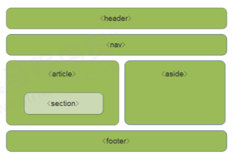

+ 这种语义化标准主要是针对搜索引擎的 
+ 这些新标签页面中可以使用多次 
+ 在 IE9 中，需要把这些元素转换为块级元素 
+ 其实，我们移动端更喜欢使用这些标签 
+ 他们这些标签功能就是代替<div>功能中的一部分，他们没有任何的默认样式，除了会让文本另起一行外；
  https://gsnedders.html5.org/outliner/

### video

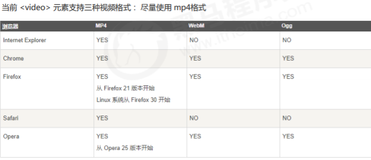

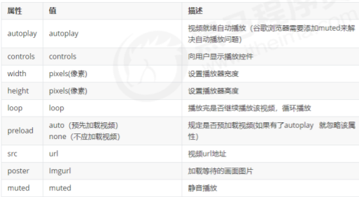


### audio

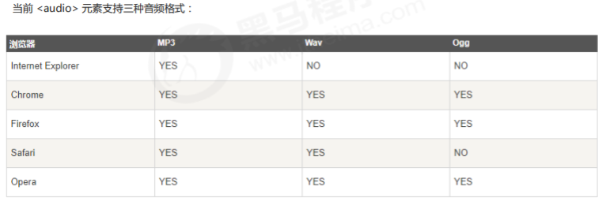

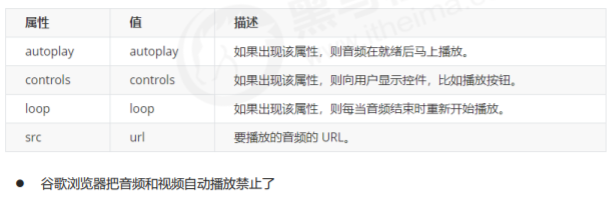

### input

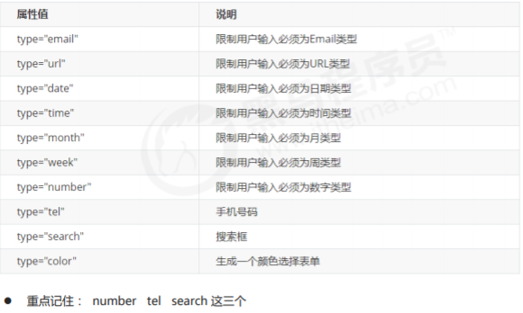

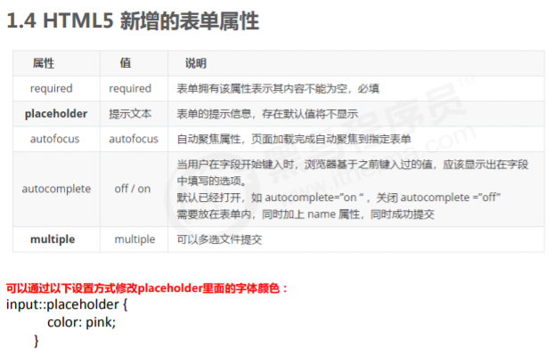

这种语义化标准主要是针对搜索引擎的  这些新标签页面中可以使用多次  在 IE9 中，需要把这些元素转换为块级元素  其实，我们移动端更喜欢使用这些标签  HTML5 还增加了很多其他标签，我们后面再慢慢学

### canvas

\<canvas> 是 HTML5 新增的元素，可用于通过使用JavaScript中的脚本来绘制图形.
	例如，它可以用于绘制图形，创建动画。\<canvas> 最早由Apple引入WebKit.
	我们可以使用\<canvas>标签来定义一个canvas元素
---->使用\<canvas>标签时，建议要成对出现，不要使用闭合的形式。
----->canvas元素默认具有高宽
	width： 300px
	height：150px

#### 整体API

```javascript
1.注意点
---canvas图像的渲染有别于html图像的渲染，
		canvas的渲染极快，不会出现代码覆盖后延迟渲染的问题
		写canvas代码一定要具有同步思想
---在获取上下文时，一定要先判断
---画布高宽的问题
	画布默认高宽300*150
	切记一定要使用html的attribute的形式来定义画布的宽高
	通过css形式定义会缩放画布内的图像
---绘制矩形的问题
	a.边框宽度的问题，边框宽度是在偏移量上下分别渲染一半，可能会出现小数边框，
		一旦出现小数边框都会向上取整
	b.canvas的api只支持一种图像的直接渲染：矩形
---我们没法使用选择器来选到canvas中的图像
2.画布api
	oc.getContext("2d"):获取画布的2d上下文
	oc.width:画布在横向上css像素的个数
	oc.height:画布在纵向上css像素的个数
	oc.toDataUrl():拿到画布的图片地址
3.上下文api
	ctx.fillRect(x,y,w,h):填充矩形
	ctx.strokeRect(x,ymwmh):带边框的矩形
	ctx.clearRect(0,0,oc.width,oc.height):清除整个画布,注意原点的位置
	ctx.fillStyle:填充颜色
		背景fillStyle的值可以是createPattern(image, repetition)返回的对象
		线性渐变fillStyle的值可以是createLinearGradient(x1, y1, x2, y2))返回的对象
				addColorStop(position, color)
			径向渐变fillStyle的值可以是createRadialGradient(x1, y1, r1, x2, y2, r2)返回的对象
				addColorStop(position, color)
	ctx.strokeStyle:线条颜色
	ctx.lineWidth：线条宽度
	ctx.lineCap：线条两端的展现形式
	ctx.lineJoin：线条连接处的展现形式
	ctx.moveTo(x,y):将画笔抬起点到x，y处
	ctx.lineTo(x,y):将画笔移到x，y处
	ctx.rect(x,y,w,h)
	ctx.arc(x,y,r,degS,degE,dir)
	ctx.arcTo(x1,y1,x2,y2,r):2个坐标，一个半径
		结合moveTo(x,y)方法使用，
		x,y:起始点
		x1,y1：控制点
		x2,y2：结束点
	ctx.quadraticCurveTo(x1,y1,x2,y2)
		结合moveTo(x,y)方法使用，
		x,y:起始点
		x1,y1：控制点
		x2,y2：结束点
		必须经过起点和终点
	ctx.bezierCurveTo(x1, y1, x2, y2, x3, y3)
		结合moveTo(x,y)方法使用，
		x,y:起始点
		x1,y1：控制点
		x2,y2：控制点
		x3，y3：结束点
		必须经过起点和终点
	ctx.fill()
	ctx.stroke()
	ctx.beginpath():清除路径容器
	ctx.closepath():闭合路径
		fill自动闭合
		stroke需要手动闭合
	ctx.save()
		将画布当前状态(样式相关 变换相关)压入到样式栈中
	ctx.restore()
		将样式栈中栈顶的元素弹到样式容器中
		图像最终渲染依赖于样式容器
	ctx.translate(x,y):将原点按当前坐标轴位移x，y个单位
	ctx.rotate(弧度):将坐标轴按顺时针方向进行旋转
	ctx.scale(因子):
		放大：放大画布，画布中的一个css像素所占据的物理面积变大，画布中包含的css像素的个数变少
			画布中图像所包含的css像素的个数不变
		缩小：缩小画布，画布中的一个css像素所占据的物理面积变小，画布中包含的css像素的个数变多
			画布中图像所包含的css像素的个数不变
	ctx.drawImage(img,x,y,w,h):在canvas中引入图片一定在图片加载完成之后再去操作
	ctx.measureText("文本"):返回一个持有文本渲染宽度的对象
	ctx.fillText()
	ctx.strokeText()
	ctx.font
	ctx.textAlign
	ctx.textBaseline
	shadowOffsetX = float
	shadowOffsetY = float
	shadowBlur = float
	shadowColor = color(必需项)
	ctx.getImageData(x,y,w,h)
		ImageData对象
			width：选中区域在横向上css像素的个数
			height：选中区域在纵向上css像素的个数
			data:数组
				选中区域所有像素点的rgba信息，rgba的取值从0到255
	ctx.putImageData(imgdata,x,y)
	ctx.createImageData(w,h)
		返回的是imgdata对象 默认像素点的信息是rgba(0,0,0,0)
	ctx.globalAlpha
		取值为0到1
	ctx.globalCompositeOperation
		source-over(默认值):源在上面,新的图像层级比较高
		source-in  :只留下源与目标的重叠部分(源的那一部分)
		source-out :只留下源超过目标的部分
		source-atop:砍掉源溢出的部分
		destination-over:目标在上面,旧的图像层级比较高
		destination-in:只留下源与目标的重叠部分(目标的那一部分)
		destination-out:只留下目标超过源的部分
		destination-atop:砍掉目标溢出的部分	
	ctx.ispointinpath(x,y)
		x,y这个点是否在路径上
4.实例
	时钟动画：结合了所有基础api
	飞鸟动画：结合图片创建动画
	马赛克：像素操作
	刮刮卡：合成+像素操作	
```

#### 替换内容

\<canvas>很容易定义一些替代内容。由于某些较老的浏览器（尤其是IE9之前的IE浏览器）
	不支持HTML元素"canvas"，
	但在这些浏览器上你应该要给用户展示些替代内容。
	这非常简单：我们只需要在<canvas>标签中提供替换内容就可以。
	--->支持<canvas>的浏览器将会忽略在容器中包含的内容，并且只是正常渲染canvas。
	-->不支持<canvas>的浏览器会显示代替内容

#### canvas标签的两个属性

\<canvas> 看起来和\元素很相像，唯一的不同就是它并没有 src 和 alt 属性。
	实际上，\<canvas> 标签只有两个属性—— width和height。这些都是可选的。
	当没有设置宽度和高度的时候，canvas会初始化宽度为300像素和高度为150像素。

>画布的高宽
>html属性设置width height时只影响画布本身不影画布内容
>css属性设置width height时不但会影响画布本身的高宽，
>还会使画布中的内容等比例缩放（缩放参照于画布默认的尺寸）

#### 渲染上下文

\<canvas> 元素只是创造了一个固定大小的画布，要想在它上面去绘制内容，我们需要找到它的渲染上下文.\<canvas> 元素有一个叫做 getContext() 的方法，这个方法是用来获得渲染上下文和它的绘画功能。

```javascript
var canvas = document.getElementById('box');
var ctx = canvas.getContext('2d');
```

检查支持性

```javascript
var canvas =document.getElementById('tutorial');
if (canvas.getContext){
	var ctx = canvas.getContext('2d');
} 
```

#### 绘制矩形

HTML中的元素canvas只支持一种原生的图形绘制：矩形。所有其他的图形的绘制都至少需要生成一条路径.

canvas提供了三种方法绘制矩形：

1. 绘制一个填充的矩形（填充色默认为黑色）

   `fillRect(x, y, width, height)`

2. 绘制一个矩形的边框（默认边框为:一像素实心黑色）

   `strokeRect(x, y, width, height)`

3. 清除指定矩形区域，让清除部分完全透明。	

   `clearRect(x, y, width, height)`

x与y指定了在canvas画布上所绘制的矩形的左上角（相对于原点）的坐标。width和height设置矩形的尺寸。（存在边框的话，边框会在width上占据一个边框的宽度，height同理）

#### strokeRect时，边框像素渲染问题

按理渲染出的边框应该是1px的，
canvas在渲染矩形边框时，边框宽度是平均分在偏移位置的两侧。
context.strokeRect(10,10,50,50):边框会渲染在10.5 和 9.5之间,浏览器是不会让一个像素只用自己的一半的
相当于边框会渲染在9到11之间
context.strokeRect(10.5,10.5,50,50):边框会渲染在10到11之间

#### 添加样式和颜色

fillStyle   :设置图形的填充颜色。
strokeStyle :设置图形轮廓的颜色。
默认情况下，线条和填充颜色都是黑色（CSS 颜色#000000）
ineWidth : 这个属性设置当前绘线的粗细。属性值必须为正数。
描述线段宽度的数字。 0、 负数、 Infinity 和 NaN 会被忽略。
默认值是1.0。

#### lineJoin

设定线条与线条间接合处的样式（默认是 miter）
	round : 圆角
	bevel : 斜角
	miter : 直角

#### 绘制路径基础api

图形的基本元素是路径。路径是通过不同颜色和宽度的线段或曲线相连形成的不同形状的点的集合。
1.首先，你需要创建路径起始点。
2.然后你使用画图命令去画出路径
3.之后你把路径封闭。
4.一旦路径生成，你就能通过描边或填充路径区域来渲染图形。

##### `beginPath()`

新建一条路径，生成之后，图形绘制命令被指向到路径上准备生成路径。本质上，路径是由很多子路径构成，这些子路径都是在一个列表中，所有的子路径（线、弧形、等等）构成图形。而每次这个方法调用之后，列表清空重置，然后我们就可以重新绘制新的图形。

##### `moveTo(x, y)`

将笔触移动到指定的坐标x以及y上,当canvas初始化或者beginPath()调用后，你通常会使用moveTo()函数设置起点.

##### `lineTo(x, y)`

将笔触移动到指定的坐标x以及y上,绘制一条从当前位置到指定x以及y位置的直线。

##### `closePath()`

闭合路径之后图形绘制命令又重新指向到上下文中。闭合路径closePath(),不是必需的。这个方法会通过绘制一条从当前点到开始点的直线来闭合图形。如果图形是已经闭合了的，即当前点为开始点，该函数什么也不做
当你调用fill()函数时，所有没有闭合的形状都会自动闭合，所以你不需要调用closePath()函数。
但是调用stroke()时不会自动闭合.

##### `stroke()`

通过线条来绘制图形轮廓。不会自动调用closePath().

##### `fill()`

通过填充路径的内容区域生成实心的图形。自动调用closePath().

##### `rect(x, y, width, height)`

绘制一个左上角坐标为（x,y），宽高为width以及height的矩形。当该方法执行的时候，moveTo()方法自动设置坐标参数（0,0）。也就是说，当前笔触自动重置会默认坐标.

##### `save()`

是 Canvas 2D API 通过将当前状态放入栈中，保存 canvas 全部状态的方法.

##### `restore()` 

是 Canvas 2D API 通过在绘图状态栈中弹出顶端的状态，将 canvas 恢复到最近的保存状态的方法。 如果没有保存状态，此方法不做任何改变。	

##### `lineCap`

lineCap 是 Canvas 2D API 指定如何绘制每一条线段末端的属性。
有3个可能的值，分别是：
	lineCap="butt"  :线段末端以方形结束。 
	round :线段末端以圆形结束
	square:线段末端以方形结束，但是增加了一个宽度和线段相同，高度是线段厚度一半的矩形区域
	默认值是 butt。

> 保存到栈中的绘制状态有下面部分组成：
> 	当前的变换矩阵。
> 	当前的剪切区域。
> 	当前的虚线列表.
> 	以下属性当前的值： strokeStyle, 
> 				 fillStyle,  
> 				 lineWidth, 
> 				 lineCap, 
> 				 lineJoin...


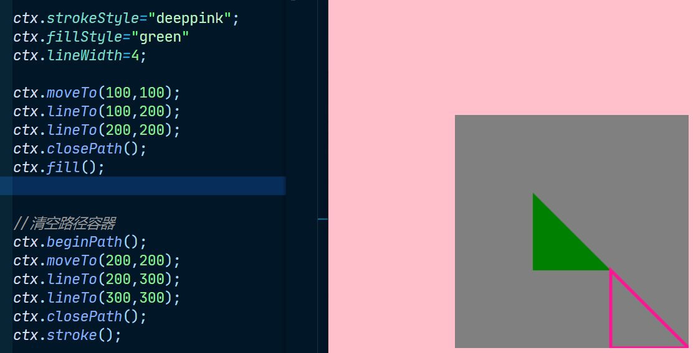

`beginPath\closePath`很重要，不然两个三角形第二次都会生成，后生成的会覆盖前面的。

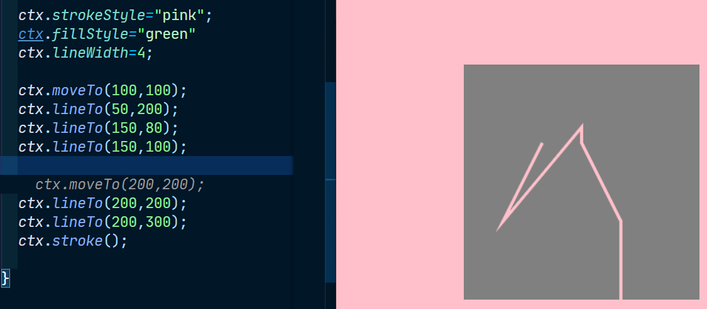

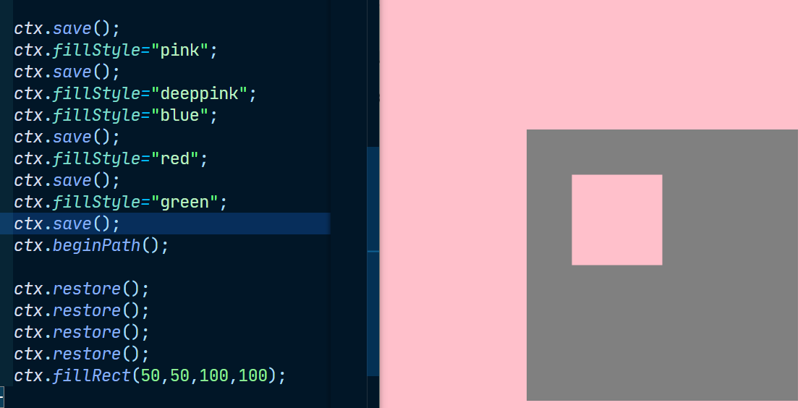

注意，颜色取决于save restore的嵌套层级，如下图save压栈，restore弹栈

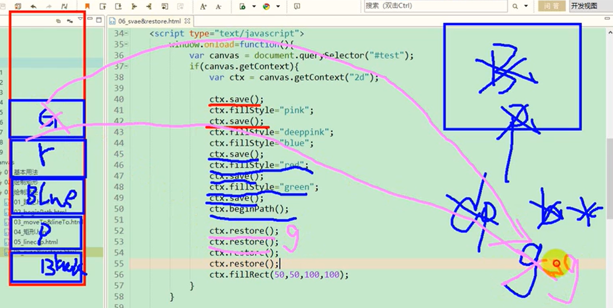

##### 基础模板

```javascript
window.onload=function(){
	/*
	1.路径容器
		每次调用路径api时,都会往路径容器里做登记
		调用beginPath时,清空整个路径容器
	2.样式容器
		每次调用样式api时,都会往样式容器里做登记
		调用save时候,将样式容器里的状态压入样式栈
		调用restor时候,将样式栈的栈顶状态弹出到样式样式容器里,进行覆盖
	3.样式栈
		调用save时候,将样式容器里的状态压入样式栈
		调用restore时候,将样式栈的栈顶状态弹出到样式样式容器里,进行覆盖
	*/
	
	var canvas = document.querySelector("#test");
	if(canvas.getContext){
		var ctx = canvas.getContext("2d");
		
		ctx.save();
		//关于样式的设置
		//save  restore成对出现
		ctx.beginPath();
		//关于路径
		ctx.restore();
		
		
		ctx.save();
		//关于样式的设置
		ctx.beginPath();
		//关于路径
		
		ctx.fill();
		ctx.restore();
	}
```

##### 案例 签名

```html
<!DOCTYPE html>
<html>
	<head>
		<meta charset="UTF-8">
		<title></title>
		<style type="text/css">
			*{
				margin: 0;
				padding: 0;
			}
			body{
				background: gray;
			}
			#test{
				position: absolute;
				left: 0;
				right: 0;
				top: 0;
				bottom: 0;
				margin: auto;
				background:white;
			}
		</style>
	</head>
	<body>
		<canvas id="test" width="500" height="500"></canvas>
	</body>
	<script type="text/javascript">
		
		window.onload=function(){
			
			var canvas =document.getElementById("test");
			if(canvas.getContext){
				var ctx = canvas.getContext("2d");
			}
			
			canvas.onmousedown=function(ev){
				ev = ev || window.event;
				if(canvas.setCapture){
					canvas.setCapture();
				}
				ctx.beginPath();
				ctx.moveTo(ev.clientX -canvas.offsetLeft,ev.clientY -canvas.offsetTop);
				document.onmousemove=function(ev){
					ctx.save();
					ctx.strokeStyle="pink";
					ev = ev || event;
					ctx.lineTo(ev.clientX -canvas.offsetLeft,ev.clientY -canvas.offsetTop);
					ctx.stroke();
					ctx.restore();
				}
				document.onmouseup=function(){
					document.onmousemove=document.onmouseup=null;
					if(document.releaseCapture){
						document.releaseCapture();
					}
				}
				return false;
			}
			
		}
		
	</script>
</html>

```

#### 圆形

弧度的js表达式:`radians=(Math.PI/180)*degrees。`

##### `arc(x,y,radius,startAngle,endAngle,anticlockwise)`

画一个以（x,y）为圆心的以radius为半径的圆弧（圆），从startAngle开始到endAngle结束，
按照anticlockwise给定的方向（默认为顺时针）来生成。
	ture：逆时针
	false:顺时针

+ x,y为绘制圆弧所在圆上的圆心坐标

+ radius为半径

+ startAngle以及endAngle参数用弧度定义了开始以及结束的弧度。这些都是以x轴为基准
+ 参数anticlockwise 为一个布尔值。为true时，是逆时针方向，否则顺时针方向。

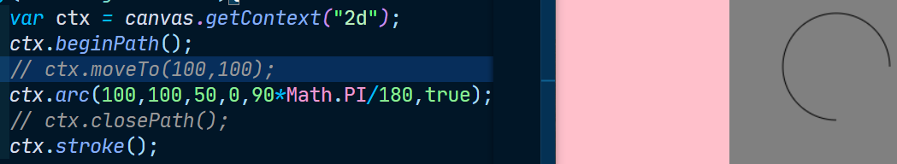

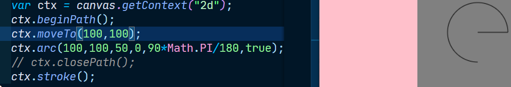

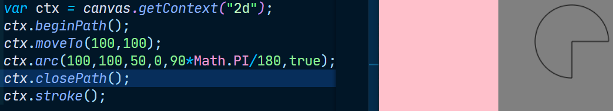

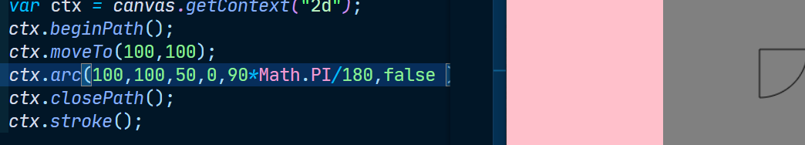

##### `arcTo(x1, y1, x2, y2, radius)`

根据给定的控制点和半径画一段圆弧
肯定会从(x1 y1) 但不一定经过(x2 y2);(x2 y2)只是控制一个方向

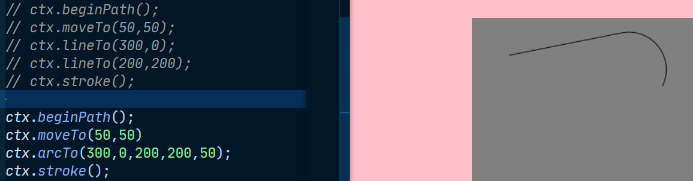


#### 贝塞尔

`quadraticCurveTo(cp1x, cp1y, x, y)`
绘制二次贝塞尔曲线，cp1x,cp1y为一个控制点，x,y为结束点。
起始点为moveto时指定的点.
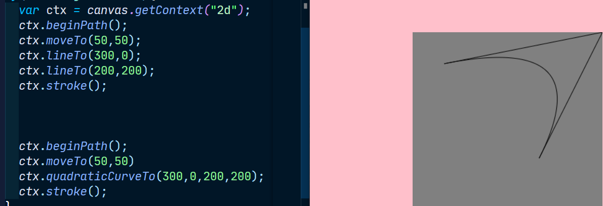

`bezierCurveTo(cp1x, cp1y, cp2x, cp2y, x, y)`
绘制三次贝塞尔曲线，cp1x,cp1y为控制点一，cp2x,cp2y为控制点二，x,y为结束点。
起始点为moveto时指定的点.

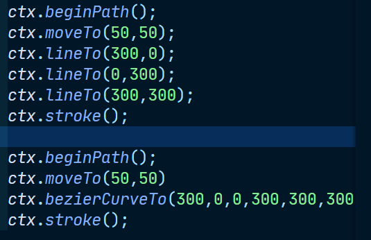

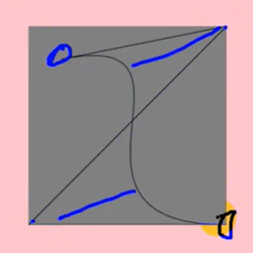

#### canvas中的变换

##### `translate(x, y)`

我们先介绍 translate 方法，它用来移动 canvas的原点到一个不同的位置。
translate 方法接受两个参数。x 是左右偏移量，y 是上下偏移量，**在canvas中translate是累加的.**

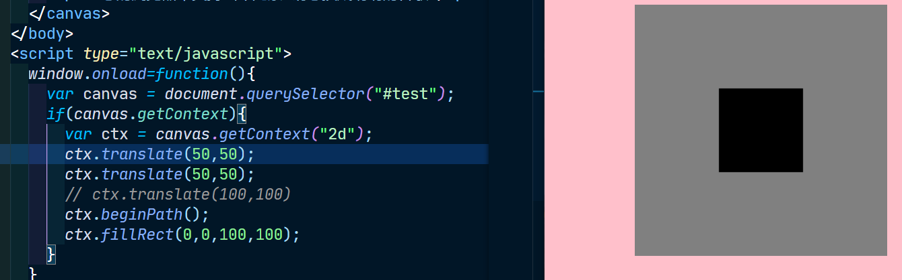

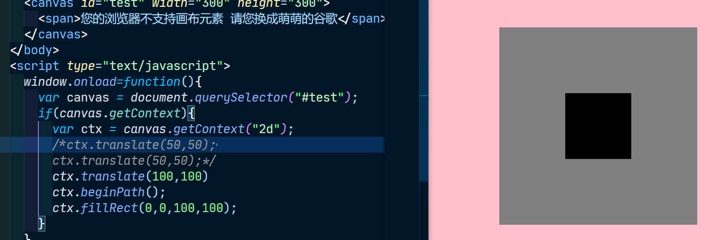

##### `rotate(angle)`

这个方法只接受一个参数：旋转的角度(angle)，它是顺时针方向的，以弧度为单位的值。
旋转的中心点始终是 canvas 的原点，如果要改变它，我们需要用到 translate 方法,**在canvas中rotate是累加的**

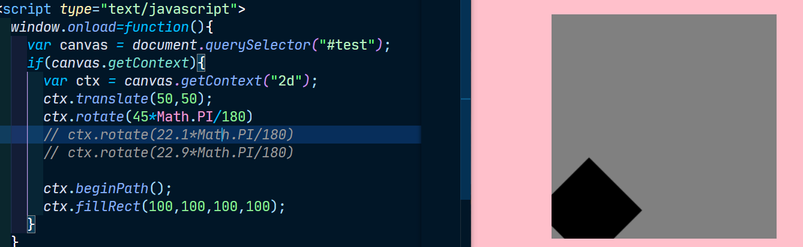


##### `scale(x, y)`

scale 方法接受两个参数。x,y 分别是横轴和纵轴的缩放因子，它们都必须是正值。值比 1.0 小表示缩小，比 1.0 大则表示放大，值为 1.0 时什么效果都没有。
缩放一般我们用它来增减图形在 canvas 中的像素数目，对形状，位图进行缩小或者放大。**在canvas中scale是累称的。**

> *css像素是一个抽象单位*
>
> 放大:使画布内css像素的个数变少，单个css像素所占据的实际物理尺寸变大
>
> 缩小:使画布内css像素的个数变多，单个css像素所占据的实际物理尺寸变小

##### 变换实例

```html
<!DOCTYPE html>
<html>

<head>
  <meta charset="UTF-8">
  <title></title>
  <style type="text/css">
    * {
      margin: 0;
      padding: 0;
    }

    html,
    body {
      height: 100%;
      overflow: hidden;
    }

    body {
      background: pink;
    }

    #test {
      background: gray;
      position: absolute;
      left: 0;
      top: 0;
      right: 0;
      bottom: 0;
      margin: auto;
    }
  </style>
</head>

<body>
  <canvas id="test" width="300" height="300">
    <span>您的浏览器不支持画布元素 请您换成萌萌的谷歌</span>
  </canvas>
</body>
<script type="text/javascript">
  window.onload = function () {
    var flag = 0;
    var scale = 0;
    var flagScale = 0;
    var canvas = document.querySelector("#test");
    if (canvas.getContext) {
      var ctx = canvas.getContext("2d");
      ctx.save();
      ctx.translate(150, 150);
      ctx.beginPath()
      ctx.fillRect(-50, -50, 100, 100);
      ctx.restore();
      setInterval(function () {
        flag++

        ctx.clearRect(0, 0, canvas.width, canvas.height)
        ctx.save()
        ctx.translate(150, 150);
        ctx.rotate(flag * Math.PI / 180)

        if (scale == 100) {
          flagScale = -1;
        } else if(scale==0){
          flagScale = 1
        }
        scale+=flagScale
        ctx.scale(scale/50,scale/50)
        ctx.beginPath()
        ctx.fillRect(-50, -50, 100, 100);
        ctx.restore()
      }, 1000 / 60)
    }
  }


</script>

</html>
```

#### 实例 钟表

1.初始化
		将圆心调整到画布的中间
		由于canvas中画圆与旋转所参照的坐标系于正常坐标系有出入
			将整个画布逆时针旋转90度
		初始化一些样式数据
			ctx.lineWidth = 8;
		  	ctx.strokeStyle = "black";
		  	ctx.lineCap = "round";
2.外层空心圆盘
	圆盘颜色:#325FA2
	圆盘宽度:14
	圆盘半径:140
	
3.时针刻度
	长度为20
	宽度为8
	外层空心圆盘与时针刻度之间的距离也为20
	
4.分针刻度
	宽度为4
	长度为3
	
5.时针
	宽度为14
	圆心外溢出80 收20
	
6.分针
	宽度为10
	圆心外溢出112 收28
	
7.秒针
	颜色:D40000
	宽度为6
	圆心外溢出83 收30
	---->中心实心圆盘
	半径为10

​	---->秒针头
​	96码开外半径为10的空心圆
​	宽度为6

```html
<!DOCTYPE html>
<html>
	<head>
		<meta charset="UTF-8">
		<title></title>
		<style type="text/css">
			*{
				margin: 0;
				padding: 0;
			}
			html,body{
				height: 100%;
				overflow: hidden;
				background: pink;
			}
			#clock{
				background: gray;
				position: absolute;
				left: 50%;
				top: 50%;
				transform: translate3d(-50%,-50%,0);
			}
			
			
			
		</style>
	</head>
	<body>
		<canvas id="clock" width="400" height="400"></canvas>
	</body>
	<script type="text/javascript">
		
		window.onload=function(){
			var clock = document.querySelector("#clock");
			if(clock.getContext){
				var ctx = clock.getContext("2d");
				setInterval(function(){
					ctx.clearRect(0,0,clock.width,clock.height);
					move();
				},1000);
				
				move();
				function move(){
					ctx.save();
					ctx.lineWidth = 8;
				  	ctx.strokeStyle = "black";
				  	ctx.lineCap = "round";
					ctx.translate(200,200);
					ctx.scale(.5,.5)
					ctx.rotate(-90*Math.PI/180);
					ctx.beginPath();
					
					//外层空心圆盘
					ctx.save();
					ctx.strokeStyle="#325FA2";
					ctx.lineWidth = 14;
					ctx.beginPath();
					ctx.arc(0,0,140,0,360*Math.PI/180);
					ctx.stroke();
					ctx.restore();
					
					
					//时针刻度
					ctx.save();
					for(var i=0;i<12;i++){
						ctx.rotate(30*Math.PI/180);
						ctx.beginPath();
						ctx.moveTo(100,0)
						ctx.lineTo(120,0);
						ctx.stroke();
					}
					ctx.restore();
					
					//分针刻度
					ctx.save();
					ctx.lineWidth=4;
					for(var i=0;i<60;i++){
						ctx.rotate(6*Math.PI/180);
						if((i+1)%5!=0){
							ctx.beginPath();
							ctx.moveTo(117,0)
							ctx.lineTo(120,0);
							ctx.stroke();
						}
					}
					ctx.restore();
					
					//时针 分针 秒针 表座
					var date = new Date();
					var s = date.getSeconds();
					var m = date.getMinutes()+s/60;
					var h = date.getHours()+m/60;
					h = h>12?h-12:h;
					
					//时针
					ctx.save()
					ctx.lineWidth=14;
					ctx.rotate(h*30*Math.PI/180)
					ctx.beginPath()
					ctx.moveTo(-20,0);
					ctx.lineTo(80,0);
					ctx.stroke();
					ctx.restore()
					
					//分针
					ctx.save()
					ctx.lineWidth=10;
					ctx.rotate(m*6*Math.PI/180)
					ctx.beginPath()
					ctx.moveTo(-28,0);
					ctx.lineTo(112,0);
					ctx.stroke();
					ctx.restore()
					
					
					//秒针
					ctx.save()
					ctx.lineWidth=6;
					ctx.strokeStyle="#D40000";
					ctx.fillStyle="#D40000";
					ctx.rotate(s*6*Math.PI/180)
					ctx.beginPath();
					ctx.moveTo(-30,0);
					ctx.lineTo(83,0);
					ctx.stroke();
						//表座
						ctx.beginPath();
						ctx.arc(0,0,10,0,360*Math.PI/180);
						ctx.fill();
						//秒头
						ctx.beginPath();
						ctx.arc(96,0,10,0,360*Math.PI/180);
						ctx.stroke();
					ctx.restore()
					ctx.restore();
				}
			}			
        }
	</script>
</html>
```

#### 在canvas中插入图片

(需要image对象)

1. canvas操作图片时，必须要等图片加载完才能操作
2. drawImage(image, x, y, width, height)
   其中 image 是 image 或者 canvas 对象，x 和 y 是其在目标 canvas 里的起始坐标。
   这个方法多了2个参数：width 和 height，这两个参数用来控制 当像canvas画入时应该缩放的大小。

可以参考MDN文档了解img对象地各种属性

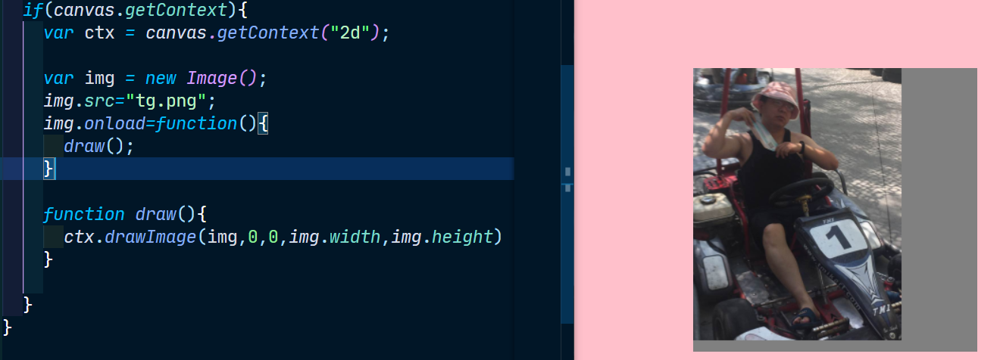

#### 在canvas中设置背景

createPattern(image, repetition)

image:图像源
epetition:
		"repeat" 
		"repeat-x" 
		"repeat-y" 
		"no-repeat" 

一般情况下，我们都会将createPattern返回的对象作为fillstyle的值。

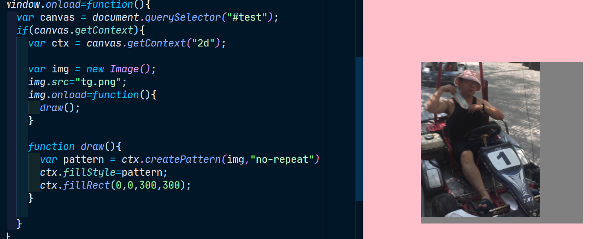

#### 渐变

##### 线性渐变

`createLinearGradient(x1, y1, x2, y2)`

+ 表示渐变的起点 (x1,y1) 与终点 (x2,y2)。

`gradient.addColorStop(position, color)`

+ gradient :createLinearGradient的返回值
+ addColorStop 方法接受 2 个参数:
  + position 参数必须是一个 0.0 与 1.0 之间的数值，表示渐变中颜色所在的相对位置。例如，0.5 表示颜色会出现在正中间。
  + color 参数必须是一个有效的 CSS 颜色值（如 #FFF， rgba(0,0,0,1)，等等）

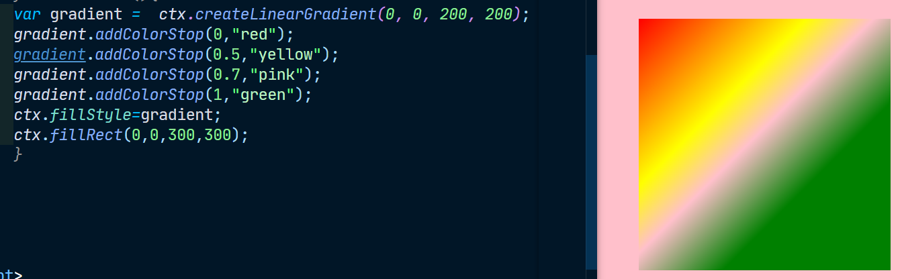

##### 径向渐变

`createRadialGradient(x1, y1, r1, x2, y2, r2)`

+ 前三个参数则定义另一个以(x1,y1) 为原点，半径为 r1 的圆。
+ 后三个参数则定义另一个以 (x2,y2) 为原点，半径为 r2 的圆。


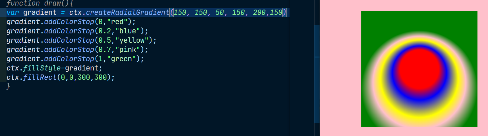

#### 文本相关

##### 绘制

canvas 提供了两种方法来渲染文本:

+ `fillText(text, x, y)`在指定的(x,y)位置填充指定文本
+ `strokeText(text, x, y)`在指定的(x,y)位置绘制文本边框

文本样式
font = value
当前我们用来绘制文本的样式. 这个字符串使用和 CSS font 属性相同的语法。
默认的字体是 10px sans-serif。font属性在指定时，必须要有大小和字体 缺一不可。

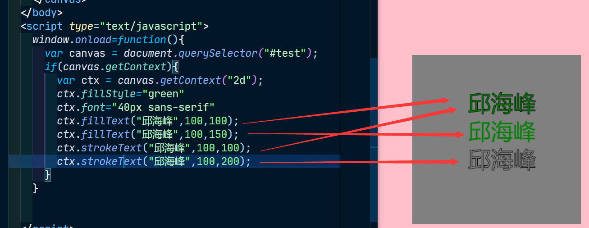

`textAlign = value`
文本对齐选项,可选的值包括： left, right  center. 

+ left文本左对齐。
+ right文本右对齐。
+ center文本居中对齐。

这里的textAlign="center"比较特殊。textAlign的值为center时候文本的居中是基于你在fillText的时候所给的x的值，也就是说文本一半在x的左边，一半在x的右边。

`textBaseline = value`
描述绘制文本时，当前文本基线的属性。

+ top文本基线在文本块的顶部。
+ middle文本基线在文本块的中间。
+ bottom文本基线在文本块的底部。

##### measureText

measureText() 方法返回一个 TextMetrics 对象，包含关于文本尺寸的信息（例如文本的宽度）

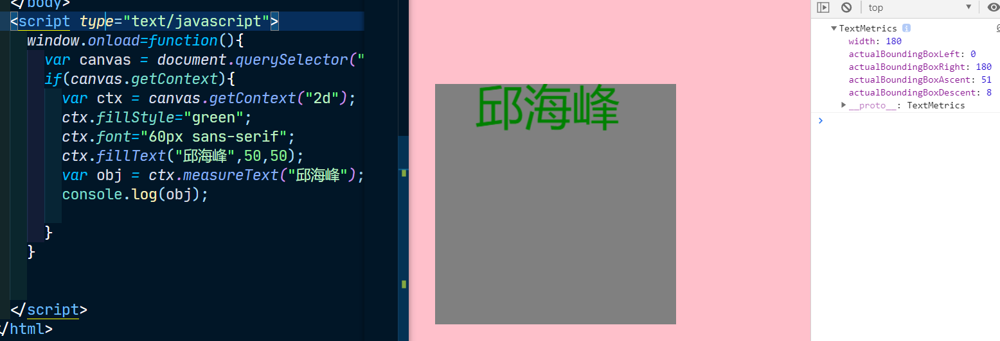

##### canvas中文本水平垂直居中

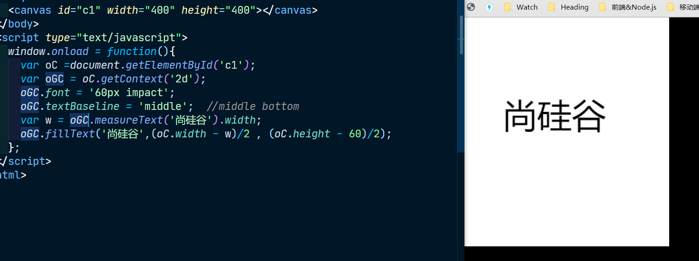

##### 文本阴影&盒阴影


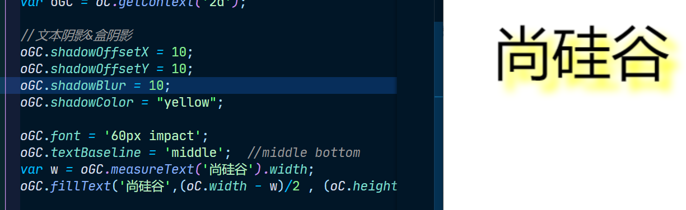

#### 像素相关

到目前为止，我们尚未深入了解Canvas画布真实像素的原理，事实上，你可以直接通过ImageData对象操纵像素数据，直接读取或将数据数组写入该对象中。

##### 得到场景像素数据

`getImageData()`:获得一个包含画布场景像素数据的`ImageData`对像,它代表了画布区域的对象数据。

`ctx.getImageData(sx, sy, sw, sh)`

+ sx:将要被提取的图像数据矩形区域的左上角 x 坐标。
+ sy:将要被提取的图像数据矩形区域的左上角 y 坐标。
+ sw:将要被提取的图像数据矩形区域的宽度。
+ sh:将要被提取的图像数据矩形区域的高度。

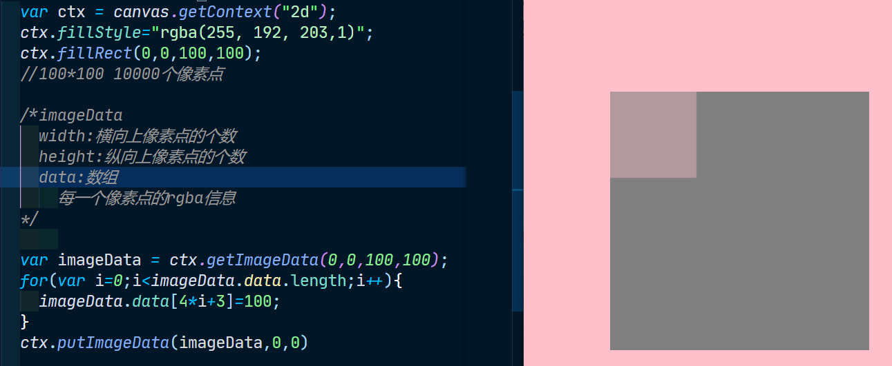

`ImageData`对象中存储着`canvas`对象真实的像素数据，它包含以下几个只读属性：

+ width:图片宽度，单位是像素
+ height:图片高度，单位是像素
+ data:Uint8ClampedArray类型的一维数组，
  包含着RGBA格式的整型数据，范围在0至255之间（包括255）
  + R:0 --> 255(黑色到白色)
  + G:0 --> 255(黑色到白色)
  + B:0 --> 255(黑色到白色)
  + A:0 --> 255(透明到不透明)

##### 创建一个`ImageData`对象

`ctx.createImageData(width, height);`

+ width : ImageData 新对象的宽度。
+ height: ImageData 新对象的高度。

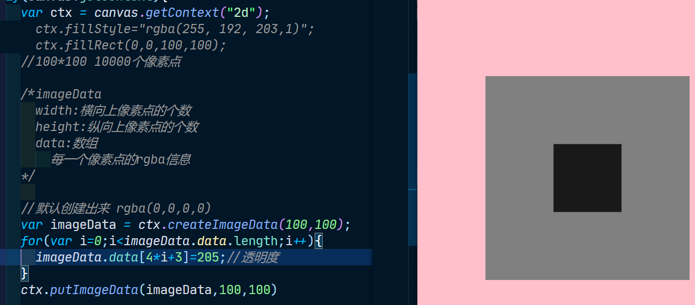

##### 在场景中写入像素数据

`putImageData()`方法去对场景进行像素数据的写入。
`putImageData(myImageData, dx, dy)`

+ dx和dy 参数表示你希望在场景内左上角绘制的像素数据所得到的设备坐标

##### 操作单个像素（行与列）

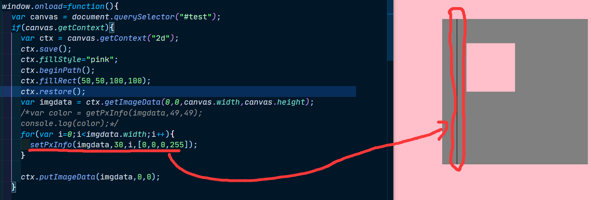

两个操作函数,注意这里有老生常谈的xy计算问题。

```javascript
function getPxInfo(imgdata, x, y) {
	var color = [];
	var data = imgdata.data;
	var w = imgdata.width;
	var h = imgdata.height;
	//(x,y)  x*w+y
	//r
	color[0] = data[(y * w + x) * 4];
	//g
	color[1] = data[(y * w + x) * 4 + 1];
	//b
	color[2] = data[(y * w + x) * 4 + 2];
	//a
	color[3] = data[(y * w + x) * 4 + 3];
	return color;
}
function setPxInfo(imgdata, x, y, color) {
	var data = imgdata.data;
	var w = imgdata.width;
	var h = imgdata.height;
	//(x,y)  x*w+y   x:多少列  y：多少行
	//r
	data[(y * w + x) * 4] = color[0];
	//g
	data[(y * w + x) * 4 + 1] = color[1];
	//b
	data[(y * w + x) * 4 + 2] = color[2];
	//a
	data[(y * w + x) * 4 + 3] = color[3];
}
```

##### 马赛克

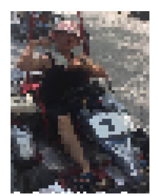

```html
<!DOCTYPE html>
<html>
	<head>
		<meta charset="UTF-8">
		<title></title>
		<style type="text/css">
			*{
				margin: 0;
				padding: 0;
			}
			html,body{
				height: 100%;
				overflow: hidden;
			}
			#msk{
				position: absolute;
				left: 50%;
				top: 50%;
				transform: translate3d(-50%,-50%,0);
				/*background: gray;*/
			}
			
		</style>
	</head>
	<body>
		<canvas id="msk" ></canvas>
	</body>
	<script type="text/javascript">
		var oc = document.querySelector("#msk");
		if(oc.getContext){
			var ctx = oc.getContext("2d");
			var img = new Image();
			img.src="2.png";
			img.onload=function(){
				oc.width=img.width*2;
				oc.height=img.height;
				draw();
			}
			function draw(){
				ctx.drawImage(img,0,0);
				var oldImgdata = ctx.getImageData(0,0,img.width,img.height);
				var newImgdata = ctx.createImageData(img.width,img.height);
				//马赛克
				/*
					1.选取一个马赛克矩形
					2.从马赛克矩形中随机抽出一个像素点的信息(rgba)
					3.将整个马赛克矩形中的像素点信息统一调成随机抽出的那个
				*/
				//选取一个马赛克矩形
				var size = 5;
				for(var i=0;i<oldImgdata.width/size;i++){
					for(var j=0;j<oldImgdata.height/size;j++){
						//(i,j)  每一个马赛克矩形的坐标
						//(0,0):  (0,0)  (4,4);[0,4]   //(1,0): (5,0) (9,4)
						//(0,1):  (0,5)  (4,9)	 	   //(1,1): (5,5) (9,9)
						//Math.random()  [0,1)
						//Math.random()*size  [0,5)
						//Math.floor(Math.random()*size) [0,4]
						//从马赛克矩形中随机抽出一个像素点的信息(rgba)
						var color = getPxInfo(oldImgdata,i*size+Math.floor(Math.random()*size),j*size+Math.floor(Math.random()*size));
						
						//将整个马赛克矩形中的像素点信息统一调成随机抽出的那个
						for(var a=0;a<size;a++){
							for(var b=0;b<size;b++){
								setPxInfo(newImgdata,i*size+a,j*size+b,color)
							}
						}
					}
				}
				// ctx.clearRect(0,0,oc.width,oc.height);
				ctx.putImageData(newImgdata,0,0);
			}
			function getPxInfo(imgdata,x,y){
				var color = [];
				var data = imgdata.data;
				var w = imgdata.width;
				var h = imgdata.height;
				color[0]=data[(y*w+x)*4];
				color[1]=data[(y*w+x)*4+1];
				color[2]=data[(y*w+x)*4+2];
				color[3]=data[(y*w+x)*4+3];
				return color;
			}
			function setPxInfo(imgdata,x,y,color){
				var data = imgdata.data;
				var w = imgdata.width;
				var h = imgdata.height;
				data[(y*w+x)*4]=color[0];
				data[(y*w+x)*4+1]=color[1];
				data[(y*w+x)*4+2]=color[2];
				data[(y*w+x)*4+3]=color[3];
			}
		}
	</script>
</html>

```

##### 全局透明度

`globalAlpha = value`
这个属性影响到 canvas 里所有图形的透明度，有效的值范围是 0.0 （完全透明）到 1.0（完全不透明）,默认是 1.0。

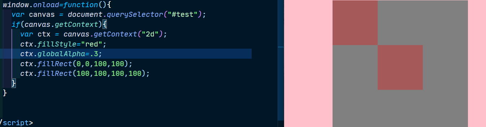

##### 合成

`source`:新的图像(源)
`destination`:已经绘制过的图形(目标)

globalCompositeOperation

+ source-over(默认值):源在上面,新的图像层级比较高

  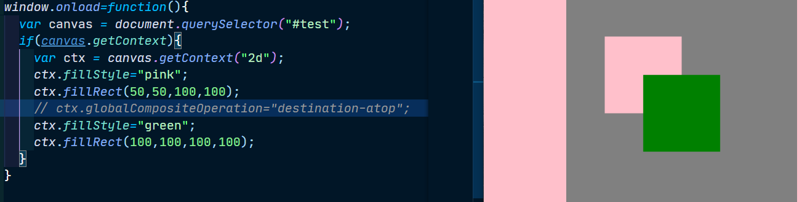

+ source-in  :只留下源与目标的重叠部分(源的那一部分)

  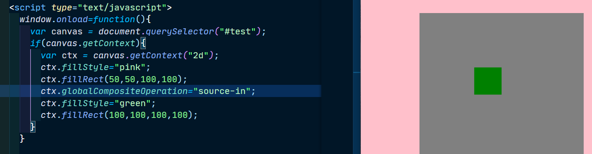

+ source-out :只留下源超过目标的部分

  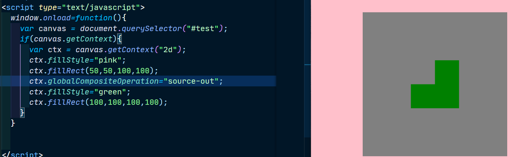

+ source-atop:砍掉源溢出的部分

  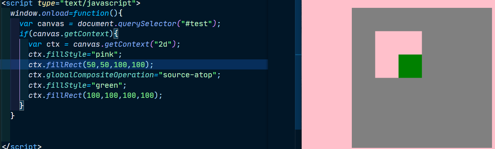

+ destination-over:目标在上面,旧的图像层级比较高

  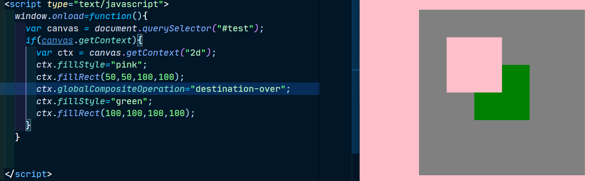

+ destination-in:只留下源与目标的重叠部分(目标的那一部分)

  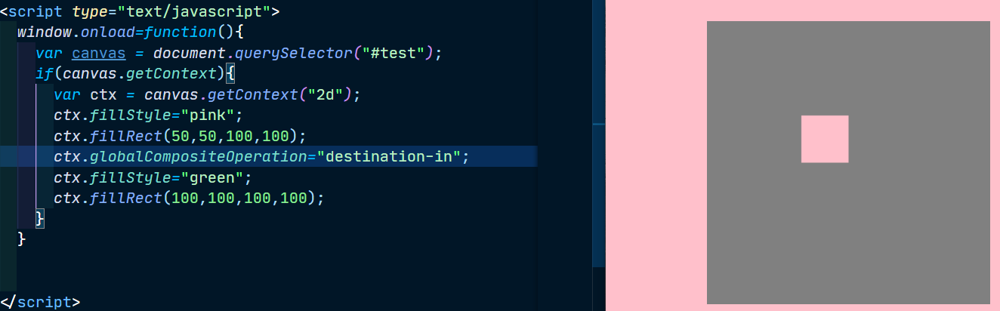

+ destination-out:只留下目标超过源的部分

  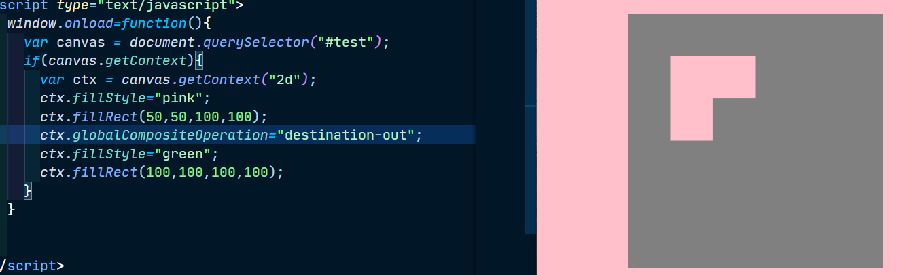

+ destination-atop:砍掉目标溢出的部分

  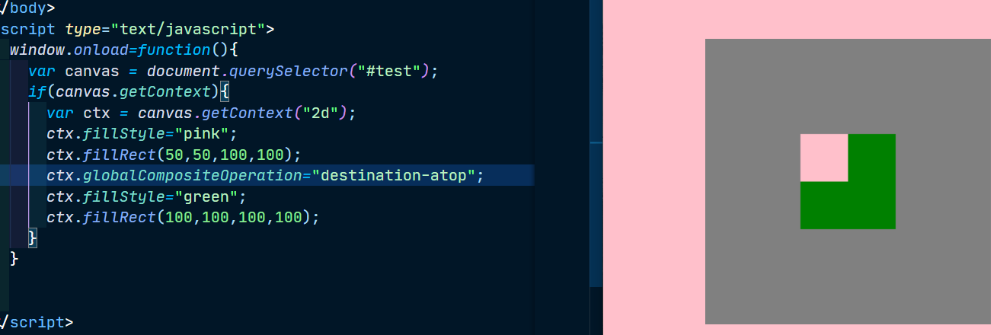

##### 案例 刮刮卡

```html
<!DOCTYPE html>
<html>

<head>
	<meta charset="UTF-8">
	<meta name="viewport" content="width=device-width,initial-scale=1.0,user-scalable=no">
	</meta>
	<title></title>
	<style type="text/css">
		* {
			margin: 0;
			padding: 0;
		}

		html,
		body {
			height: 100%;
			overflow: hidden;
		}

		#wrap,
		ul,
		ul>li {
			height: 100%;
		}

		ul>li {
			background: url(img/b.png);
			background-size: 100% 100%;
		}

		canvas {
			position: absolute;
			left: 0;
			top: 0;
			transition: 1s;
		}
	</style>
</head>

<body>
	<div id="wrap">
		<canvas></canvas>
		<ul>
			<li></li>
		</ul>
	</div>
</body>
<script type="text/javascript">
	window.onload = function () {
		var canvas = document.querySelector("canvas");
		canvas.width = document.documentElement.clientWidth;
		canvas.height = document.documentElement.clientHeight;
		if (canvas.getContext) {
			var ctx = canvas.getContext("2d");
			var img = new Image();
			img.src = "img/a.png";
			img.onload = function () {
				draw();
			}
			function draw() {
				var flag = 0;
				ctx.drawImage(img, 0, 0, canvas.width, canvas.height);
				canvas.addEventListener("touchstart", function (ev) {
					ev = ev || event;
					var touchC = ev.changedTouches[0];
					var x = touchC.clientX - canvas.offsetLeft;
					var y = touchC.clientY - canvas.offsetTop;
					ctx.globalCompositeOperation = "destination-out";
					//这里用destination-out，则每点击一下，只留下原来的图像除了新点的位置的部分
					//新点的也将消失，所以等价于每点一下则图片对应圆点消失，则只剩下背景。
					ctx.lineWidth = 40;
					ctx.lineCap = "round";
					ctx.lineJoin = "round";
					ctx.save();
					ctx.beginPath();
					//						ctx.arc(x,y,20,0,360*Math.PI/180);
					ctx.moveTo(x, y);
					ctx.lineTo(x + 1, y + 1)
					ctx.stroke();
					ctx.restore();
				})
				canvas.addEventListener("touchmove", function (ev) {
					ev = ev || event;
					var touchC = ev.changedTouches[0];
					var x = touchC.clientX - canvas.offsetLeft;
					var y = touchC.clientY - canvas.offsetTop;
					ctx.save();
					//						ctx.arc(x,y,20,0,360*Math.PI/180);
					ctx.lineTo(x, y)
					ctx.stroke();
					ctx.restore();
				})
				canvas.addEventListener("touchend", function () {
					var imgData = ctx.getImageData(0, 0, canvas.width, canvas.height)
					var allPx = imgData.width * imgData.height;
					for (var i = 0; i < allPx; i++) {
						if (imgData.data[4 * i + 3] === 0) {
							flag++;
						}
					}
					if (flag >= allPx / 2) {
						canvas.style.opacity = 0;
					}
				})
				canvas.addEventListener("transitionend", function () {
					this.remove();
				})
			}
		}
	}
</script>
</html>
```

##### 导出为图像

toDataURL(注意是canvas元素接口上的方法)

```javascript
window.onload=function(){
	//querySelector身上有坑
	//拿到画布
	var canvas = document.querySelector("#test");
	if(canvas.getContext){
		var ctx = canvas.getContext("2d");
		ctx.fillRect(0,0,199,199);
		var result =  canvas.toDataURL();
		console.log(result);
	}
}
```

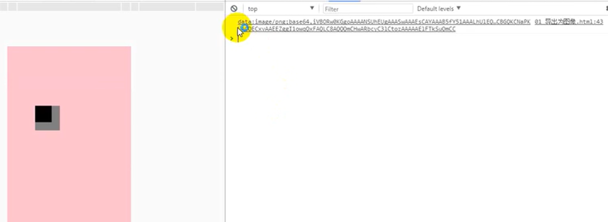

##### 事件操作

`ctx.isPointInPath(x, y)`判断在当前路径中是否包含检测点

+ x:检测点的X坐标
+ y:检测点的Y坐标

!注意，此方法只作用于最新一次性画出的canvas图像。

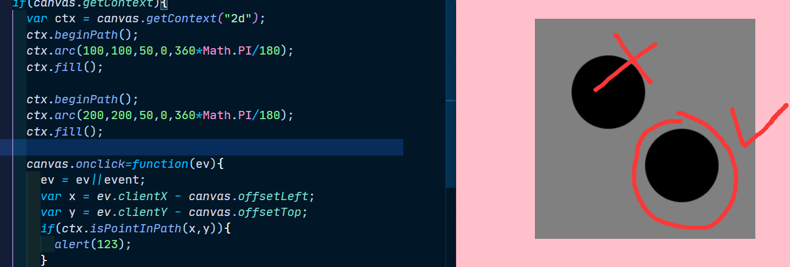

