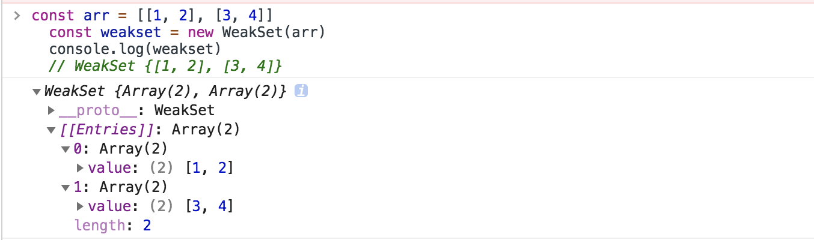
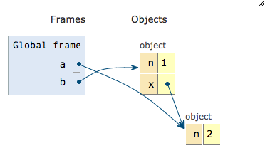

## 1. mouseenter和mouseover的区别

mouseover事件：不论鼠标指针穿过被选元素或其子元素，都会触发 mouseover 事件。

mouseenter事件：只有在鼠标指针穿过被选元素时，才会触发 mouseenter 事件。

以及

mouseout事件：不论鼠标指针离开被选元素还是任何子元素，都会触发 mouseout 事件。

mouseleave事件：只有在鼠标指针离开被选元素时，才会触发 mouseleave 事件。

## 2. alert（1&&2），alert（1||0）

&&运算符，前面的true，返回后面的。前面的为false，返回前面的。

||运算符，前面的为true，返回前面的。前面的为false，返回后面的。

## 3. 为什么TCP连接需要三次握手，两次不可以吗，为什么

感觉自己还没懂，先占坑，可看知乎

## 4. js字符串两边截取空白的trim的原型方法的实现

## 5. `['1', '2', '3'].map(parseInt)` what & why ?

```js
['10','10','10','10','10'].map(parseInt);
// [10, NaN, 2, 3, 4]
```

奇怪吧

首先需要知道parseInt：

**parseInt(string, radix)**  将一个字符串 string 转换为 radix 进制的整数， radix 为介于2-36之间的数。即将string看作是radix进制的数，并返回其对应的十进制数。

- `string`

  要被解析的值。如果参数不是一个字符串，则将其转换为字符串(使用  `ToString `抽象操作)。字符串开头的空白符将会被忽略。

- `radix`

  一个介于2和36之间的整数(数学系统的基础)，表示上述字符串的**基数**。比如参数 10 表示使用十进制数值系统。**始终指定此参数**可以消除阅读该代码时的困惑并且保证转换结果可预测。当未指定基数时，不同的实现会产生不同的结果，通常认为其值默认为**10**，但是如果你的代码运行在过时的浏览器中，那么请在使用时**总是显式地指定 radix**。

返回解析后的整数值（十进制）。 如果被解析参数的第一个字符无法被转化成数值类型，则返回 [`NaN`](https://developer.mozilla.org/zh-CN/docs/Web/JavaScript/Reference/Global_Objects/NaN)。

注意：

+ `radix`参数为n将会把第一个参数看作是一个数的n进制表示，而返回的值则是十进制的。例如：

```html
parseInt('123', 5) // 将'123'看作5进制数，返回十进制数38 => 1*5^2 + 2*5^1 + 3*5^0 = 38
```

+ 如果`parseInt`的字符不是指定基数中的数字，则忽略该字符和所有后续字符，并返回解析到该点的整数值。`parseInt`将数字截断为整数值。允许使用前导空格和尾随空格。

+ 使用parseInt去截取包含e字符数值部分会造成难以预料的结果。例如：

  parseInt("6.022e23", 10);     // 返回 6
  parseInt(6.022e2, 10);      // 返回 602

+ 在基数为 `undefined`，或者基数为 0 或者没有指定的情况下，JavaScript 作如下处理：

  - 如果字符串 `string` 以"0x"或者"0X"开头, 则基数是16 (16进制).
  - 如果字符串 `string` 以"0"开头, 基数是8（八进制）或者10（十进制），那么具体是哪个基数由实现环境决定。ECMAScript 5 规定使用10，但是并不是所有的浏览器都遵循这个规定。因此，**永远都要明确给出radix参数的值**。
  - 如果字符串 `string` 以其它任何值开头，则基数是10 (十进制)。

  如果第一个字符不能被转换成数字，`parseInt`返回`NaN`。

  算术上， `NaN` 不是任何一个进制下的数。 你可以调用[`isNaN`](https://developer.mozilla.org/zh-CN/docs/Web/JavaScript/Reference/Global_Objects/isNaN) 来判断 `parseInt` 是否返回 `NaN`。`NaN` 参与的数学运算其结果总是 `NaN`。

  将整型数值以特定基数转换成它的字符串值可以使用 `intValue.toString(radix)`.

其次还得知道map():`map()` 方法创建一个新数组，其结果是该数组中的每个元素都调用一个提供的函数后返回的结果。

```js
var new_array = arr.map(function callback(currentValue[,index[, array]]) {
 // Return element for new_array
 }[, thisArg])
```

>可以看到`callback`回调函数需要三个参数, 我们通常只使用第一个参数 (其他两个参数是可选的)。
>
>`currentValue` 是callback 数组中正在处理的当前元素。
>
>`index`可选, 是callback 数组中正在处理的当前元素的索引。
>
>`array`可选, 是callback map 方法被调用的数组。
>
>另外还有`thisArg`可选, 执行 callback 函数时使用的this 值。

```js
['1', '2', '3'].map(parseInt)
```

对于每个迭代`map`, `parseInt()`传递两个参数: **字符串和基数**。 所以实际执行的的代码是：

```js
['1', '2', '3'].map((item, index) => {
	return parseInt(item, index)
})
```

即返回的值分别为：

```js
parseInt('1', 0) // 1
parseInt('2', 1) // NaN
parseInt('3', 2) // NaN, 3 不是二进制
```

所以：

```js
['1', '2', '3'].map(parseInt)
// 1, NaN, NaN
```

由此，加里·伯恩哈德例子也就很好解释了，这里不再赘述

```js
['10','10','10','10','10'].map(parseInt);
// [10, NaN, 2, 3, 4]
```

如下解决

```js
['10','10','10','10','10'].map((val,index)=>{console.log(val+','+index);return parseInt(val,10)})
//
['10','10','10','10','10'].map(Number);
```

## 6. 防抖与节流

[参考](https://github.com/mqyqingfeng/Blog/issues/22)

1. **防抖**

> 触发高频事件后n秒内函数只会执行一次，如果n秒内高频事件再次被触发，则重新计算时间

- 思路：

> 每次触发事件时都取消之前的延时调用方法

```js
function debounce(fn) {
  let timeout = null // 创建一个标记用来存放定时器的返回值
  return function() {
    clearTimeout(timeout) // 每当用户输入的时候把前一个 setTimeout clear 掉
    timeout = setTimeout(() => {
      // 然后又创建一个新的 setTimeout, 这样就能保证输入字符后的 interval 间隔内如果还有字符输入的话，就不会执行 fn 函数
      fn.apply(this, arguments)
    }, 500)
  }
}
function sayHi() {
  console.log('防抖成功')
}

var inp = document.getElementById('inp')
inp.addEventListener('input', debounce(sayHi)) // 防抖
```

1. **节流**

> 高频事件触发，但在n秒内只会执行一次，所以节流会稀释函数的执行频率

- 思路：

> 每次触发事件时都判断当前是否有等待执行的延时函数

```js
function throttle(fn) {
  let canRun = true // 通过闭包保存一个标记
  return function() {
    if (!canRun) return // 在函数开头判断标记是否为true，不为true则return
    canRun = false // 立即设置为false
    setTimeout(() => {
      // 将外部传入的函数的执行放在setTimeout中
      fn.apply(this, arguments)
      // 最后在setTimeout执行完毕后再把标记设置为true(关键)表示可以执行下一次循环了。当定时器没有执行的时候标记永远是false，在开头被return掉
      canRun = true
    }, 500)
  }
}
function sayHi(e) {
  console.log(e.target.innerWidth, e.target.innerHeight)
}
window.addEventListener('resize', throttle(sayHi))
```

## 7. 介绍下 Set、Map、WeakSet 和 WeakMap 的区别？

Set 和 Map 主要的应用场景在于 **数据重组** 和 **数据储存**

Set 是一种叫做**集合**的数据结构，Map 是一种叫做**字典**的数据结构

#### 1. 集合（Set）

ES6 新增的一种新的数据结构，类似于数组，但成员是唯一且无序的，没有重复的值。

**Set 本身是一种构造函数，用来生成 Set 数据结构。**

```js
new Set([iterable])
```

举个例子：

```js
const s = new Set()
[1, 2, 3, 4, 3, 2, 1].forEach(x => s.add(x))

for (let i of s) {
    console.log(i)	// 1 2 3 4
}

// 去重数组的重复对象
let arr = [1, 2, 3, 2, 1, 1]
[... new Set(arr)]	// [1, 2, 3]
```

Set 对象允许你储存任何类型的唯一值，无论是原始值或者是对象引用。

向 Set 加入值的时候，不会发生类型转换，所以`5`和`"5"`是两个不同的值。Set 内部判断两个值是否不同，使用的算法叫做“Same-value-zero equality”，它类似于**精确相等**运算符（`===`），主要的区别是**`NaN`等于自身，而精确相等运算符认为`NaN`不等于自身。**

```js
let set = new Set();
let a = NaN;
let b = NaN;
set.add(a);
set.add(b);
set // Set {NaN}

let set1 = new Set()
set1.add(5)
set1.add('5')
console.log([...set1])	// [5, "5"]
```

- Set 实例属性

  - constructor： 构造函数

  - size：元素数量

    ```js
    let set = new Set([1, 2, 3, 2, 1])
    
    console.log(set.length)	// undefined
    console.log(set.size)	// 3
    ```

- Set 实例方法

  - 操作方法

    - add(value)：新增，相当于 array里的push

    - delete(value)：存在即删除集合中value

    - has(value)：判断集合中是否存在 value

    - clear()：清空集合

      ------

      ```js
      let set = new Set()
      set.add(1).add(2).add(1)
      
      set.has(1)	// true
      set.has(3)	// false
      set.delete(1)	
      set.has(1)	// false
      ```

      `Array.from` 方法可以将 Set 结构转为数组

      ```js
      const items = new Set([1, 2, 3, 2])
      const array = Array.from(items)
      console.log(array)	// [1, 2, 3]
      // 或
      const arr = [...items]
      console.log(arr)	// [1, 2, 3]
      ```

  - 遍历方法（遍历顺序为插入顺序）

    - keys()：返回一个包含集合中所有键的迭代器

    - values()：返回一个包含集合中所有值得迭代器

    - entries()：返回一个包含Set对象中所有元素得键值对迭代器

    - forEach(callbackFn, thisArg)：用于对集合成员执行callbackFn操作，如果提供了 thisArg 参数，回调中的this会是这个参数，**没有返回值**

      ```js
      let set = new Set([1, 2, 3])
      console.log(set.keys())	// SetIterator {1, 2, 3}
      console.log(set.values())	// SetIterator {1, 2, 3}
      console.log(set.entries())	// SetIterator {1, 2, 3}
      
      for (let item of set.keys()) {
        console.log(item);
      }	// 1	2	 3
      for (let item of set.entries()) {
        console.log(item);
      }	// [1, 1]	[2, 2]	[3, 3]
      
      set.forEach((value, key) => {
          console.log(key + ' : ' + value)
      })	// 1 : 1	2 : 2	3 : 3
      console.log([...set])	// [1, 2, 3]
      ```

      Set 可默认遍历，默认迭代器生成函数是 values() 方法

      ```js
      Set.prototype[Symbol.iterator] === Set.prototype.values	// true
      ```

      所以， Set可以使用 map、filter 方法

      ```js
      let set = new Set([1, 2, 3])
      set = new Set([...set].map(item => item * 2))
      console.log([...set])	// [2, 4, 6]
      
      set = new Set([...set].filter(item => (item >= 4)))
      console.log([...set])	//[4, 6]
      ```

      因此，Set 很容易实现交集（Intersect）、并集（Union）、差集（Difference）

      ```js
      let set1 = new Set([1, 2, 3])
      let set2 = new Set([4, 3, 2])
      
      let intersect = new Set([...set1].filter(value => set2.has(value)))
      let union = new Set([...set1, ...set2])
      let difference = new Set([...set1].filter(value => !set2.has(value)))
      
      console.log(intersect)	// Set {2, 3}
      console.log(union)		// Set {1, 2, 3, 4}
      console.log(difference)	// Set {1}
      ```

#### 2. WeakSet

WeakSet 对象允许你将**弱引用对象**储存在一个集合中

WeakSet 与 Set 的区别：

- WeakSet 只能储存对象引用，不能存放值，而 Set 对象都可以
- WeakSet 对象中储存的对象值都是被弱引用的，即垃圾回收机制不考虑 WeakSet 对该对象的应用，如果没有其他的变量或属性引用这个对象值，则这个对象将会被垃圾回收掉（不考虑该对象还存在于 WeakSet 中），所以，WeakSet 对象里有多少个成员元素，取决于垃圾回收机制有没有运行，运行前后成员个数可能不一致，遍历结束之后，有的成员可能取不到了（被垃圾回收了），WeakSet 对象是无法被遍历的（ES6 规定 WeakSet 不可遍历），也没有办法拿到它包含的所有元素

属性：

- constructor：构造函数，任何一个具有 Iterable 接口的对象，都可以作参数

  ```js
  const arr = [[1, 2], [3, 4]]
  const weakset = new WeakSet(arr)
  console.log(weakset)
  ```



方法：

- add(value)：在WeakSet 对象中添加一个元素value
- has(value)：判断 WeakSet 对象中是否包含value
- delete(value)：删除元素 value
- clear()：清空所有元素，**注意该方法已废弃**

```js
var ws = new WeakSet()
var obj = {}
var foo = {}

ws.add(window)
ws.add(obj)

ws.has(window)	// true
ws.has(foo)	// false

ws.delete(window)	// true
ws.has(window)	// false
```

#### 3. 字典（Map）

集合 与 字典 的区别：

- 共同点：集合、字典 可以储存不重复的值
- 不同点：集合 是以 [value, value]的形式储存元素，字典 是以 [key, value] 的形式储存

```js
const m = new Map()
const o = {p: 'haha'}
m.set(o, 'content')
m.get(o)	// content

m.has(o)	// true
m.delete(o)	// true
m.has(o)	// false
```

**任何具有 Iterator 接口、且每个成员都是一个双元素的数组的数据结构**都可以当作`Map`构造函数的参数，例如：

```js
const set = new Set([
  ['foo', 1],
  ['bar', 2]
]);
const m1 = new Map(set);
m1.get('foo') // 1

const m2 = new Map([['baz', 3]]);
const m3 = new Map(m2);
m3.get('baz') // 3
```

如果读取一个未知的键，则返回`undefined`。

```js
new Map().get('asfddfsasadf')
// undefined
```

注意，只有对同一个对象的引用，Map 结构才将其视为同一个键。这一点要非常小心。

```js
const map = new Map();

map.set(['a'], 555);
map.get(['a']) // undefined
```

上面代码的`set`和`get`方法，表面是针对同一个键，但实际上这是两个值，内存地址是不一样的，因此`get`方法无法读取该键，返回`undefined`。

由上可知，Map 的键实际上是跟内存地址绑定的，只要内存地址不一样，就视为两个键。这就解决了同名属性碰撞（clash）的问题，我们扩展别人的库的时候，如果使用对象作为键名，就不用担心自己的属性与原作者的属性同名。

如果 Map 的键是一个简单类型的值（数字、字符串、布尔值），则只要两个值严格相等，Map 将其视为一个键，比如`0`和`-0`就是一个键，布尔值`true`和字符串`true`则是两个不同的键。另外，`undefined`和`null`也是两个不同的键。虽然`NaN`不严格相等于自身，但 Map 将其视为同一个键。

```js
let map = new Map();

map.set(-0, 123);
map.get(+0) // 123

map.set(true, 1);
map.set('true', 2);
map.get(true) // 1

map.set(undefined, 3);
map.set(null, 4);
map.get(undefined) // 3

map.set(NaN, 123);
map.get(NaN) // 123
```

Map 的属性及方法

属性：

- constructor：构造函数

- size：返回字典中所包含的元素个数

  ```js
  const map = new Map([
    ['name', 'An'],
    ['des', 'JS']
  ]);
  
  map.size // 2
  ```

操作方法：

- set(key, value)：向字典中添加新元素
- get(key)：通过键查找特定的数值并返回
- has(key)：判断字典中是否存在键key
- delete(key)：通过键 key 从字典中移除对应的数据
- clear()：将这个字典中的所有元素删除

遍历方法

- Keys()：将字典中包含的所有键名以迭代器形式返回
- values()：将字典中包含的所有数值以迭代器形式返回
- entries()：返回所有成员的迭代器
- forEach()：遍历字典的所有成员

```js
const map = new Map([
            ['name', 'An'],
            ['des', 'JS']
        ]);
console.log(map.entries())	// MapIterator {"name" => "An", "des" => "JS"}
console.log(map.keys()) // MapIterator {"name", "des"}
```

Map 结构的默认遍历器接口（`Symbol.iterator`属性），就是`entries`方法。

```js
map[Symbol.iterator] === map.entries
// true
```

Map 结构转为数组结构，比较快速的方法是使用扩展运算符（`...`）。

对于 forEach ，看一个例子

```js
const reporter = {
  report: function(key, value) {
    console.log("Key: %s, Value: %s", key, value);
  }
};

let map = new Map([
    ['name', 'An'],
    ['des', 'JS']
])
map.forEach(function(value, key, map) {
  this.report(key, value);
}, reporter);
// Key: name, Value: An
// Key: des, Value: JS
```

在这个例子中， forEach 方法的回调函数的 this，就指向 reporter

**与其他数据结构的相互转换**

1. Map 转 Array

   ```js
   const map = new Map([[1, 1], [2, 2], [3, 3]])
   console.log([...map])	// [[1, 1], [2, 2], [3, 3]]
   ```

2. Array 转 Map

   ```js
   const map = new Map([[1, 1], [2, 2], [3, 3]])
   console.log(map)	// Map {1 => 1, 2 => 2, 3 => 3}
   ```

3. Map 转 Object

   因为 Object 的键名都为字符串，而Map 的键名为对象，所以转换的时候会把非字符串键名转换为字符串键名。

   ```js
   function mapToObj(map) {
       let obj = Object.create(null)
       for (let [key, value] of map) {
           obj[key] = value
       }
       return obj
   }
   const map = new Map().set('name', 'An').set('des', 'JS')
   mapToObj(map)  // {name: "An", des: "JS"}
   ```

4. Object 转 Map

   ```js
   function objToMap(obj) {
       let map = new Map()
       for (let key of Object.keys(obj)) {
           map.set(key, obj[key])
       }
       return map
   }
   
   objToMap({'name': 'An', 'des': 'JS'}) // Map {"name" => "An", "des" => "JS"}
   ```

5. Map 转 JSON

   ```js
   function mapToJson(map) {
       return JSON.stringify([...map])
   }
   
   let map = new Map().set('name', 'An').set('des', 'JS')
   mapToJson(map)	// [["name","An"],["des","JS"]]
   ```

6. JSON 转 Map

   ```js
   function jsonToStrMap(jsonStr) {
     return objToMap(JSON.parse(jsonStr));
   }
   
   jsonToStrMap('{"name": "An", "des": "JS"}') // Map {"name" => "An", "des" => "JS"}
   ```

#### 4. WeakMap

WeakMap 对象是一组键值对的集合，其中的**键是弱引用对象，而值可以是任意**。

**注意，WeakMap 弱引用的只是键名，而不是键值。键值依然是正常引用。**

WeakMap 中，每个键对自己所引用对象的引用都是弱引用，在没有其他引用和该键引用同一对象，这个对象将会被垃圾回收（相应的key则变成无效的），所以，WeakMap 的 key 是不可枚举的。

属性：

- constructor：构造函数

方法：

- has(key)：判断是否有 key 关联对象
- get(key)：返回key关联对象（没有则则返回 undefined）
- set(key)：设置一组key关联对象
- delete(key)：移除 key 的关联对象

```js
let myElement = document.getElementById('logo');
let myWeakmap = new WeakMap();

myWeakmap.set(myElement, {timesClicked: 0});

myElement.addEventListener('click', function() {
  let logoData = myWeakmap.get(myElement);
  logoData.timesClicked++;
}, false);
```

#### 5. 总结

- Set
  - 成员唯一、无序且不重复
  - [value, value]，键值与键名是一致的（或者说只有键值，没有键名）
  - 可以遍历，方法有：add、delete、has
- WeakSet
  - 成员都是对象
  - 成员都是弱引用，可以被垃圾回收机制回收，可以用来保存DOM节点，不容易造成内存泄漏
  - 不能遍历，方法有add、delete、has
- Map
  - 本质上是键值对的集合，类似集合
  - 可以遍历，方法很多可以跟各种数据格式转换
- WeakMap
  - 只接受对象作为键名（null除外），不接受其他类型的值作为键名
  - 键名是弱引用，键值可以是任意的，键名所指向的对象可以被垃圾回收，此时键名是无效的
  - 不能遍历，方法有get、set、has、delete

#### 6. 扩展：Object与Set、Map

1. Object 与 Set

   ```js
   // Object
   const properties1 = {
       'width': 1,
       'height': 1
   }
   console.log(properties1['width']? true: false) // true
   
   // Set
   const properties2 = new Set()
   properties2.add('width')
   properties2.add('height')
   console.log(properties2.has('width')) // true
   ```

2. Object 与 Map

JS 中的对象（Object），本质上是键值对的集合（hash 结构）

```js
const data = {};
const element = document.getElementsByClassName('App');

data[element] = 'metadata';
console.log(data['[object HTMLCollection]']) // "metadata"
```

但当以一个DOM节点作为对象 data 的键，对象会被自动转化为字符串[Object HTMLCollection]，所以说，Object 结构提供了 **字符串-值** 对应，Map则提供了 **值-值** 的对应

## 8. ES5/ES6 的继承除了写法以外还有什么区别？

这个问题比较复杂，暂时还不懂[url](https://muyiy.cn/question/js/7.html)

ES5 和 ES6 子类 `this` 生成顺序不同。ES5 的继承先生成了子类实例，再调用父类的构造函数修饰子类实例，ES6 的继承先生成父类实例，再调用子类的构造函数修饰父类实例。这个差别使得 ES6 可以继承内置对象。

```javascript
function MyES5Array() {
  Array.call(this, arguments);
}

// it's useless
const arrayES5 = new MyES5Array(3); // arrayES5: MyES5Array {}

class MyES6Array extends Array {}

// it's ok
const arrayES6 = new MyES6Array(3); // arrayES6: MyES6Array(3) []
```

## 9. 3 个判断数组的方法，请分别介绍它们之间的区别和优劣

```js
Object.prototype.toString.call()
instanceof 
Array.isArray()
```

```js
1. Object.prototype.toString.call()
每一个继承 Object 的对象都有 toString 方法，如果 toString 方法没有重写的话，会返回 [Object type]，其中 type 为对象的类型。但当除了 Object 类型的对象外，其他类型直接使用 toString 方法时，会直接返回都是内容的字符串，所以我们需要使用call或者apply方法来改变toString方法的执行上下文。

const an = ['Hello','An'];
an.toString(); // "Hello,An"
Object.prototype.toString.call(an); // "[object Array]"
这种方法对于所有基本的数据类型都能进行判断，即使是 null 和 undefined 。

Object.prototype.toString.call('An') // "[object String]"
Object.prototype.toString.call(1) // "[object Number]"
Object.prototype.toString.call(Symbol(1)) // "[object Symbol]"
Object.prototype.toString.call(null) // "[object Null]"
Object.prototype.toString.call(undefined) // "[object Undefined]"
Object.prototype.toString.call(function(){}) // "[object Function]"
Object.prototype.toString.call({name: 'An'}) // "[object Object]"
Object.prototype.toString.call() 常用于判断浏览器内置对象时。

更多实现可见 谈谈 Object.prototype.toString

2. instanceof
instanceof  的内部机制是通过判断对象的原型链中是不是能找到类型的 prototype。

使用 instanceof判断一个对象是否为数组，instanceof 会判断这个对象的原型链上是否会找到对应的 Array 的原型，找到返回 true，否则返回 false。

[]  instanceof Array; // true
但 instanceof 只能用来判断对象类型，原始类型不可以。并且所有对象类型 instanceof Object 都是 true。

[]  instanceof Object; // true
3. Array.isArray()
功能：用来判断对象是否为数组

instanceof 与 isArray

当检测Array实例时，Array.isArray 优于 instanceof ，因为 Array.isArray 可以检测出 iframes

var iframe = document.createElement('iframe');
document.body.appendChild(iframe);
xArray = window.frames[window.frames.length-1].Array;
var arr = new xArray(1,2,3); // [1,2,3]

// Correctly checking for Array
Array.isArray(arr);  // true
Object.prototype.toString.call(arr); // true
// Considered harmful, because doesn't work though iframes
arr instanceof Array; // false
Array.isArray() 与 Object.prototype.toString.call()

Array.isArray()是ES5新增的方法，当不存在 Array.isArray() ，可以用 Object.prototype.toString.call() 实现。

if (!Array.isArray) {
  Array.isArray = function(arg) {
    return Object.prototype.toString.call(arg) === '[object Array]';
  };
}
```

instanceof是判断类型的prototype是否出现在对象的原型链中，但是对象的原型可以随意修改，所以这种判断并不准确。

```javascript
const obj = {}
obj.__proto__ = Array.prototype
// Object.setPrototypeOf(obj, Array.prototype)
obj instanceof Array // true
```

## 10.介绍模块化发展历程

可从IIFE、AMD、CMD、CommonJS、UMD、webpack(require.ensure)、ES Module、`` 这几个角度考虑。

https://www.processon.com/view/link/5c8409bbe4b02b2ce492286a#map

模块化主要是用来抽离公共代码，隔离作用域，避免变量冲突等。

**IIFE**： 使用自执行函数来编写模块化，特点：**在一个单独的函数作用域中执行代码，避免变量冲突**。

```js
(function(){
  return {
	data:[]
  }
})()
```

**AMD**： 使用requireJS 来编写模块化，特点：**依赖必须提前声明好**。

```js
define('./index.js',function(code){
	// code 就是index.js 返回的内容
})
```

**CMD**： 使用seaJS 来编写模块化，特点：**支持动态引入依赖文件**。

```js
define(function(require, exports, module) {  
  var indexCode = require('./index.js');
});
```

**CommonJS**： nodejs 中自带的模块化。

```js
var fs = require('fs');
```

**UMD**：兼容AMD，CommonJS 模块化语法。

**webpack(require.ensure)**：webpack 2.x 版本中的代码分割。

**ES Modules**： ES6 引入的模块化，支持import 来引入另一个 js 。

```js
import a from 'a';
```

## 11.全局作用域中，用 const 和 let 声明的变量不在 window 上，那到底在哪里？如何去获取？

[关于let声明的变量在window里无法获取到的问题](https://blog.csdn.net/fang_ze_zhang/article/details/83419022)

主要还是得好好学学js作用域那一块，同时es5、es6区别语法等各种坑特别多得注意

<hr>


在ES5中，顶层对象的属性和全局变量是等价的，var 命令和 function 命令声明的全局变量，自然也是顶层对象。

```js
var a = 12;
function f(){};

console.log(window.a); // 12
console.log(window.f); // f(){}
```

但ES6规定，var 命令和 function 命令声明的全局变量，依旧是顶层对象的属性，但 let命令、const命令、class命令声明的全局变量，不属于顶层对象的属性。

```js
let aa = 1;
const bb = 2;

console.log(window.aa); // undefined
console.log(window.bb); // undefined
```

在哪里？怎么获取？通过在设置断点，看看浏览器是怎么处理的：


通过上图也可以看到，在全局作用域中，用 let 和 const 声明的全局变量并没有在全局对象中，只是一个块级作用域（Script）中

怎么获取？在定义变量的块级作用域中就能获取啊，既然不属于顶层对象，那就不加 window（global）呗。

```js
let aa = 1;
const bb = 2;

console.log(aa); // 1
console.log(bb); // 2
```

## 12.使用 sort() 对数组 [3, 15, 8, 29, 102, 22] 进行排序，输出结果

`sort` 函数，可以接收一个函数，返回值是比较两个数的相对顺序的值

1. 默认没有函数 是按照 `UTF-16` 排序的，对于字母数字 你可以利用 `ASCII` 进行记忆

```js
 [3, 15, 8, 29, 102, 22].sort();

// [102, 15, 22, 29, 3, 8]
```

1. 带函数的比较

```js
 [3, 15, 8, 29, 102, 22].sort((a,b) => {return a - b});
```

- 返回值大于0 即a-b > 0 ， a 和 b 交换位置
- 返回值大于0 即a-b < 0 ， a 和 b 位置不变
- 返回值等于0 即a-b = 0 ， a 和 b 位置不变

> 对于函数体返回 `b-a` 可以类比上面的返回值进行交换位置

## 13. JS **JavaScript Demo: Function.call() **JavaScript Demo: Function.apply()

 `call()` 方法接受的是**一个参数列表**，而 `apply()` 方法接受的是**一个包含多个参数的数组**。

## 14.输出以下代码的执行结果并解释为什么

```js
var a = {n: 1};
var b = a;
a.x = a = {n: 2};

console.log(a.x) 	
console.log(b.x)
```

结果: undefined {n:2}

首先，a和b同时引用了{n:2}对象，接着执行到a.x = a = {n：2}语句，尽管赋值是从右到左的没错，但是.的优先级比=要高，所以这里首先执行a.x，相当于为a（或者b）所指向的{n:1}对象新增了一个属性x，即此时对象将变为{n:1;x:undefined}。之后按正常情况，从右到左进行赋值，此时执行a ={n:2}的时候，a的引用改变，指向了新对象{n：2},而b依然指向的是旧对象。之后执行a.x = {n：2}的时候，并不会重新解析一遍a，而是沿用最初解析a.x时候的a，也即旧对象，故此时旧对象的x的值为{n：2}，旧对象为 {n:1;x:{n：2}}，它被b引用着。 后面输出a.x的时候，又要解析a了，此时的a是指向新对象的a，而这个新对象是没有x属性的，故访问时输出undefined；而访问b.x的时候，将输出旧对象的x的值，即{n:2}。



## 15. 数组里10万个数据，取第一个元素和第99999个元素时间相差多少

js 中数组元素的存储方式并不是连续的，而是哈希映射关系。哈希映射关系，可以通过键名 key，直接计算出值存储的位置，所以查找起来很快。推荐一下这篇文章：[深究 JavaScript 数组](https://juejin.im/entry/59ae664d518825244d207196)

## 16.输出以下代码运行结果

```js
// example 1
var a={}, b='123', c=123;  
a[b]='b';
a[c]='c';  
console.log(a[b]);

---------------------
// example 2
var a={}, b=Symbol('123'), c=Symbol('123');  
a[b]='b';
a[c]='c';  
console.log(a[b]);

---------------------
// example 3
var a={}, b={key:'123'}, c={key:'456'};  
a[b]='b';
a[c]='c';  
console.log(a[b]);
```

这题考察的是对象的键名的转换。

- 对象的键名只能是字符串和 Symbol 类型。
- 其他类型的键名会被转换成字符串类型。
- 对象转字符串默认会调用 toString 方法。

```js
// example 1
var a={}, b='123', c=123;
a[b]='b';

// c 的键名会被转换成字符串'123'，这里会把 b 覆盖掉。
a[c]='c';  

// 输出 c
console.log(a[b]);
// example 2
var a={}, b=Symbol('123'), c=Symbol('123');  

// b 是 Symbol 类型，不需要转换。
a[b]='b';

// c 是 Symbol 类型，不需要转换。任何一个 Symbol 类型的值都是不相等的，所以不会覆盖掉 b。
a[c]='c';

// 输出 b
console.log(a[b]);
// example 3
var a={}, b={key:'123'}, c={key:'456'};  

// b 不是字符串也不是 Symbol 类型，需要转换成字符串。
// 对象类型会调用 toString 方法转换成字符串 [object Object]。
a[b]='b';

// c 不是字符串也不是 Symbol 类型，需要转换成字符串。
// 对象类型会调用 toString 方法转换成字符串 [object Object]。这里会把 b 覆盖掉。
a[c]='c';  

// 输出 c
console.log(a[b]);
```

前面说的很清楚了，除了Symbol，如果想要不被覆盖 可以使用ES6提供的Map

```js
var a=new Map(), b='123', c=123;
a.set(b,'b');
a.set(c,'c');
a.get(b);  // 'b'
a.get(c);  // 'c'
```

## 17.var、let 和 const 区别的实现原理是什么

- var：遇到有var的作用域，**在任何语句执行前都已经完成了声明和初始化**，也就是变量提升而且拿到undefined的原因由来
- function： 声明、初始化、赋值一开始就全部完成，所以函数的变量提升优先级更高
- let：解析器进入一个块级作用域，发现let关键字，变量只是先完成**声明**，并没有到**初始化**那一步。此时如果在此作用域提前访问，则报错xx is not defined，这就是暂时性死区的由来。等到解析到有let那一行的时候，才会进入**初始化**阶段。如果let的那一行是赋值操作，则初始化和赋值同时进行
- const、class都是同let一样的道理

比如解析如下代码步骤：

```javascript
{
// 没用的第一行
// 没用的第二行
console.log(a) // 如果此时访问a报错 a is not defined
let a = 1
}
```

步骤：

1. 发现作用域有let a，先注册个a，仅仅注册
2. 没用的第一行
3. 没用的第二行
4. a is not defined，暂时性死区的表现
5. 假设前面那行不报错，a初始化为undefined
6. a赋值为1

对比于var，let、const只是解耦了声明和初始化的过程，var是在任何语句执行前都已经完成了声明和初始化，let、const仅仅是在任何语句执行前只完成了声明

## 18.Async/Await 如何通过同步的方式实现异步

看了第一个回答，讲的挺深入底层的，但我现在还不太看得懂，先占个坑。

[网址](https://muyiy.cn/question/async/9.html)

## 19.输出运行结果

```js
function Foo() {
Foo.a = function() {
console.log(1)
}
this.a = function() {
console.log(2)
}
}
Foo.prototype.a = function() {
console.log(3)
}
Foo.a = function() {
console.log(4)
}
Foo.a();
let obj = new Foo();
obj.a();
Foo.a();
```

结果：

```javascript
function Foo() {
    Foo.a = function() {
        console.log(1)
    }
    this.a = function() {
        console.log(2)
    }
}
// 以上只是 Foo 的构建方法，没有产生实例，此刻也没有执行

Foo.prototype.a = function() {
    console.log(3)
}
// 现在在 Foo 上挂载了原型方法 a ，方法输出值为 3

Foo.a = function() {
    console.log(4)
}
// 现在在 Foo 上挂载了直接方法 a ，输出值为 4

Foo.a();
// 立刻执行了 Foo 上的 a 方法，也就是刚刚定义的，所以
// # 输出 4

let obj = new Foo();
/* 这里调用了 Foo 的构建方法。Foo 的构建方法主要做了两件事：
1. 将全局的 Foo 上的直接方法 a 替换为一个输出 1 的方法。
2. 在新对象上挂载直接方法 a ，输出值为 2。
*/

obj.a();
// 因为有直接方法 a ，不需要去访问原型链，所以使用的是构建方法里所定义的 this.a，
// # 输出 2

Foo.a();
// 构建方法里已经替换了全局 Foo 上的 a 方法，所以
// # 输出 1
```

同理

```javascript
function Foo() {
    getName = function () { alert (1); };
    return this;
}
Foo.getName = function () { alert (2);};
Foo.prototype.getName = function () { alert (3);};
var getName = function () { alert (4);};
function getName() { alert (5);}
 
//请写出以下输出结果：
Foo.getName();
getName();
Foo().getName();
getName();
new Foo.getName();
new Foo().getName();
new new Foo().getName();
```

先看此题的上半部分做了什么，首先定义了一个叫Foo的函数，之后为Foo创建了一个叫getName的静态属性存储了一个匿名函数，之后为Foo的原型对象新创建了一个叫getName的匿名函数。之后又通过函数变量表达式创建了一个getName的函数，最后再声明一个叫getName函数。

第一问的Foo.getName自然是访问Foo函数上存储的静态属性，答案自然是2，这里就不需要解释太多的，一般来说第一问对于稍微懂JS基础的同学来说应该是没问题的,当然我们可以用下面的代码来回顾一下基础，先加深一下了解

1. Foo.getName();

   自然是访问Foo函数上存储的静态属性，答案自然是2，这里就不需要解释太多的，一般来说第一问对于稍微懂JS基础的同学来说应该是没问题的,当然我们可以用下面的代码来回顾一下基础，先加深一下了解

   ```javascript
   function User(name) {
   	var name = name; //私有属性
   	this.name = name; //公有属性
   	function getName() { //私有方法
   		return name;
   	}
   }
   User.prototype.getName = function() { //公有方法
   	return this.name;
   }
   User.name = 'Wscats'; //静态属性
   User.getName = function() { //静态方法
   	return this.name;
   }
   var Wscat = new User('Wscats'); //实例化
   ```

   注意下面这几点：

   - 调用公有方法，公有属性，我们必需先实例化对象，也就是用new操作符实化对象，就可构造函数实例化对象的方法和属性，并且公有方法是不能调用私有方法和静态方法的
   - 静态方法和静态属性就是我们无需实例化就可以调用
   - 而对象的私有方法和属性,外部是不可以访问的

2. getName();

   既然是直接调用那么就是访问当前上文作用域内的叫getName的函数，所以这里应该直接把关注点放在4和5上，跟1 2 3都没什么关系。当然后来我问了我的几个同事他们大多数回答了5。此处其实有两个坑，一是变量声明提升，二是函数表达式和函数声明的区别。

   我们来看看为什么，可参考(1)关于Javascript的函数声明和函数表达式 (2)关于JavaScript的变量提升

   在Javascript中，定义函数有两种类型

   函数声明

   ```javascript
   // 函数声明
   function wscat(type) {
   	return type === "wscat";
   }
   ```

   函数表达式

   ```javascript
   // 函数表达式
   var oaoafly = function(type) {
   	return type === "oaoafly";
   }
   ```

   先看下面这个经典问题，在一个程序里面同时用函数声明和函数表达式定义一个名为getName的函数

   ```javascript
   getName() //oaoafly
   var getName = function() {
   	console.log('wscat')
   }
   getName() //wscat
   function getName() {
   	console.log('oaoafly')
   }
   getName() //wscat
   ```

   上面的代码看起来很类似，感觉也没什么太大差别。但实际上，Javascript函数上的一个“陷阱”就体现在Javascript两种类型的函数定义上。

   - JavaScript 解释器中存在一种变量声明被提升的机制，也就是说函数声明会被提升到作用域的最前面，即使写代码的时候是写在最后面，也还是会被提升至最前面。
   - 而用函数表达式创建的函数是在运行时进行赋值，且要等到表达式赋值完成后才能调用

   ```javascript
   var getName //变量被提升，此时为undefined
   
   getName() //oaoafly 函数被提升 这里受函数声明的影响，虽然函数声明在最后可以被提升到最前面了
   var getName = function() {
   	console.log('wscat')
   } //函数表达式此时才开始覆盖函数声明的定义
   getName() //wscat
   function getName() {
   	console.log('oaoafly')
   }
   getName() //wscat 这里就执行了函数表达式的值
   ```

   所以可以分解为这两个简单的问题来看清楚区别的本质

   ```javascript
   var getName;
   console.log(getName) //undefined
   getName() //Uncaught TypeError: getName is not a function
   var getName = function() {
   	console.log('wscat')
   }
   var getName;
   console.log(getName) //function getName() {console.log('oaoafly')}
   getName() //oaoafly
   function getName() {
   	console.log('oaoafly')
   }
   ```

   这个区别看似微不足道，但在某些情况下确实是一个难以察觉并且“致命“的陷阱。出现这个陷阱的本质原因体现在这两种类型在函数提升和运行时机（解析时/运行时）上的差异。

   当然我们给一个总结：Javascript中函数声明和函数表达式是存在区别的，函数声明在JS解析时进行函数提升，因此在同一个作用域内，不管函数声明在哪里定义，该函数都可以进行调用。而函数表达式的值是在JS运行时确定，并且在表达式赋值完成后，该函数才能调用。

   所以第二问的答案就是4，5的函数声明被4的函数表达式覆盖了

3. Foo().getName();

   先执行了Foo函数，然后调用Foo函数的返回值对象的getName属性函数。

   Foo函数的第一句`getName = function () { alert (1); };`是一句函数赋值语句，注意它没有var声明，所以先向当前Foo函数作用域内寻找getName变量，没有。再向当前函数作用域上层，即外层作用域内寻找是否含有getName变量，找到了，也就是第二问中的alert(4)函数，将此变量的值赋值为`function(){alert(1)}`。

   此处实际上是将外层作用域内的getName函数修改了。

   > 注意：此处若依然没有找到会一直向上查找到window对象，若window对象中也没有getName属性，就在window对象中创建一个getName变量。

   之后Foo函数的返回值是this，而JS的this问题已经有非常多的文章介绍，这里不再多说。

   简单的讲，this的指向是由所在函数的调用方式决定的。而此处的直接调用方式，this指向window对象。

   遂Foo函数返回的是window对象，相当于执行`window.getName()`，而window中的getName已经被修改为alert(1)，所以最终会输出1
   此处考察了两个知识点，一个是变量作用域问题，一个是this指向问题
   我们可以利用下面代码来回顾下这两个知识点:

   ```javascript
   var name = "Wscats"; //全局变量
   window.name = "Wscats"; //全局变量
   function getName() {
   	name = "Oaoafly"; //去掉var变成了全局变量
   	var privateName = "Stacsw";
   	return function() {
   		console.log(this); //window
   		return privateName
   	}
   }
   var getPrivate = getName("Hello"); //当然传参是局部变量，但函数里面我没有接受这个参数
   console.log(name) //Oaoafly
   console.log(getPrivate()) //Stacsw
   ```

   因为JS没有块级作用域，但是函数是能产生一个作用域的，函数内部不同定义值的方法会直接或者间接影响到全局或者局部变量，函数内部的私有变量可以用闭包获取，函数还真的是第一公民呀~

   而关于this，this的指向在函数定义的时候是确定不了的，只有函数执行的时候才能确定this到底指向谁，实际上this的最终指向的是那个调用它的对象

   所以第三问中实际上就是window在调用**Foo()**函数，所以this的指向是window

   ```javascript
   window.Foo().getName();
   //->window.getName();
   ```

4. getName();

   直接调用getName函数，相当于`window.getName()`，因为这个变量已经被Foo函数执行时修改了，遂结果与第三问相同，为1，也就是说Foo执行后把全局的getName函数给重写了一次，所以结果就是Foo()执行重写的那个getName函数

5. new Foo.getName()

   下面是JS运算符的优先级表格，从高到低排列。可参考MDN运算符优先级

   | 优先级 | 运算类型             | 关联性   | 运算符         |
   | ------ | -------------------- | -------- | -------------- |
   | 19     | 圆括号               | n/a      | ( … )          |
   | 18     | 成员访问             | 从左到右 | … . …          |
   |        | 需计算的成员访问     | 从左到右 | … [ … ]        |
   |        | new (带参数列表)     | n/a new  | … ( … )        |
   | 17     | 函数调用             | 从左到右 | … ( … )        |
   |        | new (无参数列表)     | 从右到左 | new …          |
   | 16     | 后置递增(运算符在后) | n/a      | … ++           |
   |        | 后置递减(运算符在后) | n/a      | … --           |
   | 15     | 逻辑非               | 从右到左 | ! …            |
   |        | 按位非               | 从右到左 | ~ …            |
   |        | 一元加法             | 从右到左 | + …            |
   |        | 一元减法             | 从右到左 | - …            |
   |        | 前置递增             | 从右到左 | ++ …           |
   |        | 前置递减             | 从右到左 | -- …           |
   |        | typeof               | 从右到左 | typeof …       |
   |        | void                 | 从右到左 | void …         |
   |        | delete               | 从右到左 | delete …       |
   | 14     | 乘法                 | 从左到右 | … * …          |
   |        | 除法                 | 从左到右 | … / …          |
   |        | 取模                 | 从左到右 | … % …          |
   | 13     | 加法                 | 从左到右 | … + …          |
   |        | 减法                 | 从左到右 | … - …          |
   | 12     | 按位左移             | 从左到右 | … << …         |
   |        | 按位右移             | 从左到右 | … >> …         |
   |        | 无符号右移           | 从左到右 | … >>> …        |
   | 11     | 小于                 | 从左到右 | … < …          |
   |        | 小于等于             | 从左到右 | … <= …         |
   |        | 大于                 | 从左到右 | … > …          |
   |        | 大于等于             | 从左到右 | … >= …         |
   |        | in                   | 从左到右 | … in …         |
   |        | instanceof           | 从左到右 | … instanceof … |
   | 10     | 等号                 | 从左到右 | … == …         |
   |        | 非等号               | 从左到右 | … != …         |
   |        | 全等号               | 从左到右 | … === …        |
   |        | 非全等号             | 从左到右 | … !== …        |
   | 9      | 按位与               | 从左到右 | … & …          |
   | 8      | 按位异或             | 从左到右 | … ^ …          |
   | 7      | 按位或               | 从左到右 | … 按位或 …     |
   | 6      | 逻辑与               | 从左到右 | … && …         |
   | 5      | 逻辑或               | 从左到右 | … 逻辑或 …     |
   | 4      | 条件运算符           | 从右到左 | … ? … : …      |
   | 3      | 赋值                 | 从右到左 | … = …          |
   |        |                      |          | … += …         |
   |        |                      |          | … -= …         |
   |        |                      |          | … *= …         |
   |        |                      |          | … /= …         |
   |        |                      |          | … %= …         |
   |        |                      |          | … <<= …        |
   |        |                      |          | … >>= …        |
   |        |                      |          | … >>>= …       |
   |        |                      |          | … &= …         |
   |        |                      |          | … ^= …         |
   |        |                      |          | … 或= …        |
   | 2      | yield                | 从右到左 | yield …        |
   |        | yield*               | 从右到左 | yield* …       |
   | 1      | 展开运算符           | n/a      | ... …          |
   | 0      | 逗号                 | 从左到右 | … , …          |

   这题首先看优先级的第18和第17都出现关于new的优先级，new (带参数列表)比new (无参数列表)高比函数调用高，跟成员访问同级

   `new Foo.getName();`的优先级是这样的

   相当于是:

   ```
   new (Foo.getName)();
   ```

   - 点的优先级(18)比new无参数列表(17)优先级高
   - 当点运算完后又因为有个括号`()`，此时就是变成new有参数列表(18)，所以直接执行new，当然也可能有朋友会有疑问为什么遇到()不函数调用再new呢，那是因为函数调用(17)比new有参数列表(18)优先级低

   > .成员访问(18)->new有参数列表(18)

   所以这里实际上将getName函数作为了构造函数来执行，遂弹出2。

6. 这一题比上一题的唯一区别就是在Foo那里多出了一个括号，这个有括号跟没括号我们在第五问的时候也看出来优先级是有区别的

   ```
   (new Foo()).getName()
   ```

   那这里又是怎么判断的呢？首先new有参数列表(18)跟点的优先级(18)是同级，同级的话按照从左向右的执行顺序，所以先执行new有参数列表(18)再执行点的优先级(18)，最后再函数调用(17)

   > new有参数列表(18)->.成员访问(18)->()函数调用(17)

   这里还有一个小知识点，Foo作为构造函数有返回值，所以这里需要说明下JS中的构造函数返回值问题。

   ### 构造函数的返回值

   在传统语言中，构造函数不应该有返回值，实际执行的返回值就是此构造函数的实例化对象。
   而在JS中构造函数可以有返回值也可以没有。

   1. 没有返回值则按照其他语言一样返回实例化对象。

   ```
   function Foo(name) {
   this.name = name
   }
   console.log(new Foo('wscats'))
   ```

   

   1. 若有返回值则检查其返回值是否为引用类型。如果是非引用类型，如基本类型（String,Number,Boolean,Null,Undefined）则与无返回值相同，实际返回其实例化对象。

   ```
   function Foo(name) {
   this.name = name
   return 520
   }
   console.log(new Foo('wscats'))
   ```

   

   1. 若返回值是引用类型，则实际返回值为这个引用类型。

   ```
   function Foo(name) {
   this.name = name
   return {
   age: 16
   }
   }
   console.log(new Foo('wscats'))
   ```


   原题中，由于返回的是this，而this在构造函数中本来就代表当前实例化对象，最终Foo函数返回实例化对象。

   之后调用实例化对象的getName函数，因为在Foo构造函数中没有为实例化对象添加任何属性，当前对象的原型对象(prototype)中寻找getName函数。

   当然这里再拓展个题外话，如果构造函数和原型链都有相同的方法，如下面的代码，那么默认会拿构造函数的公有方法而不是原型链，这个知识点在原题中没有表现出来，后面改进版我已经加上。

   ```javascript
   function Foo(name) {
   this.name = name
   this.getName = function() {
   return this.name
   }
   }
   Foo.prototype.name = 'Oaoafly';
   Foo.prototype.getName = function() {
   return 'Oaoafly'
   }
   console.log((new Foo('Wscats')).name) //Wscats
   console.log((new Foo('Wscats')).getName()) //Wscats
   ```

7. `new new Foo().getName();`

   同样是运算符优先级问题。做到这一题其实我已经觉得答案没那么重要了，关键只是考察面试者是否真的知道面试官在考察我们什么。
   最终实际执行为:

   ```
   new ((new Foo()).getName)();
   ```

   > new有参数列表(18)->new有参数列表(18)

   先初始化Foo的实例化对象，然后将其原型上的getName函数作为构造函数再次new，所以最终结果为3

进阶版

```javascript
function Foo() {
this.getName = function() {
console.log(3);
return {
getName: getName //这个就是第六问中涉及的构造函数的返回值问题
}
}; //这个就是第六问中涉及到的，JS构造函数公有方法和原型链方法的优先级
getName = function() {
console.log(1);
};
return this
}
Foo.getName = function() {
console.log(2);
};
Foo.prototype.getName = function() {
console.log(6);
};
var getName = function() {
console.log(4);
};

function getName() {
console.log(5);
} //答案：
Foo.getName(); //2
getName(); //4
console.log(Foo())
Foo().getName(); //1
getName(); //1
new Foo.getName(); //2
new Foo().getName(); //3
//多了一问
new Foo().getName().getName(); //3 1
new new Foo().getName(); //3
```

## 20.写出结果

```js
String('11') == new String('11');
String('11') === new String('11');
```

True false

new String() 返回的是对象

`==` 的时候，实际运行的是 String('11') == new String('11').toString();

`===` 不再赘述。

```javascript
var str1 = String('11')
var str2 = new String('11')
str1 == str2 // true
str1 === str2 // false
typeof str1  // "string"
typeof str2 // "object"
```

## 21.写出结果

```js
1 + "1"

2 * "2"

[1, 2] + [2, 1]

"a" + + "b"
//答案为
//'11'
//4
//'1,22,1'
//'aNaN'
```

- 1 + "1"

加性操作符：如果只有一个操作数是字符串，则将另一个操作数转换为字符串，然后再将两个字符串拼接起来

所以值为：“11”

- 2 * "2"

乘性操作符：如果有一个操作数不是数值，则在后台调用 Number()将其转换为数值

- [1, 2] + [2, 1]

Javascript中所有对象基本都是先调用`valueOf`方法，如果不是数值，再调用`toString`方法。

所以两个数组对象的toString方法相加，值为："1,22,1"

- "a" + + "b"

后边的“+”将作为一元操作符，如果操作数是字符串，将调用Number方法将该操作数转为数值，如果操作数无法转为数值，则为NaN。

所以值为："aNaN"

以上均参考：《Javascript高级程序设计》

**稍稍补充一小下：** 加号作为一元运算符时，其后面的表达式将进行[ToNumber(参考es规范)](http://www.ecma-international.org/ecma-262/6.0/#sec-tonumber)的抽象操作：

- true -> 1
- false -> 0
- undefined -> NaN
- null -> 0
- ’字符串‘ -> 字符串为纯数字时返回转换后的数字（十六进制返回十进制数），否则返回NaN
- 对象 -> 通过[ToPrimitive](http://www.ecma-international.org/ecma-262/6.0/#sec-toprimitive)拿到基本类型值，然后再进行[ToNumber](http://www.ecma-international.org/ecma-262/6.0/#sec-tonumber)操作

```javascript
+true  // 1
+false // 0
+undefined // NaN
+null // 0
+'b'    // NaN
+'0x10' // 16
+{valueOf: ()=> 5} // 5
```

## 22.为什么 for 循环嵌套顺序会影响性能？

```js
var t1 = new Date().getTime()
for (let i = 0; i < 100; i++) {
  for (let j = 0; j < 1000; j++) {
    for (let k = 0; k < 10000; k++) {
    }
  }
}
var t2 = new Date().getTime()
console.log('first time', t2 - t1)

for (let i = 0; i < 10000; i++) {
  for (let j = 0; j < 1000; j++) {
    for (let k = 0; k < 100; k++) {

    }
  }
}
var t3 = new Date().getTime()
console.log('two time', t3 - t2)
```

想起来之前在书上看到的，let每个循环都会初始化，所以外层循环次数越大，内层变量初始化次数越多，影响性能。

## 23.输出以下代码执行结果

```js
function wait() {
  return new Promise(resolve =>
    setTimeout(resolve, 10 * 1000)
  )
}

async function main() {
  console.time();
  const x = wait();
  const y = wait();
  const z = wait();
  await x;
  await y;
  await z;
  console.timeEnd();
}
main();
```

<hr>

## 24.理解任务队列(消息队列)

一种是同步任务（synchronous），另一种是异步任务（asynchronous）

```js
    // 请问最后的输出结果是什么？
    console.log("A");
    while(true){ }
    console.log("B");
```

如果你的回答是A,恭喜你答对了，因为这是同步任务，程序由上到下执行，遇到while()死循环，下面语句就没办法执行。

```js
    // 请问最后的输出结果是什么？
    console.log("A");
    setTimeout(function(){
    	console.log("B");
    },0);
    while(true){}
```

如果你的答案是A，恭喜你现在对js运行机制已经有个粗浅的认识了！ 题目中的setTimeout()就是个异步任务。在所有同步任务执行完之前，任何的异步任务是不会执行的

```js
// new Promise(xx)相当于同步任务, 会立即执行, .then后面的是微任务
console.log('----------------- start -----------------');
setTimeout(() => {
    console.log('setTimeout');
}, 0)
new Promise((resolve, reject) =>{  // new Promise(xx)相当于同步任务, 会立即执行, .then后面的是微任务
    for (var i = 0; i < 5; i++) {
        console.log(i);
    }
    resolve();  
}).then(() => {  
    console.log('promise实例成功回调执行');
})
console.log('----------------- end -----------------');

> ----------------- start -----------------
> 0
> 1
> 2
> 3
> 4
> ----------------- end -----------------
> promise实例成功回调执行
> setTimeout
```

new Promise(xx)相当于同步任务, 会立即执行

所以: x,y,z 三个任务是几乎同时开始的, 最后的时间依然是10*1000ms (比这稍微大一点点, 超出部分在1x1000ms之内)

**但如果稍稍修改**

```javascript
function wait() {
	return new Promise(resolve =>
		setTimeout(resolve, 10 * 1000)
	)
}

async function main() {
	console.time();
	const x = await wait(); // 每个都是都执行完才结,包括setTimeout（10*1000）的执行时间
	const y = await wait(); // 执行顺序 x->y->z 同步执行，x 与 setTimeout 属于同步执行
	const z = await wait();
	console.timeEnd(); // default: 30099.47705078125ms
	
	console.time();
	const x1 = wait(); // x1,y1,z1 同时异步执行， 包括setTimeout（10*1000）的执行时间
	const y1 = wait(); // x1 与 setTimeout 属于同步执行
	const z1 = wait();
	await x1;
	await y1;
	await z1;
	console.timeEnd(); // default: 10000.67822265625ms
	
	console.time();
	const x2 = wait(); // x2,y2,z2 同步执行，但是不包括setTimeout（10*1000）的执行时间
	const y2 = wait(); // x2 与 setTimeout 属于异步执行
	const z2 = wait();
	x2,y2,z2;
	console.timeEnd(); // default: 0.065185546875ms
}
main();
```